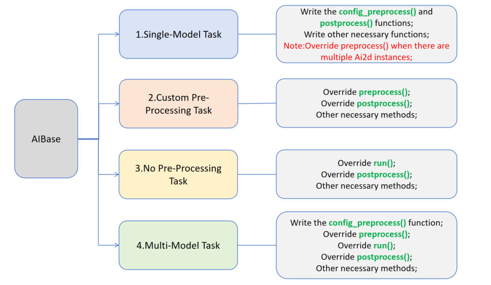
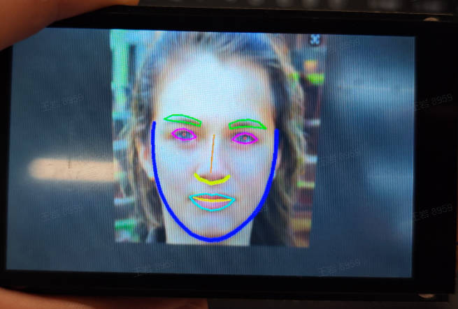
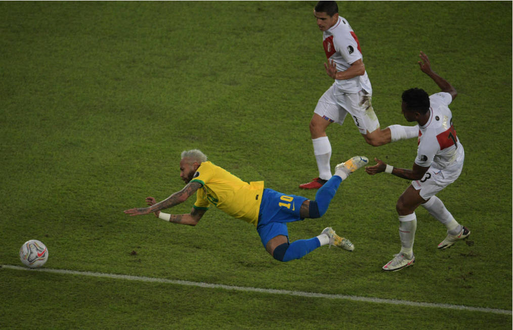
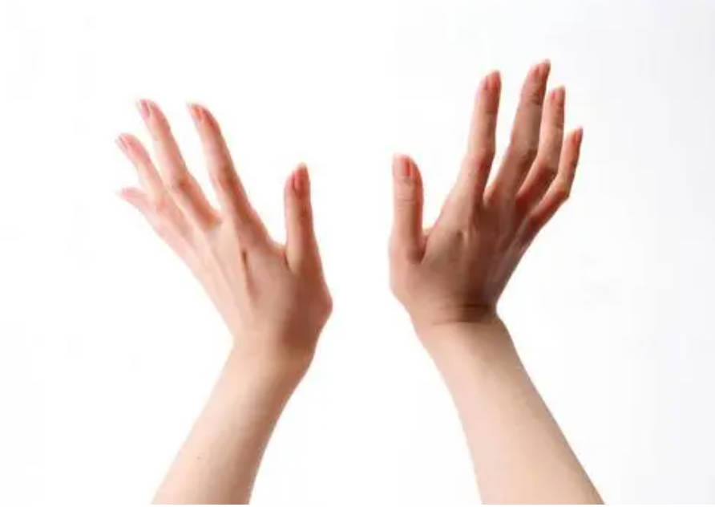
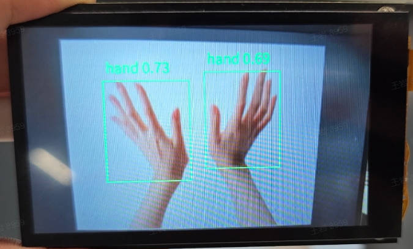
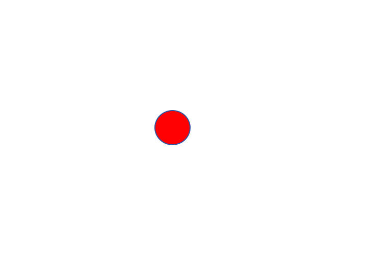
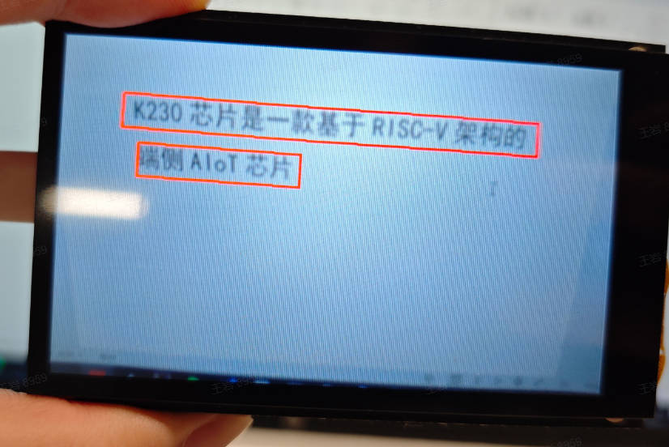
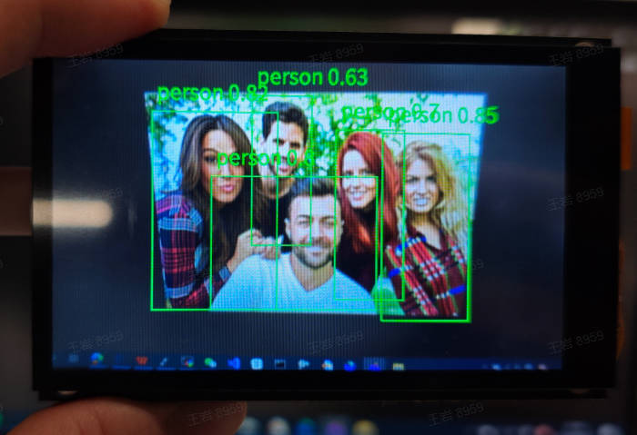
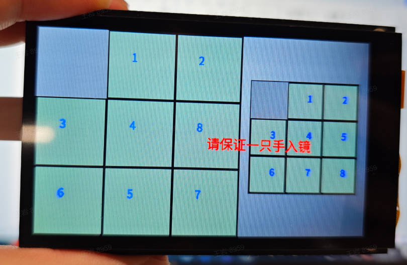
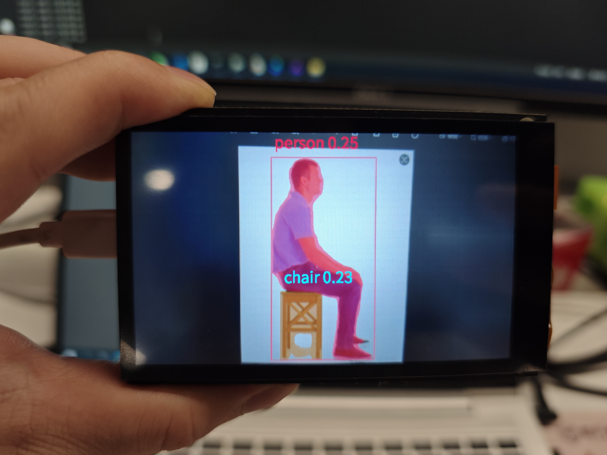

# AI Demo Documentation

## AI Demo Application

The K230 supports a wide range of AI applications. To facilitate user trial experiences, the CanMV K230 image comes with several built-in AI Demo applications. These are categorized into single-model and multi-model applications, covering various fields such as object, face, hand, body, license plate, OCR, audio (KWS, TTS), and more. Users can easily run these applications by opening the source code with CanMV IDE. The source code for AI Demo applications is located in the `/CanMV/sdcard/examples/05-AI-Demo` directory. Below is the list of AI Demo applications; note that some demos cannot run on the K230D chip due to memory limitations. Please refer to the compatibility list.

|Demo Name|Scene|Task Type|K230|K230D|
| ----------------------- | --------------- | ---------- | ---- | ---- |
|body_seg|Human body parts segmentation|Single model task|√||
|dynamic_gesture|Dynamic gesture recognition|Multi-model task|√|√|
|eye_gaze|Watching estimate|Multi-model task|√||
|face_detection|Face detection|Single model task|√|√|
|face_landmark|Key parts of the face|Multi-model task|√|√|
|face_mesh|Face 3D mesh|Multi-model task|√||
|face_parse|Face analysis|Multi-model task|√||
|face_pose|Face posture|Multi-model task|√|√|
|face_registration|Face registration|Multi-model task|√||
|face_recognition|Face recognition|Multi-model task|√||
|face_registration_lite|Lightweight face registration|Multi-model task|√|√|
|face_recognition_lite|Lightweight face recognition|Multi-model task|√|√|
|Falldown_detection|Fall detection|Single model task|√|√|
|finger_guessing|Rock-scissors game|Multi-model task|√|√|
|hand_detection|Palm detection|Single model task|√|√|
|hand_keypoint_class|Key points classification of palm|Multi-model task|√|√|
|hand_keypoint_detection|Palm key point detection|Multi-model task|√|√|
|hand_recognition|Gesture recognition|Multi-model task|√|√|
|keyword_spotting|Keyword awakening|Single model task|√|√|
|multi_kws|Multi-command keyword wake up|Single model task|√|√|
|licence_det|License plate inspection|Single model task|√|√|
|licence_det_rec|License plate recognition|Multi-model task|√|√|
|nanotracker|Single-target tracking|Multi-model task|√|√|
|object_detect_yolov8n|yolov8n target detection|Single model task|√|√|
|ocr_det|OCR detection|Single model task|√||
|ocr_rec|OCR recognition|Multi-model task|√||
|person_detection|Human body test|Single model task|√|√|
|person_kp_detect|Human key points detection|Multi-model task|√|√|
|puzzle_game|Jigsaw puzzle game|Multi-model task|√|√|
|segment_yolov8n|yolov8 segmentation|Single model task|√||
|self_learning|Self-study|Single model task|√|√|
|space_resize|Local amplifier|Multi-model task|√|√|
|tts_zh|Chinese text to pronunciation|Multi-model task|√||
|yolo11n_obb|yolo11n Oriented Bounding Boxes|Single model task|√|√|
|yolov8n_obb|yolov8n Oriented Bounding Boxes|Single model task|√|√|

```{admonition} Note
To run the above demos on the K230D chip development board, you need to change the `display_mode` in `__main__` to `lcd` to adapt the display output, and also reduce the resolution as per the comments. Some demos cannot run on the K230D, see the table above for details.
```

## AI Demo Development Framework Introduction

### AI Demo Development Framework

To help users simplify the development of AI components, we have built a supporting AI development framework based on the API interface provided by K230_CanMV. The framework structure is shown in the diagram below:


The Camera outputs two streams of images by default: one in YUV420SP format (Sensor.YUV420SP) is directly provided to the Display for display; the other in RGBP888 format (Sensor.RGBP888) is used for AI processing. The AI is mainly responsible for the pre-processing, inference, and post-processing workflow of tasks. After processing, the results are drawn on the OSD image instance and sent to the Display for overlay display.

```{admonition} Note
The PipeLine process encapsulation mainly simplifies the development process of visual tasks. You can use 'get_frame' to get a frame for machine vision processing; if you want to customize the AI process, refer to [face_detection](./face_detection.md). For audio-related AI, refer to the keyword_spotting and tts_zh examples in the demo.
```

### Interface Encapsulation

For user convenience, we have encapsulated common functions for obtaining images from the Camera, AI2D pre-processing, and kmodel model inference based on the framework above. For encapsulated interfaces, please refer to: [AI Demo API](../../api/aidemo_libs.md)

### Application Methods and Examples

#### Overview

Users can write custom task classes inheriting from AIBase according to specific AI scenarios. Tasks can be divided into four categories: single-model tasks, multi-model tasks, custom pre-processing tasks, and no pre-processing tasks. Different tasks require different code implementations, as shown in the diagram below:



Introduction to different tasks:

| Task Type          | Task Description                                              | Code Description                                              |
| ------------------ | ------------------------------------------------------------- | ------------------------------------------------------------- |
| Single-Model Task  | This task has only one model, focusing on the model's pre-processing, inference, and post-processing. Pre-processing uses Ai2d, possibly with one or multiple Ai2d instances. Post-processing is customized based on the scenario. | Write a custom task class, focusing on config_preprocess, postprocess, and other methods like draw_result. If multiple Ai2d instances are used, override preprocess to set the computation process of pre-processing stages. |
| Custom Pre-Processing Task | This task has one model, focusing on pre-processing, inference, and post-processing. Pre-processing does not use Ai2d; it can be customized with ulab.numpy. Post-processing is customized based on the scenario. | Write a custom task class, focusing on preprocess, postprocess, and other methods like draw_result. |
| No Pre-Processing Task | This task has one model and requires no pre-processing. Focus on inference and post-processing. Usually part of a multi-model task, using the output of the previous model as input. Post-processing is customized based on needs. | Write a custom task class, focusing on run (the entire inference process, including preprocess, inference, postprocess), postprocess, and other methods like draw_results. |
| Multi-Model Task   | This task includes multiple models, possibly in series or other combinations. Each model is essentially one of the first three types, unified in a complete task class. | Write multiple sub-model task classes. Different sub-model tasks refer to the first three task definitions. Different tasks focus on different methods. Write a multi-model task class to unify sub-model task classes for the entire scenario. |

#### Single-Model Task

The pseudocode structure for a single-model task is as follows:

```python
from libs.PipeLine import PipeLine
from libs.AIBase import AIBase
from libs.AI2D import Ai2d
from libs.Utils import *
import os
from media.media import *
import nncase_runtime as nn
import ulab.numpy as np
import image
import gc
import sys

# Custom AI task class, inheriting from AIBase
class MyAIApp(AIBase):
    def __init__(self, kmodel_path, model_input_size, rgb888p_size=[224,224], display_size=[1920,1080], debug_mode=0):
        # Call the constructor of the base class
        super().__init__(kmodel_path, model_input_size, rgb888p_size, debug_mode)
        # Model file path
        self.kmodel_path = kmodel_path
        # Model input resolution
        self.model_input_size = model_input_size
        # Image resolution from sensor to AI, align width to 16
        self.rgb888p_size = [ALIGN_UP(rgb888p_size[0], 16), rgb888p_size[1]]
        # Display resolution, align width to 16
        self.display_size = [ALIGN_UP(display_size[0], 16), display_size[1]]
        # Enable debug mode
        self.debug_mode = debug_mode
        # Instantiate Ai2d for model pre-processing
        self.ai2d = Ai2d(debug_mode)
        # Set input and output format and type for Ai2d
        self.ai2d.set_ai2d_dtype(nn.ai2d_format.NCHW_FMT, nn.ai2d_format.NCHW_FMT, np.uint8, np.uint8)

    # Configure pre-processing operations, using resize here. Ai2d supports crop/shift/pad/resize/affine. See /sdcard/libs/AI2D.py for code.
    def config_preprocess(self, input_image_size=None):
        with ScopedTiming("set preprocess config", self.debug_mode > 0):
            # Initialize ai2d pre-processing configuration, default to sensor size to AI, can modify input size by setting input_image_size
            ai2d_input_size = input_image_size if input_image_size else self.rgb888p_size
            # Configure resize pre-processing method
            self.ai2d.resize(nn.interp_method.tf_bilinear, nn.interp_mode.half_pixel)
            # Build pre-processing workflow
            self.ai2d.build([1,3,ai2d_input_size[1],ai2d_input_size[0]],[1,3,self.model_input_size[1],self.model_input_size[0]])

    # Customize post-processing for the current task, results is a list of model output arrays, need to override based on actual task
    def postprocess(self, results):
        with ScopedTiming("postprocess", self.debug_mode > 0):
           pass

    # Draw results on the screen, need to write according to the task
    def draw_result(self, pl, dets):
        with ScopedTiming("display_draw", self.debug_mode > 0):
            pass

if __name__ == "__main__":
    # Display mode, default "hdmi", can choose "hdmi" or "lcd"
    display_mode="hdmi"
    if display_mode=="hdmi":
        display_size=[1920,1080]
    else:
        display_size=[800,480]
    # Set model path, replace with the current task model
    kmodel_path = "example_test.kmodel"
    rgb888p_size = [1920, 1080]
    ###### Other Parameters ########
    ...
    ######################

    # Initialize PipeLine for image processing workflow
    pl = PipeLine(rgb888p_size=rgb888p_size, display_size=display_size, display_mode=display_mode)
    pl.create()  # Create PipeLine instance
    # Initialize custom AI task instance
    my_ai = MyAIApp(kmodel_path, model_input_size=[320, 320],rgb888p_size=rgb888p_size, display_size=display_size, debug_mode=0)
    my_ai.config_preprocess()  # Configure pre-processing

    while True:
        os.exitpoint()                      # Check for exit signal
        with ScopedTiming("total",1):
            img = pl.get_frame()            # Get current frame data
            res = my_ai.run(img)            # Infer current frame
            my_ai.draw_result(pl, res)      # Draw result
            pl.show_image()                 # Show result
            gc.collect()                    # Garbage collection
    my_ai.deinit()                          # Deinitialize
    pl.destroy()                            # Destroy PipeLine instance
```

Below is an example code for face detection:

```python
from libs.PipeLine import PipeLine
from libs.AIBase import AIBase
from libs.AI2D import Ai2d
from libs.Utils import *
import os
import ujson
from media.media import *
from time import *
import nncase_runtime as nn
import ulab.numpy as np
import time
import utime
import image
import random
import gc
import sys
import aidemo

#Custom Face Detection Class, inheriting from the AIBase class
class FaceDetectionApp(AIBase):
    def __init__(self, kmodel_path, model_input_size, anchors, confidence_threshold=0.5, nms_threshold=0.2, rgb888p_size=[224,224], display_size=[1920,1080], debug_mode=0):
        super().__init__(kmodel_path, model_input_size, rgb888p_size, debug_mode)  # Call the constructor of the base class
        self.kmodel_path = kmodel_path  # Model file path
        self.model_input_size = model_input_size  # Model input resolution
        self.confidence_threshold = confidence_threshold  # Confidence threshold
        self.nms_threshold = nms_threshold  # NMS (Non-Maximum Suppression) threshold
        self.anchors = anchors  # Anchor data, used for object detection
        self.rgb888p_size = [ALIGN_UP(rgb888p_size[0], 16), rgb888p_size[1]]  # Image resolution from sensor to AI, aligned to 16 in width
        self.display_size = [ALIGN_UP(display_size[0], 16), display_size[1]]  # Display resolution, aligned to 16 in width
        self.debug_mode = debug_mode  # Whether to enable debug mode
        self.ai2d = Ai2d(debug_mode)  # Instantiate Ai2d for model pre-processing
        self.ai2d.set_ai2d_dtype(nn.ai2d_format.NCHW_FMT, nn.ai2d_format.NCHW_FMT, np.uint8, np.uint8)  # Set input and output format and type for Ai2d

    # Configure pre-processing operations, using pad and resize here. Ai2d supports crop/shift/pad/resize/affine. See the code in /sdcard/app/libs/AI2D.py.
    def config_preprocess(self, input_image_size=None):
        with ScopedTiming("set preprocess config", self.debug_mode > 0):  # Timer, enabled if debug_mode is greater than 0
            ai2d_input_size = input_image_size if input_image_size else self.rgb888p_size  # Initialize ai2d pre-processing configuration, default to sensor size to AI, can modify input size by setting input_image_size
            top, bottom, left, right = self.get_padding_param()  # Get padding parameters
            self.ai2d.pad([0, 0, 0, 0, top, bottom, left, right], 0, [104, 117, 123])  # Pad the edges
            self.ai2d.resize(nn.interp_method.tf_bilinear, nn.interp_mode.half_pixel)  # Resize the image
            self.ai2d.build([1,3,ai2d_input_size[1],ai2d_input_size[0]],[1,3,self.model_input_size[1],self.model_input_size[0]])  # Build the pre-processing workflow

    # Customize post-processing for the current task, results is a list of model output arrays, using the face_det_post_process interface from the aidemo library here
    def postprocess(self, results):
        with ScopedTiming("postprocess", self.debug_mode > 0):
            post_ret = aidemo.face_det_post_process(self.confidence_threshold, self.nms_threshold, self.model_input_size[1], self.anchors, self.rgb888p_size, results)
            if len(post_ret) == 0:
                return post_ret
            else:
                return post_ret[0]

    # Draw detection results on the screen
    def draw_result(self, pl, dets):
        with ScopedTiming("display_draw", self.debug_mode > 0):
            if dets:
                pl.osd_img.clear()  # Clear the OSD image
                for det in dets:
                    # Convert the coordinates of the detection box to coordinates under the display resolution
                    x, y, w, h = map(lambda x: int(round(x, 0)), det[:4])
                    x = x * self.display_size[0] // self.rgb888p_size[0]
                    y = y * self.display_size[1] // self.rgb888p_size[1]
                    w = w * self.display_size[0] // self.rgb888p_size[0]
                    h = h * self.display_size[1] // self.rgb888p_size[1]
                    pl.osd_img.draw_rectangle(x, y, w, h, color=(255, 255, 0, 255), thickness=2)  # Draw a rectangle
            else:
                pl.osd_img.clear()

    # Get padding parameters
    def get_padding_param(self):
        dst_w = self.model_input_size[0]  # Model input width
        dst_h = self.model_input_size[1]  # Model input height
        ratio_w = dst_w / self.rgb888p_size[0]  # Width scaling ratio
        ratio_h = dst_h / self.rgb888p_size[1]  # Height scaling ratio
        ratio = min(ratio_w, ratio_h)  # Take the smaller scaling ratio
        new_w = int(ratio * self.rgb888p_size[0])  # New width
        new_h = int(ratio * self.rgb888p_size[1])  # New height
        dw = (dst_w - new_w) / 2  # Width difference
        dh = (dst_h - new_h) / 2  # Height difference
        top = int(round(0))
        bottom = int(round(dh * 2 + 0.1))
        left = int(round(0))
        right = int(round(dw * 2 - 0.1))
        return top, bottom, left, right

if __name__ == "__main__":
    # Display mode, default is "hdmi", you can choose "hdmi" or "lcd"
    display_mode="hdmi"
    # k230 remains unchanged, k230d can be adjusted to [640,360]
    rgb888p_size = [1920, 1080]

    if display_mode=="hdmi":
        display_size=[1920,1080]
    else:
        display_size=[800,480]
    # Set model path and other parameters
    kmodel_path = "/sdcard/examples/kmodel/face_detection_320.kmodel"
    # Other parameters
    confidence_threshold = 0.5
    nms_threshold = 0.2
    anchor_len = 4200
    det_dim = 4
    anchors_path = "/sdcard/examples/utils/prior_data_320.bin"
    anchors = np.fromfile(anchors_path, dtype=np.float)
    anchors = anchors.reshape((anchor_len, det_dim))

    # Initialize PipeLine for image processing workflow
    pl = PipeLine(rgb888p_size=rgb888p_size, display_size=display_size, display_mode=display_mode)
    pl.create()  # Create PipeLine instance
    # Initialize custom face detection instance
    face_det = FaceDetectionApp(kmodel_path, model_input_size=[320, 320], anchors=anchors, confidence_threshold=confidence_threshold, nms_threshold=nms_threshold, rgb888p_size=rgb888p_size, display_size=display_size, debug_mode=0)
    face_det.config_preprocess()  # Configure pre-processing

    while True:
        os.exitpoint()                      # Check for exit signal
        with ScopedTiming("total",1):
            img = pl.get_frame()            # Get current frame data
            res = face_det.run(img)         # Infer current frame
            face_det.draw_result(pl, res)   # Draw result
            pl.show_image()                 # Show result
            gc.collect()                    # Garbage collection
    face_det.deinit()                       # Deinitialize
    pl.destroy()                            # Destroy PipeLine instance
```

The pseudocode for multiple Ai2d instances is as follows:

```python
from libs.PipeLine import PipeLine
from libs.AIBase import AIBase
from libs.AI2D import Ai2d
from libs.Utils import *
import os
from media.media import *
import nncase_runtime as nn
import ulab.numpy as np
import image
import gc
import sys
 
# Custom AI task class, inheriting from AIBase class
class MyAIApp(AIBase):
    def __init__(self, kmodel_path, model_input_size, rgb888p_size=[224,224], display_size=[1920,1080], debug_mode=0):
        # Call the constructor of the base class
        super().__init__(kmodel_path, model_input_size, rgb888p_size, debug_mode)
        # Model file path
        self.kmodel_path = kmodel_path
        # Model input resolution
        self.model_input_size = model_input_size
        # Image resolution from sensor to AI, aligned to 16 in width
        self.rgb888p_size = [ALIGN_UP(rgb888p_size[0], 16), rgb888p_size[1]]
        # Display resolution, aligned to 16 in width
        self.display_size = [ALIGN_UP(display_size[0], 16), display_size[1]]
        # Whether to enable debug mode
        self.debug_mode = debug_mode
        # Instantiate Ai2d for model pre-processing
        self.ai2d_resize = Ai2d(debug_mode)
        # Set input and output format and type for Ai2d
        self.ai2d_resize.set_ai2d_dtype(nn.ai2d_format.NCHW_FMT, nn.ai2d_format.NCHW_FMT, np.uint8, np.uint8)
        # Instantiate Ai2d for model pre-processing
        self.ai2d_resize = Ai2d(debug_mode)
        # Set input and output format and type for Ai2d
        self.ai2d_resize.set_ai2d_dtype(nn.ai2d_format.NCHW_FMT, nn.ai2d_format.NCHW_FMT, np.uint8, np.uint8)
        # Instantiate Ai2d for model pre-processing
        self.ai2d_crop = Ai2d(debug_mode)
        # Set input and output format and type for Ai2d
        self.ai2d_crop.set_ai2d_dtype(nn.ai2d_format.NCHW_FMT, nn.ai2d_format.NCHW_FMT, np.uint8, np.uint8)

    # Configure pre-processing operations, using resize and crop here. Ai2d supports crop/shift/pad/resize/affine. See the code in /sdcard/libs/AI2D.py.
    def config_preprocess(self, input_image_size=None):
        with ScopedTiming("set preprocess config", self.debug_mode > 0):
            # Initialize ai2d pre-processing configuration, default to sensor size to AI, can modify input size by setting input_image_size
            ai2d_input_size = input_image_size if input_image_size else self.rgb888p_size
            # Configure resize pre-processing method
            self.ai2d_resize.resize(nn.interp_method.tf_bilinear, nn.interp_mode.half_pixel)
            # Build pre-processing workflow
            self.ai2d_resize.build([1,3,ai2d_input_size[1],ai2d_input_size[0]],[1,3,640,640])
            # Configure crop pre-processing method
            self.ai2d_crop.crop(0,0,320,320)
            # Build pre-processing workflow
            self.ai2d_crop.build([1,3,640,640],[1,3,320,320])

    # Assume this task requires crop and resize pre-processing, the order is resize first then crop, this order does not match ai2d's processing order, so two Ai2d instances are needed to handle them separately
    def preprocess(self,input_np):
        resize_tensor=self.ai2d_resize.run(input_np)
        resize_np=resize_tensor.to_numpy()
        crop_tensor=self.ai2d_crop.run(resize_np)
        return [crop_tensor]


    # Customize post-processing for the current task, results is a list of model output arrays, need to override based on actual task
    def postprocess(self, results):
        with ScopedTiming("postprocess", self.debug_mode > 0):
           pass

    # Draw results on the screen, need to write according to the task
    def draw_result(self, pl, dets):
        with ScopedTiming("display_draw", self.debug_mode > 0):
            pass

    # Override deinit to release multiple ai2d resources
    def deinit(self):
        with ScopedTiming("deinit",self.debug_mode > 0):
            del self.ai2d_resize
            del self.ai2d_crop
            super().deinit()

if __name__ == "__main__":
    # Display mode, default is "hdmi", you can choose "hdmi" or "lcd"
    display_mode="hdmi"
    if display_mode=="hdmi":
        display_size=[1920,1080]
    else:
        display_size=[800,480]
    # Set model path, replace with the current task model
    kmodel_path = "example_test.kmodel"
    rgb888p_size = [1920, 1080]
    ###### Other parameters ########
    ...
    ######################

    # Initialize PipeLine for image processing workflow
    pl = PipeLine(rgb888p_size=rgb888p_size, display_size=display_size, display_mode=display_mode)
    pl.create()  # Create PipeLine instance
    # Initialize custom AI task instance
    my_ai = MyAIApp(kmodel_path, model_input_size=[320, 320],rgb888p_size=rgb888p_size, display_size=display_size, debug_mode=0)
    my_ai.config_preprocess()  # Configure pre-processing

    while True:
        os.exitpoint()                      # Check for exit signal
        with ScopedTiming("total",1):
            img = pl.get_frame()            # Get current frame data
            res = my_ai.run(img)            # Infer current frame
            my_ai.draw_result(pl, res)      # Draw result
            pl.show_image()                 # Show result
            gc.collect()                    # Garbage collection
    my_ai.deinit()                          # Deinitialize
    pl.destroy()                            # Destroy PipeLine instance
```

#### Custom Pre-processing Task

For AI tasks that require rewriting the pre-processing (not using the provided ai2d class, writing pre-processing manually), the pseudocode is as follows:

```python
from libs.PipeLine import PipeLine
from libs.AIBase import AIBase
from libs.AI2D import Ai2d
from libs.Utils import *
import os
from media.media import *
import nncase_runtime as nn
import ulab.numpy as np
import image
import gc
import sys

# Custom AI Task Class, Inheriting from AIBase Base Class
class MyAIApp(AIBase):
    def __init__(self, kmodel_path, model_input_size, rgb888p_size=[224,224], display_size=[1920,1080], debug_mode=0):
        # Call the constructor of the base class
        super().__init__(kmodel_path, model_input_size, rgb888p_size, debug_mode)
        # Model file path
        self.kmodel_path = kmodel_path
        # Model input resolution
        self.model_input_size = model_input_size
        # Image resolution from sensor to AI, aligned to 16 in width
        self.rgb888p_size = [ALIGN_UP(rgb888p_size[0], 16), rgb888p_size[1]]
        # Display resolution, aligned to 16 in width
        self.display_size = [ALIGN_UP(display_size[0], 16), display_size[1]]
        # Whether to enable debug mode
        self.debug_mode = debug_mode
        # Instantiate Ai2d for model pre-processing
        self.ai2d = Ai2d(debug_mode)
        # Set input and output format and type for Ai2d
        self.ai2d.set_ai2d_dtype(nn.ai2d_format.NCHW_FMT, nn.ai2d_format.NCHW_FMT, np.uint8, np.uint8)

    # For AI tasks that do not use ai2d for pre-processing, use the encapsulated interface or ulab.numpy to implement pre-processing, need to override this function in the subclass
    def preprocess(self,input_np):
        #############
        # Note custom pre-processing
        #############
        return [tensor]

    # Customize post-processing for the current task, results is a list of model output arrays, need to override based on actual task
    def postprocess(self, results):
        with ScopedTiming("postprocess", self.debug_mode > 0):
           pass

    # Draw results on the screen, need to write according to the task
    def draw_result(self, pl, dets):
        with ScopedTiming("display_draw", self.debug_mode > 0):
            pass

if __name__ == "__main__":
    # Display mode, default "hdmi", can choose "hdmi" and "lcd"
    display_mode="hdmi"
    if display_mode=="hdmi":
        display_size=[1920,1080]
    else:
        display_size=[800,480]
    # Set model path, replace with the current task model
    kmodel_path = "example_test.kmodel"
    rgb888p_size = [1920, 1080]
    ###### Other parameters ########
    ...
    ######################

    # Initialize PipeLine for image processing workflow
    pl = PipeLine(rgb888p_size=rgb888p_size, display_size=display_size, display_mode=display_mode)
    pl.create()  # Create PipeLine instance
    # Initialize custom AI task instance
    my_ai = MyAIApp(kmodel_path, model_input_size=[320, 320],rgb888p_size=rgb888p_size, display_size=display_size, debug_mode=0)
    my_ai.config_preprocess()  # Configure pre-processing

    while True:
        os.exitpoint()                      # Check for exit signal
        with ScopedTiming("total",1):
            img = pl.get_frame()            # Get current frame data
            res = my_ai.run(img)            # Infer current frame
            my_ai.draw_result(pl, res)      # Draw result
            pl.show_image()                 # Show result
            gc.collect()                    # Garbage collection
    my_ai.deinit()                          # Deinitialize
    pl.destroy()                            # Destroy PipeLine instance
```

### Example of Keyword Spotting with Keyword "XiaonanXiaonan"

```python
from libs.Utils import ScopedTiming
from libs.AIBase import AIBase
from libs.AI2D import Ai2d
from media.pyaudio import *                     # Audio module
from media.media import *                       # Software abstraction module, mainly encapsulates media data link and media buffer
import media.wave as wave                       # wav audio processing module
import nncase_runtime as nn                     # nncase runtime module, encapsulates kpu (kmodel inference) and ai2d (image pre-processing acceleration) operations
import ulab.numpy as np                         # Similar to python numpy operations, but with some different interfaces
import aidemo                                   # aidemo module, encapsulates ai demo related pre-processing, post-processing, etc.
import time                                     # Time statistics
import struct                                   # Byte character conversion module
import gc                                       # Garbage collection module
import os,sys                                   # Operating system interface module
 
# Custom keyword spotting class, inheriting from AIBase base class
class KWSApp(AIBase):
    def __init__(self, kmodel_path, threshold, debug_mode=0):
        super().__init__(kmodel_path)  # Call the constructor of the base class
        self.kmodel_path = kmodel_path  # Model file path
        self.threshold=threshold
        self.debug_mode = debug_mode  # Whether to enable debug mode
        self.cache_np = np.zeros((1, 256, 105), dtype=np.float)

    # Custom pre-processing, return model input tensor list
    def preprocess(self,pcm_data):
        pcm_data_list=[]
        # Get audio stream data
        for i in range(0, len(pcm_data), 2):
            # Organize every two bytes into a signed integer, then convert it to a float, which is the sampled data for one sample, added to the current frame (0.3s) data list
            int_pcm_data = struct.unpack("<h", pcm_data[i:i+2])[0]
            float_pcm_data = float(int_pcm_data)
            pcm_data_list.append(float_pcm_data)
        # Process pcm data into feature vectors for model input
        mp_feats = aidemo.kws_preprocess(fp, pcm_data_list)[0]
        mp_feats_np = np.array(mp_feats).reshape((1, 30, 40))
        audio_input_tensor = nn.from_numpy(mp_feats_np)
        cache_input_tensor = nn.from_numpy(self.cache_np)
        return [audio_input_tensor,cache_input_tensor]

    # Custom post-processing for the current task, results is a list of model output arrays
    def postprocess(self, results):
        with ScopedTiming("postprocess", self.debug_mode > 0):
            logits_np = results[0]
            self.cache_np= results[1]
            max_logits = np.max(logits_np, axis=1)[0]
            max_p = np.max(max_logits)
            idx = np.argmax(max_logits)
            # If the score is greater than the threshold and idx==1 (i.e., contains the wake word), play the reply audio
            if max_p > self.threshold and idx == 1:
                return 1
            else:
                return 0


if __name__ == "__main__":
    os.exitpoint(os.EXITPOINT_ENABLE)
    nn.shrink_memory_pool()
    # Set model path and other parameters
    kmodel_path = "/sdcard/examples/kmodel/kws.kmodel"
    # Other parameters
    THRESH = 0.5                # Detection threshold
    SAMPLE_RATE = 16000         # Sampling rate 16000Hz, i.e., 16000 samples per second
    CHANNELS = 1                # Number of channels 1 for mono, 2 for stereo
    FORMAT = paInt16            # Audio input/output format paInt16
    CHUNK = int(0.3 * 16000)    # Number of frames to read audio data each time, set to 0.3s frames 16000*0.3=4800
    reply_wav_file = "/sdcard/examples/utils/wozai.wav"         # kws wake word reply audio path

    # Initialize audio pre-processing interface
    fp = aidemo.kws_fp_create()
    # Initialize audio stream
    p = PyAudio()
    p.initialize(CHUNK)
    MediaManager.init()    # vb buffer initialization
    # Used to collect real-time audio data
    input_stream = p.open(format=FORMAT,channels=CHANNELS,rate=SAMPLE_RATE,input=True,frames_per_buffer=CHUNK)
    # Used to play reply audio
    output_stream = p.open(format=FORMAT,channels=CHANNELS,rate=SAMPLE_RATE,output=True,frames_per_buffer=CHUNK)
    # Initialize custom keyword spotting instance
    kws = KWSApp(kmodel_path,threshold=THRESH,debug_mode=0)

    try:
        while True:
            os.exitpoint()                      # Check for exit signal
            with ScopedTiming("total",1):
                pcm_data=input_stream.read()
                res=kws.run(pcm_data)
                if res:
                    print("====Detected XiaonanXiaonan!====")
                    wf = wave.open(reply_wav_file, "rb")
                    wav_data = wf.read_frames(CHUNK)
                    while wav_data:
                        output_stream.write(wav_data)
                        wav_data = wf.read_frames(CHUNK)
                    time.sleep(1) # Time buffer for playing reply sound
                    wf.close()
                else:
                    print("Deactivated!")
                gc.collect()                    # Garbage collection
    except Exception as e:
        sys.print_exception(e)                  # Print exception information
    finally:
        input_stream.stop_stream()
        output_stream.stop_stream()
        input_stream.close()
        output_stream.close()
        p.terminate()
        MediaManager.deinit()              # Release vb buffer
        aidemo.kws_fp_destroy(fp)
        kws.deinit()                       # Deinitialize
```

### No Pre-processing Task

For AI tasks that do not require pre-processing (direct input inference), the pseudocode is as follows:

```python
from libs.PipeLine import PipeLine
from libs.AIBase import AIBase
from libs.AI2D import Ai2d
from libs.Utils import *
import os
from media.media import *
import nncase_runtime as nn
import ulab.numpy as np
import image
import gc
import sys

# Custom AI Task Class, Inheriting from AIBase Base Class
class MyAIApp(AIBase):
    def __init__(self, kmodel_path, model_input_size, rgb888p_size=[224,224], display_size=[1920,1080], debug_mode=0):
        # Call the constructor of the base class
        super().__init__(kmodel_path, model_input_size, rgb888p_size, debug_mode)
        # Model file path
        self.kmodel_path = kmodel_path
        # Model input resolution
        self.model_input_size = model_input_size
        # Image resolution from sensor to AI, aligned to 16 in width
        self.rgb888p_size = [ALIGN_UP(rgb888p_size[0], 16), rgb888p_size[1]]
        # Display resolution, aligned to 16 in width
        self.display_size = [ALIGN_UP(display_size[0], 16), display_size[1]]
        # Whether to enable debug mode
        self.debug_mode = debug_mode

    # Custom post-processing for the current task, results is a list of model output arrays, needs to be rewritten based on the actual task
    def postprocess(self, results):
        with ScopedTiming("postprocess", self.debug_mode > 0):
           pass

    # For AI tasks without preprocessing, this function needs to be overridden in the subclass
    def run(self, inputs_np):
        # First convert ulab.numpy.ndarray list to tensor list
        tensors = []
        for input_np in inputs_np:
            tensors.append(nn.from_numpy(input_np))
        # Call the inference function in AIBase for model inference
        results = self.inference(tensors)
        # Call the postprocess method of the current subclass for custom post-processing
        outputs = self.postprocess(results)
        return outputs

    # Draw results on the screen, needs to be written according to the task
    def draw_result(self, pl, dets):
        with ScopedTiming("display_draw", self.debug_mode > 0):
            pass

if __name__ == "__main__":
    # Display mode, default "hdmi", can choose "hdmi" and "lcd"
    display_mode = "hdmi"
    if display_mode == "hdmi":
        display_size = [1920, 1080]
    else:
        display_size = [800, 480]
    # Set model path, replace with the current task model
    kmodel_path = "example_test.kmodel"
    rgb888p_size = [1920, 1080]
    ###### Other parameters ########
    ...
    ######################

    # Initialize PipeLine for image processing workflow
    pl = PipeLine(rgb888p_size=rgb888p_size, display_size=display_size, display_mode=display_mode)
    pl.create()  # Create PipeLine instance
    # Initialize custom AI task instance
    my_ai = MyAIApp(kmodel_path, model_input_size=[320, 320], rgb888p_size=rgb888p_size, display_size=display_size, debug_mode=0)
    my_ai.config_preprocess()  # Configure preprocessing

    while True:
        os.exitpoint()                      # Check for exit signal
        with ScopedTiming("total", 1):
            img = pl.get_frame()            # Get current frame data
            res = my_ai.run(img)            # Infer current frame
            my_ai.draw_result(pl, res)      # Draw result
            pl.show_image()                 # Show result
            gc.collect()                    # Garbage collection
    my_ai.deinit()                          # Deinitialize
    pl.destroy()                            # Destroy PipeLine instance
```

For example, in the single-object tracking module (nanotracker.py), the tracking module only needs the output of the template model and real-time inference model as the input for the tracking model, without requiring preprocessing:

```python
class TrackerApp(AIBase):
    def __init__(self, kmodel_path, crop_input_size, thresh, rgb888p_size=[1280,720], display_size=[1920,1080], debug_mode=0):
        super().__init__(kmodel_path, rgb888p_size, debug_mode)
        # kmodel path
        self.kmodel_path = kmodel_path
        # Crop model input size
        self.crop_input_size = crop_input_size
        # Tracking box threshold
        self.thresh = thresh
        # Tracking box width and height adjustment coefficient
        self.CONTEXT_AMOUNT = 0.5
        # Image resolution from sensor to AI, aligned to 16 in width
        self.rgb888p_size = [ALIGN_UP(rgb888p_size[0], 16), rgb888p_size[1]]
        # Video output VO resolution, aligned to 16 in width
        self.display_size = [ALIGN_UP(display_size[0], 16), display_size[1]]
        # Debug mode
        self.debug_mode = debug_mode
        # Optional
        self.ai2d = Ai2d(debug_mode)
        self.ai2d.set_ai2d_dtype(nn.ai2d_format.NCHW_FMT, nn.ai2d_format.NCHW_FMT, np.uint8, np.uint8)

    # Optional
    def config_preprocess(self, input_image_size=None):
        with ScopedTiming("set preprocess config", self.debug_mode > 0):
            pass

    # Override the run function, because there is no preprocessing, so the original run operation which includes preprocess->inference->postprocess is not suitable, here it only includes inference->postprocess
    def run(self, input_np_1, input_np_2, center_xy_wh):
        input_tensors = []
        input_tensors.append(nn.from_numpy(input_np_1))
        input_tensors.append(nn.from_numpy(input_np_2))
        results = self.inference(input_tensors)
        return self.postprocess(results, center_xy_wh)

    # Custom post-processing, results is a list of model output arrays, here using aidemo's nanotracker_postprocess function
    def postprocess(self, results, center_xy_wh):
        with ScopedTiming("postprocess", self.debug_mode > 0):
            det = aidemo.nanotracker_postprocess(results[0], results[1], [self.rgb888p_size[1], self.rgb888p_size[0]], self.thresh, center_xy_wh, self.crop_input_size[0], self.CONTEXT_AMOUNT)
            return det
```

### Multi-Model Task

Here is an example of dual-model cascade inference, with the pseudocode as follows:

```python
from libs.PipeLine import PipeLine
from libs.AIBase import AIBase
from libs.AI2D import Ai2d
from libs.Utils import *
import os
from media.media import *
import nncase_runtime as nn
import ulab.numpy as np
import image
import gc
import sys

# Custom AI task class, inheriting from AIBase base class
class MyAIApp_1(AIBase):
    def __init__(self, kmodel_path, model_input_size, rgb888p_size=[224,224], display_size=[1920,1080], debug_mode=0):
        # Call the constructor of the base class
        super().__init__(kmodel_path, model_input_size, rgb888p_size, debug_mode)
        # Model file path
        self.kmodel_path = kmodel_path
        # Model input resolution
        self.model_input_size = model_input_size
        # Image resolution from sensor to AI, aligned to 16 in width
        self.rgb888p_size = [ALIGN_UP(rgb888p_size[0], 16), rgb888p_size[1]]
        # Display resolution, aligned to 16 in width
        self.display_size = [ALIGN_UP(display_size[0], 16), display_size[1]]
        # Whether to enable debug mode
        self.debug_mode = debug_mode
        # Instantiate Ai2d for model preprocessing
        self.ai2d = Ai2d(debug_mode)
        # Set input and output format and type for Ai2d
        self.ai2d.set_ai2d_dtype(nn.ai2d_format.NCHW_FMT, nn.ai2d_format.NCHW_FMT, np.uint8, np.uint8)

    # Configure preprocessing operations, using resize here. Ai2d supports crop/shift/pad/resize/affine. Check /sdcard/libs/AI2D.py for specific code.
    def config_preprocess(self, input_image_size=None):
        with ScopedTiming("set preprocess config", self.debug_mode > 0):
            # Initialize ai2d preprocessing configuration, default is the size from sensor to AI, can modify input size by setting input_image_size
            ai2d_input_size = input_image_size if input_image_size else self.rgb888p_size
            # Configure resize preprocessing method
            self.ai2d.resize(nn.interp_method.tf_bilinear, nn.interp_mode.half_pixel)
            # Build preprocessing workflow
            self.ai2d.build([1,3,ai2d_input_size[1],ai2d_input_size[0]], [1,3,self.model_input_size[1],self.model_input_size[0]])

    # Custom post-processing for the current task, results is a list of model output arrays, needs to be rewritten based on the actual task
    def postprocess(self, results):
        with ScopedTiming("postprocess", self.debug_mode > 0):
           pass

# Custom AI task class, inheriting from AIBase base class
class MyAIApp_2(AIBase):
    def __init__(self, kmodel_path, model_input_size, rgb888p_size=[224,224], display_size=[1920,1080], debug_mode=0):
        # Call the constructor of the base class
        super().__init__(kmodel_path, model_input_size, rgb888p_size, debug_mode)
        # Model file path
        self.kmodel_path = kmodel_path
        # Model input resolution
        self.model_input_size = model_input_size
        # Image resolution from sensor to AI, aligned to 16 in width
        self.rgb888p_size = [ALIGN_UP(rgb888p_size[0], 16), rgb888p_size[1]]
        # Display resolution, aligned to 16 in width
        self.display_size = [ALIGN_UP(display_size[0], 16), display_size[1]]
        # Whether to enable debug mode
        self.debug_mode = debug_mode
        # Instantiate Ai2d for model preprocessing
        self.ai2d = Ai2d(debug_mode)
        # Set input and output format and type for Ai2d
        self.ai2d.set_ai2d_dtype(nn.ai2d_format.NCHW_FMT, nn.ai2d_format.NCHW_FMT, np.uint8, np.uint8)

    # Configure preprocessing operations, using resize here. Ai2d supports crop/shift/pad/resize/affine. Check /sdcard/libs/AI2D.py for specific code.
    def config_preprocess(self, input_image_size=None):
        with ScopedTiming("set preprocess config", self.debug_mode > 0):
            # Initialize ai2d preprocessing configuration, default is the size from sensor to AI, can modify input size by setting input_image_size
            ai2d_input_size = input_image_size if input_image_size else self.rgb888p_size
            # Configure resize preprocessing method
            self.ai2d.resize(nn.interp_method.tf_bilinear, nn.interp_mode.half_pixel)
            # Build preprocessing workflow
            self.ai2d.build([1,3,ai2d_input_size[1],ai2d_input_size[0]], [1,3,self.model_input_size[1],self.model_input_size[0]])

    # Custom post-processing for the current task, results is a list of model output arrays, needs to be rewritten based on the actual task
    def postprocess(self, results):
        with ScopedTiming("postprocess", self.debug_mode > 0):
           pass

class MyApp:
    def __init__(self, kmodel1_path, kmodel2_path, kmodel1_input_size, kmodel2_input_size, rgb888p_size, display_size, debug_mode):
        # Create instances for two model inferences
        self.app_1 = MyAIApp_1(kmodel1_path, kmodel1_input_size, rgb888p_size, display_size, debug_mode)
        self.app_2 = MyAIApp_2(kmodel2_path, kmodel2_input_size, rgb888p_size, display_size, debug_mode)
        self.app_1.config_preprocess()

    # Write the run function, specific code should be written according to AI task requirements, here is just an example
    def run(self, input_np):
        outputs_1 = self.app_1.run(input_np)
        outputs_2 = []
        for out in outputs_1:
            self.app_2.config_preprocess(out)
            out_2 = self.app_2.run(input_np)
            outputs_2.append(out_2)
        return outputs_1, outputs_2

    # Draw
    def draw_result(self, pl, outputs_1, outputs_2):
        pass

    ###### Other functions ########
    # Omitted
    ####################

if __name__ == "__main__":
    # Display mode, default "hdmi", can choose "hdmi" and "lcd"
    display_mode = "hdmi"
    if display_mode == "hdmi":
        display_size = [1920, 1080]
    else:
        display_size = [800, 480]
    rgb888p_size = [1920, 1080]
    # Set model path, replace with the current task model
    kmodel1_path = "test_kmodel1.kmodel"
    kmodel1_input_size = [320, 320]
    kmodel2_path = "test_kmodel2.kmodel"
    kmodel2_input_size = [48, 48]

    ###### Other parameters ########
    # Omitted
    ######################

    # Initialize PipeLine for image processing workflow
    pl = PipeLine(rgb888p_size=rgb888p_size, display_size=display_size, display_mode=display_mode)
    pl.create()  # Create PipeLine instance
    # Initialize custom AI task instance
    my_ai = MyApp(kmodel1_path, kmodel2_path, kmodel1_input_size, kmodel2_input_size, rgb888p_size=rgb888p_size, display_size=display_size, debug_mode=0)
    my_ai.config_preprocess()  # Configure preprocessing

    while True:
        os.exitpoint()                      # Check for exit signal
        with ScopedTiming("total", 1):
            img = pl.get_frame()            # Get current frame data
            outputs_1, outputs_2 = my_ai.run(img)  # Infer current frame
            my_ai.draw_result(pl, outputs_1, outputs_2)  # Draw result
            pl.show_image()                 # Show result
            gc.collect()                    # Garbage collection
    my_ai.app_1.deinit()                    # Deinitialize
    my_ai.app_2.deinit()
    pl.destroy()                            # Destroy PipeLine instance
```

For example code, please refer to the license plate detection and recognition: burn the firmware, open the IDE, select File -> Open File, and choose the corresponding script according to the following path: **This PC -> CanMV -> sdcard -> examples -> 05-AI-Demo -> licence_det_rec.py**.

### Reference Documents

#### K230 CanMV Documentation

Documentation link: [Welcome to K230 CanMV’s documentation! — K230 CanMV 文档 (canaan-creative.com)](https://www.kendryte.com/zh/sdkResource/230canmv)

### Ulab Library Support

Link: [ulab – Manipulate numeric data similar to numpy — Adafruit CircuitPython 9.1.0-beta.3 documentation](https://docs.circuitpython.org/en/latest/shared-bindings/ulab/index.html)

GitHub Link: [v923z/micropython-ulab: a numpy-like fast vector module for micropython, circuitpython, and their derivatives (github.com)](https://github.com/v923z/micropython-ulab)

## AI Demo

```{admonition} Note
To run the above demos on the K230D chip development board, you need to change the `display_mode` in `__main__` to `lcd` to adapt to the display output. Additionally, you need to reduce the resolution as per the comments. Some demos may not run on the K230D, please refer to the table above for details.
```

Please download the latest version of the firmware according to your development board type from the [K230 MicroPython Image Download List](https://www.kendryte.com/resource?selected=0-0-3-0) and [K230D MicroPython Image Download List](https://www.kendryte.com/resource?selected=1-0-2-0) and complete the burning process. For burning instructions, please refer to the documentation: [Burn Firmware](../../../zh/userguide/how_to_burn_firmware.md).

After the image burning is complete, connect the IDE. For IDE usage instructions, refer to the documentation: [How to Use IDE](../../../zh/userguide/how_to_use_ide.md).

### Dynamic Gesture Recognition

#### Demo Description

Dynamic gesture recognition implements the recognition of five dynamic gestures, which include: waving up, waving down, waving left, waving right, and pinching with fingers.

#### Code

Open the IDE, select File -> Open File, and choose the corresponding script according to the following path: **This PC -> CanMV -> sdcard -> examples -> 05-AI-Demo -> dynamic_gesture.py**. You can refer to the source code displayed in the IDE. Click the run button at the bottom left of the IDE to demonstrate the demo.

#### Demonstration Effect

Please point your palm at the camera. After the corresponding direction of the palm appears in the upper left corner of the screen, make actions of waving left, right, up, down, or pinching with five fingers. The recognized action will display the category of the dynamic gesture and mark it with an arrow.

### Gaze Estimation

#### Demo Description

Gaze estimation predicts the eye gaze direction based on facial features. This application uses a dual-model approach, first performing face detection, then predicting the gaze direction of the detected face, and marking it with an arrow on the screen.

#### Code

Open the IDE, select File -> Open File, and choose the corresponding script according to the following path: **This PC -> CanMV -> sdcard -> examples -> 05-AI-Demo -> eye_gaze.py**. You can refer to the source code displayed in the IDE. Click the run button at the bottom left of the IDE to demonstrate the demo.

#### Demonstration Effect

The original image is as follows:


Here, the demonstration effect is given using the 01studio LCD screen (800*480) as an example. Please change the `display_mode` in the `__main__` function to `lcd` and run it. The HDMI effect is similar.


### Face Detection

#### Demo Description

The face detection application detects every face in the video and marks it with a detection box, while also marking the five key points of each face: left eyeball, right eyeball, nose tip, left mouth corner, and right mouth corner.

#### Code

Open the IDE, select File -> Open File, and choose the corresponding script according to the following path: **This PC -> CanMV -> sdcard -> examples -> 05-AI-Demo -> face_detection.py**. You can refer to the source code displayed in the IDE. Click the run button at the bottom left of the IDE to demonstrate the demo.

#### Demonstration Effect

The original image is as follows:


Here, the demonstration effect is given using the 01studio LCD screen (800*480) as an example. Please change the `display_mode` in the `__main__` function to `lcd` and run it. The HDMI effect is similar.


### Facial Key Points

#### Demo Description

The facial key points application is a dual-model application. First, it performs face detection on each frame of the video, then recognizes 106 key points for each detected face, and draws the contours of the face, mouth, eyes, nose, and eyebrow regions based on these key points.

#### Code

Open the IDE, select File -> Open File, and choose the corresponding script according to the following path: **This PC -> CanMV -> sdcard -> examples -> 05-AI-Demo -> face_landmark.py**. You can refer to the source code displayed in the IDE. Click the run button at the bottom left of the IDE to demonstrate the demo.

#### Demonstration Effect

The original image is as follows:


Here, the demonstration effect is given using the 01studio LCD screen (800*480) as an example. Please change the `display_mode` in the `__main__` function to `lcd` and run it. The HDMI effect is similar.



### Face 3D Mesh

#### Demo Description

The face 3D mesh is a multi-model application. First, it performs face detection on each frame of the video, then uses a face alignment model (3DDFA, 3D Dense Face Alignment) for face alignment, and finally uses a face mesh model for face 3D mesh reconstruction to obtain the mesh of each face in the image.

#### Code

Open the IDE, select File -> Open File, and choose the corresponding script according to the following path: **This PC -> CanMV -> sdcard -> examples -> 05-AI-Demo -> face_mesh.py**. You can refer to the source code displayed in the IDE. Click the run button at the bottom left of the IDE to demonstrate the demo.

#### Demonstration Effect

The original image is as follows:


Here, the demonstration effect is given using the 01studio LCD screen (800*480) as an example. Please change the `display_mode` in the `__main__` function to `lcd` and run it. The HDMI effect is similar.


### Face Parsing

#### Demo Description

Face parsing (also known as face segmentation) is a dual-model application. First, it performs face detection, then implements segmentation of different parts of the face. Face segmentation includes pixel-level classification of parts such as eyes, nose, and mouth, with different regions marked in different colors on the screen.

#### Code

Open the IDE, select File -> Open File, and choose the corresponding script according to the following path: **This PC -> CanMV -> sdcard -> examples -> 05-AI-Demo -> face_parse.py**. You can refer to the source code displayed in the IDE. Click the run button at the bottom left of the IDE to demonstrate the demo.

#### Demonstration Effect

The original image is as follows:


Here, the demonstration effect is given using the 01studio LCD screen (800*480) as an example. Please change the `display_mode` in the `__main__` function to `lcd` and run it. The HDMI effect is similar.


### Face Pose

#### Demo Description

Face pose is a dual-model application. First, it performs face detection on each frame of the video, then predicts the face orientation for each detected face. Face orientation is represented using Euler angles (roll/yaw/pitch), where roll indicates the degree of head shaking left or right, yaw indicates the degree of head rotation left or right, and pitch indicates the degree of head nodding up or down. This application visualizes face orientation on the screen by constructing a projection matrix.

#### Code

Open the IDE, select File -> Open File, and choose the corresponding script according to the following path: **This PC -> CanMV -> sdcard -> examples -> 05-AI-Demo -> face_pose.py**. You can refer to the source code displayed in the IDE. Click the run button at the bottom left of the IDE to demonstrate the demo.

#### Demonstration Effect

The original image is as follows:


Here, the demonstration effect is given using the 01studio LCD screen (800*480) as an example. Please change the `display_mode` in the `__main__` function to `lcd` and run it. The HDMI effect is similar.


### Face Registration

#### Demo Description

Face registration is a pre-task for face recognition, where each image containing a face in the face database is characterized, and the face features are written into the face database directory as a bin file for the face recognition program to call. The output face feature dimension of face registration is 512.

#### Code

Open the IDE, select File -> Open File, and choose the corresponding script according to the following path: **This PC -> CanMV -> sdcard -> examples -> 05-AI-Demo -> face_registration.py**. You can refer to the source code displayed in the IDE. Click the run button at the bottom left of the IDE to demonstrate the demo.

#### Demonstration Effect

Register images with faces as face features and store them in the face feature library. Below is one of the face images:


### Face Recognition

#### Demo Description

The face recognition application performs face identity recognition on each frame of the video based on the information from face registration. If the recognized face is in the registration database, it labels the recognized face's identity information; otherwise, it displays "unknown."

#### Code

Open the IDE, select File -> Open File, and choose the corresponding script according to the following path: **This PC -> CanMV -> sdcard -> examples -> 05-AI-Demo -> face_recognition.py**. You can refer to the source code displayed in the IDE. Click the run button at the bottom left of the IDE to demonstrate the demo.

#### Demonstration Effect

The registered face original image is as follows:


Here, the demonstration effect is given using the 01studio LCD screen (800*480) as an example. Please change the `display_mode` in the `__main__` function to `lcd` and run it. The HDMI effect is similar.


### Fall Detection

#### Demo Description

The fall detection application detects whether there is a human in each frame of the video and checks for the fall status of the human. If not fallen, it marks "NoFall"; if fallen, it marks "Fall."

#### Code

Open the IDE, select File -> Open File, and choose the corresponding script according to the following path: **This PC -> CanMV -> sdcard -> examples -> 05-AI-Demo -> falldown_detect.py**. You can refer to the source code displayed in the IDE. Click the run button at the bottom left of the IDE to demonstrate the demo.

#### Demonstration Effect

The original image is as follows:



Here, the demonstration effect is given using the 01studio LCD screen (800*480) as an example. Please change the `display_mode` in the `__main__` function to `lcd` and run it. The HDMI effect is similar.


### Rock-Paper-Scissors Game

#### Demo Description

The rock-paper-scissors game is a fun game based on hand applications. First, ensure there are no other palms on the screen, then one hand enters the camera to show rock/paper/scissors. The machine will also randomly show rock/paper/scissors, and the winner is determined by the best of three rounds.

#### Code

Open the IDE, select File -> Open File, and choose the corresponding script according to the following path: **This PC -> CanMV -> sdcard -> examples -> 05-AI-Demo -> finger_guessing.py**. You can refer to the source code displayed in the IDE. Click the run button at the bottom left of the IDE to demonstrate the demo.

#### Demonstration Effect

Initially, ensure the camera range is blank. One hand enters the camera while showing rock/paper/scissors. The rule is best of three. Please experience it yourself.

### Palm Detection

#### Demo Description

The palm detection application detects the presence of palms in each frame of the video and marks the palm detection box on the screen.

#### Code

Open the IDE, select File -> Open File, and choose the corresponding script according to the following path: **This PC -> CanMV -> sdcard -> examples -> 05-AI-Demo -> hand_detection.py**. You can refer to the source code displayed in the IDE. Click the run button at the bottom left of the IDE to demonstrate the demo.

#### Demonstration Effect

The original image is as follows:



Here, the demonstration effect is given using the 01studio LCD screen (800*480) as an example. Please change the `display_mode` in the `__main__` function to `lcd` and run it. The HDMI effect is similar.



### Palm Key Point Classification

#### Demo Description

The palm key point classification application is a dual-model task. First, it detects the palms present in the video, then performs key point regression on the detected palms. After obtaining the key point information, it distinguishes different gestures by calculating the angle information between fingers. It currently supports 9 gestures as shown below.


#### Code

Open the IDE, select File -> Open File, and choose the corresponding script according to the following path: **This PC -> CanMV -> sdcard -> examples -> 05-AI-Demo -> hand_keypoint_class.py**. You can refer to the source code displayed in the IDE. Click the run button at the bottom left of the IDE to demonstrate the demo.

#### Demonstration Effect

The original image is as follows:


Here, the demonstration effect is given using the 01studio LCD screen (800*480) as an example. Please change the `display_mode` in the `__main__` function to `lcd` and run it. The HDMI effect is similar.


### Palm Key Point Detection

#### Demo Description

Palm key point detection is a dual-model task. First, it detects the palm in each frame of the video, then performs key point regression on each detected palm to obtain the positions of 21 palm skeletal key points. These key points and their connections are displayed on the screen.

#### Code

Open the IDE, select File -> Open File, and choose the corresponding script according to the following path: **This PC -> CanMV -> sdcard -> examples -> 05-AI-Demo -> hand_keypoint_detection.py**. You can refer to the source code displayed in the IDE. Click the run button at the bottom left of the IDE to demonstrate the demo.

#### Demonstration Effect

The original image is as follows:


Here, the demonstration effect is given using the 01studio LCD screen (800*480) as an example. Please change the `display_mode` in the `__main__` function to `lcd` and run it. The HDMI effect is similar.


### Gesture Recognition

#### Demo Description

The gesture recognition application is a classification-based task. First, it detects the palm in each frame of the video, then classifies the detected palm to recognize the gesture. This example supports three gestures as shown below.


#### Code

Open the IDE, select File -> Open File, and choose the corresponding script according to the following path: **This PC -> CanMV -> sdcard -> examples -> 05-AI-Demo -> hand_recognition.py**. You can refer to the source code displayed in the IDE. Click the run button at the bottom left of the IDE to demonstrate the demo.

#### Demonstration Effect

The original image is as follows:


Here, the demonstration effect is given using the 01studio LCD screen (800*480) as an example. Please change the `display_mode` in the `__main__` function to `lcd` and run it. The HDMI effect is similar.


### Keyword Spotting

#### Demo Description

The keyword spotting application is a typical audio application. After the application starts, wake it up by saying "Xiao Nan, Xiao Nan" near the microphone. Once the wake word is recognized, it will respond with "I'm here." Other audio data collection applications can also refer to this application.

#### Code

Open the IDE, select File -> Open File, and choose the corresponding script according to the following path: **This PC -> CanMV -> sdcard -> examples -> 05-AI-Demo -> keyword_spotting.py**. You can refer to the source code displayed in the IDE. Click the run button at the bottom left of the IDE to demonstrate the demo.

#### Demonstration Effect

Please approach the microphone and wake it up with "Xiao Nan, Xiao Nan." After waking up, the K230 will respond with "I'm here!"

### License Plate Detection

#### Demo Description

The license plate detection application detects license plates appearing in the video and marks them with detection boxes on the screen.

#### Code

Open the IDE, select File -> Open File, and choose the corresponding script according to the following path: **This PC -> CanMV -> sdcard -> examples -> 05-AI-Demo -> licence_det.py**. You can refer to the source code displayed in the IDE. Click the run button at the bottom left of the IDE to demonstrate the demo.

#### Demonstration Effect

Please find license plate images for detection yourself. This example involves license plate privacy, so no demonstration effect is provided.

### License Plate Recognition

#### Demo Description

The license plate recognition application is a dual-model task. First, it detects license plates in the video, then recognizes each detected license plate and displays the recognized content near the corresponding detection box.

#### Code

Open the IDE, select File -> Open File, and choose the corresponding script according to the following path: **This PC -> CanMV -> sdcard -> examples -> 05-AI-Demo -> licence_det_rec.py**. You can refer to the source code displayed in the IDE. Click the run button at the bottom left of the IDE to demonstrate the demo.

#### Demonstration Effect

Please find license plate images for recognition yourself. This example involves license plate privacy, so no demonstration effect is provided.

### Single Object Tracking

#### Demo Description

The single object tracking application tracks and recognizes the registered object within the target box. After starting the application, wait for a while. During this time, place the object to be tracked (preferably with a different color from the background) in the target box. Once registration is complete, it will automatically enter tracking mode, and the moving target box will follow the object.

#### Code

Open the IDE, select File -> Open File, and choose the corresponding script according to the following path: **This PC -> CanMV -> sdcard -> examples -> 05-AI-Demo -> nanotracker.py**. You can refer to the source code displayed in the IDE. Click the run button at the bottom left of the IDE to demonstrate the demo.

#### Demonstration Effect

The original image is as follows:



Here, the demonstration effect is given using the 01studio LCD screen (800*480) as an example. Please change the `display_mode` in the `__main__` function to `lcd` and run it. The HDMI effect is similar.


### YOLOv8n Object Detection

#### Demo Description

The YOLOv8n object detection application uses the YOLOv8n model to detect 80 categories from the COCO dataset, and the detection results are marked on the screen with detection boxes.

#### Code

Open the IDE, select File -> Open File, and choose the corresponding script according to the following path: **This PC -> CanMV -> sdcard -> examples -> 05-AI-Demo -> object_detect_yolov8n.py**. You can refer to the source code displayed in the IDE. Click the run button at the bottom left of the IDE to demonstrate the demo.

#### Demonstration Effect

The original image is as follows:


Here, the demonstration effect is given using the 01studio LCD screen (800*480) as an example. Please change the `display_mode` in the `__main__` function to `lcd` and run it. The HDMI effect is similar.


### OCR Detection

#### Demo Description

The OCR detection application detects text appearing in the video, and the detection results are marked on the screen with detection boxes.

#### Code

Open the IDE, select File -> Open File, and choose the corresponding script according to the following path: **This PC -> CanMV -> sdcard -> examples -> 05-AI-Demo -> ocr_det.py**. You can refer to the source code displayed in the IDE. Click the run button at the bottom left of the IDE to demonstrate the demo.

#### Demonstration Effect

The original image is as follows:


Here, the demonstration effect is given using the 01studio LCD screen (800*480) as an example. Please change the `display_mode` in the `__main__` function to `lcd` and run it. The HDMI effect is similar.



### OCR Recognition

#### Demo Description

The OCR recognition application is a dual-model task. First, it detects text in each frame of the video, then recognizes the detected text, and finally marks the detection box on the screen and adds the recognized text content near the detection box.

#### Code

Open the IDE, select File -> Open File, and choose the corresponding script according to the following path: **This PC -> CanMV -> sdcard -> examples -> 05-AI-Demo -> ocr_rec.py**. You can refer to the source code displayed in the IDE. Click the run button at the bottom left of the IDE to demonstrate the demo.

#### Demonstration Effect

The original image is as follows:


Here, the demonstration effect is given using the 01studio LCD screen (800*480) as an example. Please change the `display_mode` in the `__main__` function to `lcd` and run it. The HDMI effect is similar.


### Human Detection

#### Demo Description

The human detection application detects people in the video and marks them on the screen with detection boxes.

#### Code

Open the IDE, select File -> Open File, and choose the corresponding script according to the following path: **This PC -> CanMV -> sdcard -> examples -> 05-AI-Demo -> person_detection.py**. You can refer to the source code displayed in the IDE. Click the run button at the bottom left of the IDE to demonstrate the demo.

#### Demonstration Effect

The original image is as follows:


Here, the demonstration effect is given using the 01studio LCD screen (800*480) as an example. Please change the `display_mode` in the `__main__` function to `lcd` and run it. The HDMI effect is similar.



### Human Key Point Detection

#### Demo Description

The human key point detection application uses the YOLOv8n-pose model to detect human poses, resulting in the positions of 17 human skeletal key points, which are connected with lines of different colors and displayed on the screen.

#### Code

Open the IDE, select File -> Open File, and choose the corresponding script according to the following path: **This PC -> CanMV -> sdcard -> examples -> 05-AI-Demo -> person_keypoint_detect.py**. You can refer to the source code displayed in the IDE. Click the run button at the bottom left of the IDE to demonstrate the demo.

#### Demonstration Effect

The original image is as follows:


Here, the demonstration effect is given using the 01studio LCD screen (800*480) as an example. Please change the `display_mode` in the `__main__` function to `lcd` and run it. The HDMI effect is similar.


### Puzzle Game

#### Demo Description

The puzzle game is a hand-based fun game. When the application starts, ensure there are no palms in the camera range and wait for the screen to initialize. On the left is a randomly scrambled puzzle, and on the right is the target puzzle. When a palm enters, open the thumb and middle finger. The yellow dot between the fingers is used to locate the moving block. Quickly pinch the two fingers together and then open them again. The yellow dot turns blue, and the corresponding block moves to the adjacent empty space.

#### Code

Open the IDE, select File -> Open File, and choose the corresponding script according to the following path: **This PC -> CanMV -> sdcard -> examples -> 05-AI-Demo -> puzzle_game.py**. You can refer to the source code displayed in the IDE. Click the run button at the bottom left of the IDE to demonstrate the demo.

#### Demonstration Effect

Here, the demonstration effect is given using the 01studio LCD screen (800*480) as an example. Please change the `display_mode` in the `__main__` function to `lcd` and run it. The HDMI effect is similar. Keep a certain distance from the camera, open the thumb and middle finger, and pinch the thumb and middle finger around the empty block. The empty block and the current block will swap positions.



### YOLOv8n Segmentation

#### Demo Description

The YOLOv8n segmentation application uses the YOLOv8n model to segment objects from 80 categories of the COCO dataset appearing in the video, displaying them as a mask on the screen.

#### Code

Open the IDE, select File -> Open File, and choose the corresponding script according to the following path: **This PC -> CanMV -> sdcard -> examples -> 05-AI-Demo -> segment_yolov8n.py**. You can refer to the source code displayed in the IDE. Click the run button at the bottom left of the IDE to demonstrate the demo.

#### Demonstration Effect

The original image is as follows:


Here, the demonstration effect is given using the 01studio LCD screen (800*480) as an example. Please change the `display_mode` in the `__main__` function to `lcd` and run it. The HDMI effect is similar.



### Self-Learning

#### Demo Description

Self-learning is a feature-based classification method. First, set the labels in the code and specify the names of the items to be collected. Then start the application and place the items to be collected in the feature collection box as prompted on the screen. Once feature collection is complete, it automatically enters recognition mode. Place the item to be recognized in the collection box, and it will be compared with the registered items for feature comparison, completing classification based on similarity.

#### Code

Open the IDE, select File -> Open File, and choose the corresponding script according to the following path: **This PC -> CanMV -> sdcard -> examples -> 05-AI-Demo -> self_learning.py**. You can refer to the source code displayed in the IDE. Click the run button at the bottom left of the IDE to demonstrate the demo.

#### Demonstration Effect

The images of the apple and banana to be learned are as follows:


Here, the demonstration effect is given using the 01studio LCD screen (800*480) as an example. Please change the `display_mode` in the `__main__` function to `lcd` and run it. The HDMI effect is similar. Follow the screen prompts to place the apple and banana in the box for learning, then automatically enter recognition mode. The object in the box will be recognized as an apple or banana, and a similarity score will be given.


### Local Magnifier

#### Demo Description

The local magnifier is a fun application based on hand features. After starting the application, ensure one hand is inside the camera. Pinch the thumb and middle finger together, position it at a certain location, and open the two fingers. The enlarged image of that area will be displayed near the fingers.

#### Code

Open the IDE, select File -> Open File, and choose the corresponding script according to the following path: **This PC -> CanMV -> sdcard -> examples -> 05-AI-Demo -> space_resize.py**. You can refer to the source code displayed in the IDE. Click the run button at the bottom left of the IDE to demonstrate the demo.

#### Demonstration Effect

Here, the demonstration effect is given using the 01studio LCD screen (800*480) as an example. Please change the `display_mode` in the `__main__` function to `lcd` and run it. The HDMI effect is similar. Pinch the thumb and middle finger, place them in the frame, then open and close the fingers, and a small surrounding area will zoom in and out.


### Text-to-Speech (Chinese)

#### Demo Description

Text-to-Speech (TTS, Chinese) is a typical audio application. You can modify the text in the main function, and after the audio is generated, you can listen to it through headphones. This application takes a relatively long time, and the complete audio playback time is also quite long, depending on the length of the generated text.

#### Code

Open the IDE, select File -> Open File, and choose the corresponding script according to the following path: **This PC -> CanMV -> sdcard -> examples -> 05-AI-Demo -> tts_zh.py**. You can refer to the source code displayed in the IDE. Click the run button at the bottom left of the IDE to demonstrate the demo.

#### Demonstration Effect

Please insert headphones or speakers, run the program, and the generated audio will play after completion. Please experience it yourself!

### Human body segmentation

#### demo description

The human body segmentation task divides the entire human body into 15 parts and represents it in different colors.

#### Code

Open the IDE, select File->Open File, and select the corresponding script to open according to the following path:**This computer -> CanMV->sdcard->examples->05-AI-Demo->body_seg.py**, you can refer to the source code displayed by the IDE. Click the Run button in the lower left corner of the IDE to demonstrate the demo.

### Multiple command word spotting

#### demo description

Multi-command word spotting is an extended version of keyword wakeup, which supports `xiaonanxiaonan`,`go`,`stop`,`wow` the wake-up of four keywords is suitable for scenes controlled by voice commands.

#### Code

Open the IDE, select File->Open File, and select the corresponding script to open according to the following path:**This computer -> CanMV->sdcard->examples->05-AI-Demo->multi_kws.py**, you can refer to the source code displayed by the IDE. Click the Run button in the lower left corner of the IDE to demonstrate the demo.

### Lightweight version of face registration

#### demo description

The lightweight version of face registration uses a new face recognition model. Compared with the weight model (44M), its model is less than 3M, which is suitable for the K230D face recognition registration process!

#### Code

Open the IDE, select File->Open File, and select the corresponding script to open according to the following path:**This computer -> CanMV -> sdcard -> examples -> 05-AI-Demo -> face_registration_lite.py**, you can refer to the source code displayed by the IDE. Click the Run button in the lower left corner of the IDE to demonstrate the demo.

### Lightweight Face Recognition

#### demo description

The lightweight version of face recognition uses a new face recognition model. Compared with the weight model (44M), its model is less than 3M, which is suitable for face recognition processes with frame rate requirements or K230D!

#### Code

Open the IDE, select File->Open File, and select the corresponding script to open according to the following path:**This computer -> CanMV->sdcard->examples->05-AI-Demo->face_recognition_lite.py**, you can refer to the source code displayed by the IDE. Click the Run button in the lower left corner of the IDE to demonstrate the demo.

### YOLO11n Oriented Bounding Boxes

#### demo description

YOLO11n Oriented Bounding Boxes achieves 15 target angle detection, including aircraft, ships, etc.

#### Code

Open the IDE, select File->Open File, and select the corresponding script to open according to the following path:**This computer -> CanMV->sdcard->examples->05-AI-Demo->yolo11n_obb.py**, you can refer to the source code displayed by the IDE. Click the Run button in the lower left corner of the IDE to demonstrate the demo.

### YOLOv8n Oriented Bounding Boxes

#### demo description

YOLOv8n Oriented Bounding Boxes achieves 15 target angle detection, including aircraft, ships, etc.

#### Code

Open the IDE, select File->Open File, and select the corresponding script to open according to the following path:**This computer -> CanMV->sdcard->examples->05-AI-Demo->yolov8n_obb.py**, you can refer to the source code displayed by the IDE. Click the Run button in the lower left corner of the IDE to demonstrate the demo.
