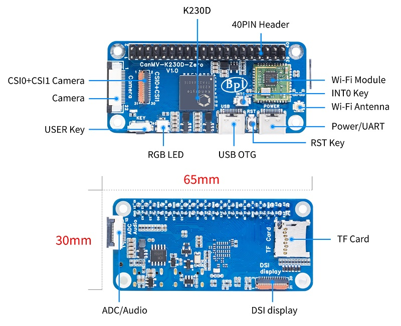
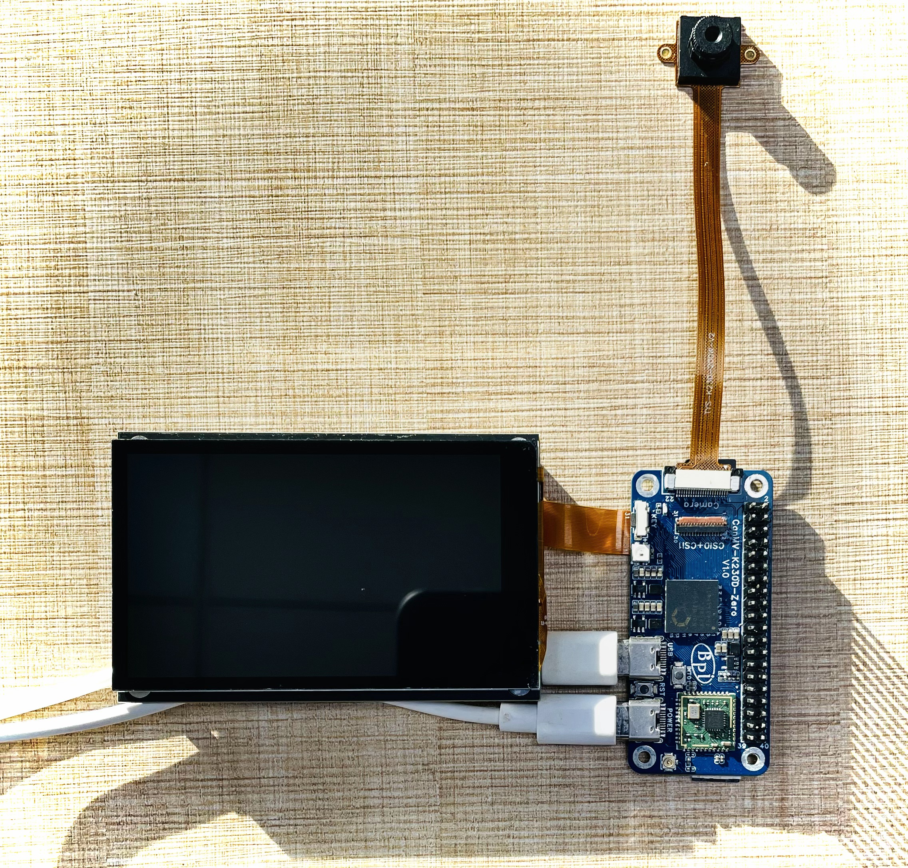

# CanMV-K230D Development Board

## 1. Overview

The CanMV-K230D Zero development board is a collaborative design by Canaan Technology and the Banana Pi open-source hardware community. It features with the Kendryte K230D chip, equipped with a dual-core XuanTie C908 RISC-V CPU and an independently developed third-generation KPU (Neural Network Processing Unit). The board includes 128MB of LPDDR4 memory, providing robust support for high-performance local AI inference computing. With its comprehensive development resources and compact design, the CanMV-K230D Zero is well-suited for a wide range of DIY projects, AIoT (Artificial Intelligence of Things) devices, and embedded system applications. It is an ideal choice for programming education, AI-based audio and video innovation, and system performance evaluation, empowering users to embark on a journey of technological exploration.

## 2. Technical Specifications

| Parameter            | Description                                                           |
|----------------------|-----------------------------------------------------------------------|
| **CPU**              | Dual-core XuanTie C908 RISC-V CPU   - Core 1: 1.6GHz, supports RVV1.0   - Core 2: 800MHz                   |
| **KPU**              | Third-generation Neural Network Processing Unit, supports multiple data types (e.g., INT8/INT16)   Typical performance: ResNet50 ≥ 85 fps@INT8, MobileNet_v2 ≥ 670 fps@INT8, YOLOv5s ≥ 38 fps@INT8    |
| **DPU**              | Integrated 3D structured light depth engine, supporting up to 1920×1080 resolution           |
| **VPU**              | Built-in H.264/H.265 hardware encoder and decoder                                      |
| **Video Input**      | Dual MIPI-CSI interfaces: 2-lane and 4-lane configurations            |
| **Display Output**   | MIPI DSI interface, supporting up to 1080P resolution                              |
| **RAM**              | 128MB LPDDR4 @ 2666Mbps                                                        |
| **Storage**          | Onboard TF card slot, supporting up to 1TB                                          |
| **USB**              | One USB 2.0 port, supporting OTG functionality                                         |
| **Network**          | 2.4GHz Wi-Fi module                                                             |
| **Audio**            | Onboard audio input/output interface                                              |
| **GPIO Expansion**   | 40-pin expandable GPIO, supports I2C, UART, I2S, SPI, PWM, ADC, JTAG, etc.                       |
| **Buttons**          | One function button and one reset button                                          |
| **Power Supply**     | USB Type-C, 5V/2A input                                                     |
| **Dimensions**       | 65mm (Length) × 30mm (Width) × 7mm (Height)                                   |

## 3. Connection Diagram

When using the BPI-CanMV-K230D Zero development board, connect two USB cables: one for power supply and the other for serial communication.

