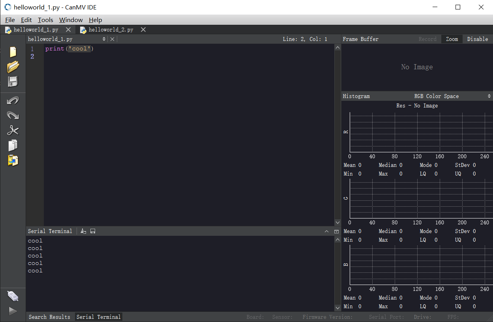
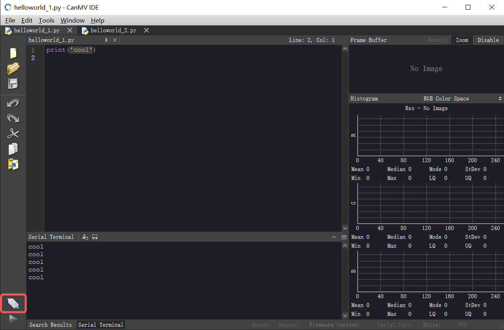
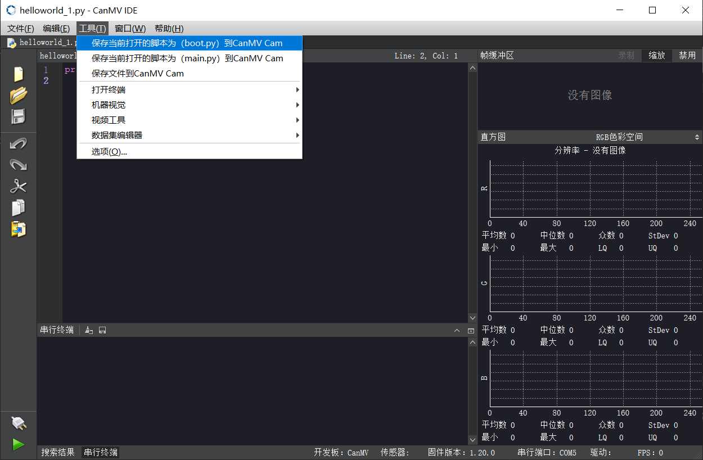

# K230 CanMV IDE使用说明

版权所有©2023北京嘉楠捷思信息技术有限公司

## 免责声明

您购买的产品、服务或特性等应受北京嘉楠捷思信息技术有限公司（“本公司”，下同）及其关联公司的商业合同和条款的约束，本文档中描述的全部或部分产品、服务或特性可能不在您的购买或使用范围之内。除非合同另有约定，本公司不对本文档的任何陈述、信息、内容的正确性、可靠性、完整性、适销性、符合特定目的和不侵权提供任何明示或默示的声明或保证。除非另有约定，本文档仅作为使用指导参考。

由于产品版本升级或其他原因，本文档内容将可能在未经任何通知的情况下，不定期进行更新或修改。

## 商标声明

、“嘉楠”和其他嘉楠商标均为北京嘉楠捷思信息技术有限公司及其关联公司的商标。本文档可能提及的其他所有商标或注册商标，由各自的所有人拥有。

**版权所有 © 2023北京嘉楠捷思信息技术有限公司。保留一切权利。**
非经本公司书面许可，任何单位和个人不得擅自摘抄、复制本文档内容的部分或全部，并不得以任何形式传播。

## 目录

[TOC]

## 前言

### 概述

本文档主要介绍CanMV IDE的使用。

### 读者对象

本文档（本指南）主要适用于以下人员：

- 技术支持工程师
- 软件开发工程师

### 缩略词定义

| 简称 | 说明 |
| ---- | ---- |
| MV  | Machine Vision   |

### 修订记录

| 文档版本号 | 修改说明 | 修改者     | 日期       |
| ---------- | -------- | ---------- | ---------- |
| V1.0       | 初版     | 黄子懿      | 2023-09-18 |

## 1. 概述

CanMV 基于 OpenMV 项目开发，CanMV IDE 与 OpenMV IDE 基本一致，主要修改了连接方式和通信协议等相关组件，IDE 基于 qtcreator 开发。

K230 使用的 CanMV IDE 与 K210 的一致，可以在[这里](https://github.com/kendryte/canmv_ide/releases)下载。

用户也可以选择使用 [OpenMV IDE](https://github.com/openmv/openmv-ide/releases)，但是 OpenMV IDE 只能连接 K230，不能连接 K210，使用 4.0 以上版本的 OpenMV IDE 连接可以获得更高的图像显示帧率。

## 2. 快速上手

### 2.1 连接开发板

将开发板的USB端口连接到电脑，点击界面左下角的连接按钮。

选择 USB 端口对应的COM号，如图为 COM14，并点击 OK ，等待连接完成。

如果使用 OpenMV IDE，则直接点击左下角的连接按钮即可。

### 2.2 运行 Python 代码

运行代码前首先需要在编辑器中打开一个代码文件，如图已经打开了一个文件，点击左下角的运行按钮即可运行当前文件，如下图运行了`print('cool')`，在串口终端中打印了一个`cool`。

### 2.3 保存代码和文件到开发板

点击菜单栏中的`工具`或者`Tools`选项，前三个选项都可以将文件保存到开发板的`/sdcard`目录下。

前两个选项会分别将当前打开的文件保存为固定的`boot.py`或`main.py`，这两个文件功能一致，都是在CanMV启动时运行，但是`boot.py`会先运行，`main.py`后运行。

第三个选项`保存文件到CanMV Cam`可以保存一个指定的文件到开发板。

