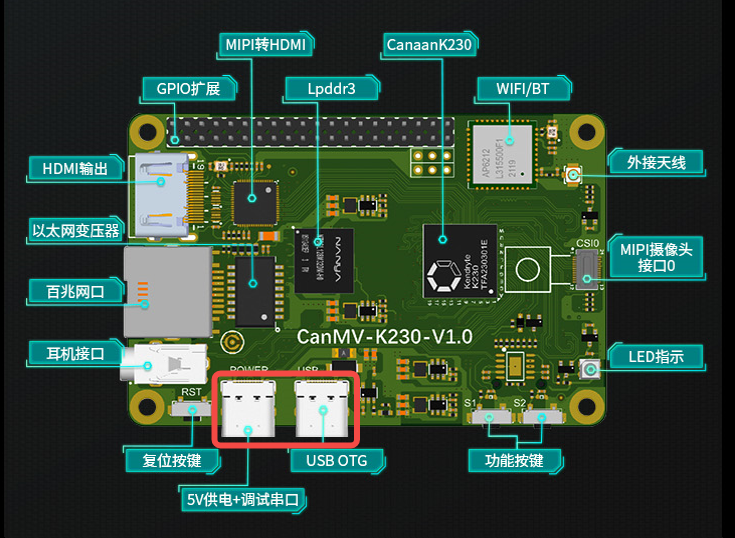
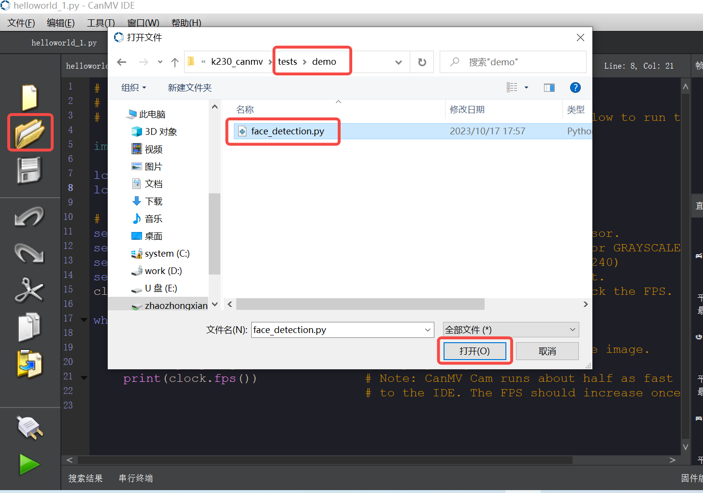

# CanMV-K230 快速入门指南

版权所有©2023北京嘉楠捷思信息技术有限公司

## 免责声明

您购买的产品、服务或特性等应受北京嘉楠捷思信息技术有限公司（“本公司”，下同）及其关联公司的商业合同和条款的约束，本文档中描述的全部或部分产品、服务或特性可能不在您的购买或使用范围之内。除非合同另有约定，本公司不对本文档的任何陈述、信息、内容的正确性、可靠性、完整性、适销性、符合特定目的和不侵权提供任何明示或默示的声明或保证。除非另有约定，本文档仅作为使用指导参考。

由于产品版本升级或其他原因，本文档内容将可能在未经任何通知的情况下，不定期进行更新或修改。

## 商标声明

、“嘉楠”和其他嘉楠商标均为北京嘉楠捷思信息技术有限公司及其关联公司的商标。本文档可能提及的其他所有商标或注册商标，由各自的所有人拥有。

**版权所有 © 2023北京嘉楠捷思信息技术有限公司。保留一切权利。**
非经本公司书面许可，任何单位和个人不得擅自摘抄、复制本文档内容的部分或全部，并不得以任何形式传播。

## 目录

[TOC]

## 1. 开发板概况

CanMV-K230开发板采用的是嘉楠科技Kendryte®系列AIoT芯片中的最新一代SoC芯片K230。该芯片采用全新的多异构单元加速计算架构，集成了2个RISC-V高能效计算核心，内置新一代KPU（Knowledge Process Unit）智能计算单元，具备多精度AI算力，广泛支持通用的AI计算框架，部分典型网络的利用率超过了70%。

该芯片同时具备丰富多样的外设接口，以及2D、2.5D等多个标量、向量、图形等专用硬件加速单元，可以对多种图像、视频、音频、AI等多样化计算任务进行全流程计算加速，具备低延迟、高性能、低功耗、快速启动、高安全性等多项特性。

CanMV-K230采用单板设计，扩展接口丰富，极大程度的发挥K230高性能的优势，可直接用于各种智能产品的开发，加速产品落地。

## 2. CanMV-K230默认套件

CanMV-K230开发板默认套件包含以下物品：

1、CanMV-K230主板 x 1

2、OV5647摄像头 x 1

3、Type-C数据线 x 1

另外，需要用户准备以下配件：

1、TF卡， 用于烧写固件，启动系统（必须）

2、带HDMI接口的显示器及HDMI连接线，显示器要求支持1080P30，否则无法显示

3、100M/1000M 以太网线缆，及有线路由器

4、Type-C数据线

## 3 USB连接

使用Type-C线连接CanMV-K230如下图的位置，线另一端连接至电脑

### 3.2 Windows

查看设备管理器

- `USB-Enhanced-SERIAL-A CH342（COM80）`为小核linux调试串口
- `USB-Enhanced-SERIAL-B CH342（COM81）`为大核rt-smart调试串口
- `USB串行设备（COM75）`为micropython REPL串口 是CanMV-IDE需要连接的串口。

### 3.2.2 linux

Linux串口显示如下：

- `/dev/ttyACM0`为小核linux调试串口
- `/dev/ttyACM1`为大核rt-smart调试串口
- `/dev/ttyACM2`为micropython REPL串口 是CanMV-IDE需要连接的串口。

## 4 固件获取及烧录

### 4.1 固件获取

CanMV-K230 固件下载地址： <https://github.com/kendryte/k230_canmv/releases>

请下载“sysimage-sdcard.img.gz”结尾的gz压缩包，解压得到sysimage-sdcard.img文件，即为CanMV-K230的固件。

### 4.2 固件烧录

将固件通过电脑烧写至TF卡中。

#### 4.2.1 Linux下烧录

在TF卡插到宿主机之前，输入：

`ls -l /dev/sd\*`

查看当前的存储设备。

将TF卡插入宿主机后，再次输入：

`ls -l /dev/sd\*`

查看此时的存储设备，新增加的就是TF卡设备节点。

假设/dev/sdc就是TF卡设备节点，执行如下命令烧录TF卡：

`sudo dd if=sysimage-sdcard.img of=/dev/sdc bs=1M oflag=sync`

#### 4.2.2 Windows下烧录

Windows下可通过balena Etcher工具对TF卡进行烧录（balena Etcher工具下载地址<https://www.balena.io/etcher/>）。

1）将TF卡插入PC，然后启动balena Etcher工具，点击工具界面的"Flash from file”按钮，选择待烧写的固件。

2）点击工具界面的“Select target”按钮，选择目标sdcard卡。

3）点击“Flash”按钮开始烧写，烧写过程有进度条展示，烧写结束后会提示Flash Finish。

## 5 CanMV-IDE下载

下载地址 : <https://github.com/kendryte/canmv_ide/releases>

用户也可以选择使用 OpenMV IDE : <https://github.com/openmv/openmv-ide/releases>

## 6 启动系统

将烧好固件的TF卡插入CanMV-K230 TF卡插槽，Type-C线连接电脑和板端的POWER口，板子即上电，系统开始启动。

### 6.1 连接开发板

打开CanMV-IDE，连接开发板如下图所示

点击左下角红框按钮，选择串口，点击OK进行连接。

等待下图框消失

左下角图标变为绿色三角，即为连接成功。

### 6.2 运行python

在 <https://github.com/kendryte/k230_canmv/tree/main/tests> 下载测试程序，通过IDE加载。

点击打开按钮，选择下载的文件，打开。 点击左下角的绿色按钮运行，等待一会儿，显示器会显示sensor采集的图像，该程序为人脸检测程序，可以看到人脸被框出。

