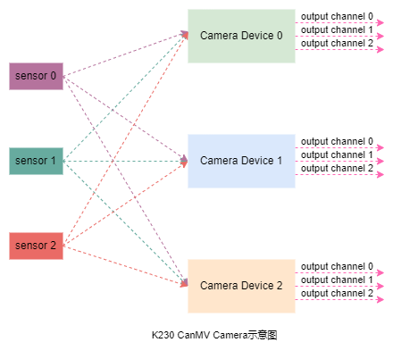

# 3.1 Sensor 模块 API 手册

```{attention}
该模块自固件版本 V0.7 起发生了较大改动，若使用 V0.7 之前的固件，请参考旧版本文档。
```

## 1. 概述

CanMV K230 平台的 `sensor` 模块负责图像采集与数据处理。该模块提供了一套高级 API，开发者可以利用这些接口轻松获取不同格式与尺寸的图像，而无需了解底层硬件的具体实现。其架构如下图所示：



图中，sensor 0、sensor 1 和 sensor 2 分别代表三个图像输入传感器设备；Camera Device 0、Camera Device 1 和 Camera Device 2 对应相应的图像处理单元；output channel 0、output channel 1 和 output channel 2 表示每个图像处理单元最多支持三个输出通道。通过软件配置，不同的传感器设备可以灵活映射到相应的图像处理单元。

CanMV K230 的 `sensor` 模块最多支持三路图像传感器的同时接入，每一路均可独立完成图像数据的采集、捕获和处理。此外，每个视频通道可并行输出三路图像数据供后端模块进行进一步处理。实际应用中，具体支持的传感器数量、输入分辨率和输出通道数将受限于开发板的硬件配置和内存大小，因此需根据项目需求进行综合评估。

## 2. API 介绍

### 构造函数

**描述**

通过 `csi id` 和图像传感器类型构建 `Sensor` 对象。

在图像处理应用中，用户通常需要首先创建一个 `Sensor` 对象。CanMV K230 软件可以自动检测内置的图像传感器，无需用户手动指定具体型号，只需设置传感器的最大输出分辨率和帧率。有关支持的图像传感器信息，请参见[图像传感器支持列表](#4-图像传感器支持列表)。如果设定的分辨率或帧率与当前传感器的默认配置不符，系统会自动调整为最优配置，最终的配置可在日志中查看，例如 `use sensor 23, output 640x480@90`。

**语法**

```python
sensor = Sensor(id, [width, height, fps])
```

**参数**

| 参数名称 | 描述                              | 输入/输出 | 说明                          |
|----------|-----------------------------------|-----------|-------------------------------|
| id       | `csi` 端口，支持 `0-2`，具体端口请参考硬件原理图 | 输入      | 可选，不同型号开发板的默认值不同 |
| width    | `sensor` 最大输出图像宽度         | 输入      | 可选，默认 `1920`             |
| height   | `sensor` 最大输出图像高度         | 输入      | 可选，默认 `1080`             |
| fps      | `sensor` 最大输出图像帧率         | 输入      | 可选，默认 `30`               |

**返回值**

| 返回值     | 描述                  |
|------------|-----------------------|
| Sensor 对象 | 传感器对象            |

**举例**

```python
sensor = Sensor(id=0)
sensor = Sensor(id=0, width=1280, height=720, fps=60)
sensor = Sensor(id=0, width=640, height=480)
```

### 2.1 sensor.reset

**描述**

复位 `sensor` 对象。在构造 `Sensor` 对象后，必须调用此函数以继续执行其他操作。

**语法**

```python
sensor.reset()
```

**参数**

| 参数名称 | 描述 | 输入/输出 |
|----------|------|-----------|
| 无       |      |           |

**返回值**

| 返回值 | 描述 |
|--------|------|
| 无     |      |

**举例**

```python
# 初始化 sensor 设备 0 以及传感器 OV5647
sensor.reset()
```

### 2.2 sensor.set_framesize

**描述**

设置指定通道的输出图像尺寸。用户可以通过 `framesize` 参数或直接指定 `width` 和 `height` 来配置输出图像尺寸。**宽度会自动对齐到 16 像素宽**。

**语法**

```python
sensor.set_framesize(framesize=FRAME_SIZE_INVALID, chn=CAM_CHN_ID_0, alignment=0, **kwargs)
```

**参数**

| 参数名称 | 描述              | 输入/输出 |
|----------|-------------------|-----------|
| framesize| sensor 输出图像尺寸 | 输入      |
| chn      | sensor 输出通道号   | 输入      |
| width    | 输出图像宽度，*kw_arg*  | 输入      |
| height   | 输出图像高度，*kw_arg*  | 输入      |

**返回值**

| 返回值 | 描述 |
|--------|------|
| 无     |      |

**注意事项**

- 输出图像尺寸不得超过图像传感器的实际输出能力。
- 各通道的最大输出图像尺寸受硬件限制。

**举例**

```python
# 配置 sensor 设备 0，输出通道 0，输出图尺寸为 640x480
sensor.set_framesize(chn=CAM_CHN_ID_0, width=640, height=480)

# 配置 sensor 设备 0，输出通道 1，输出图尺寸为 320x240
sensor.set_framesize(chn=CAM_CHN_ID_1, width=320, height=240)
```

### 2.3 sensor.set_pixformat

**描述**

配置指定通道的图像传感器输出图像格式。

**语法**

```python
sensor.set_pixformat(pix_format, chn=CAM_CHN_ID_0)
```

**参数**

| 参数名称   | 描述              | 输入/输出 |
|------------|-------------------|-----------|
| pix_format | 输出图像格式       | 输入      |
| chn        | sensor 输出通道号  | 输入      |

**返回值**

| 返回值 | 描述 |
|--------|------|
| 无     |      |

**举例**

```python
# 配置 sensor 设备 0，输出通道 0，输出 NV12 格式
sensor.set_pixformat(sensor.YUV420SP, chn=CAM_CHN_ID_0)

# 配置 sensor 设备 0，输出通道 1，输出 RGB888 格式
sensor.set_pixformat(sensor.RGB888, chn=CAM_CHN_ID_1)
```

### 2.4 sensor.set_hmirror

**描述**

配置图像传感器是否进行水平镜像。

**语法**

```python
sensor.set_hmirror(enable)
```

**参数**

| 参数名称 | 描述                                    | 输入/输出 |
|----------|-----------------------------------------|-----------|
| enable   | `True` 开启水平镜像功能<br>`False` 关闭水平镜像功能 | 输入      |

**返回值**

| 返回值 | 描述 |
|--------|------|
| 无     |      |

**举例**

```python
sensor.set_hmirror(True)
```

### 2.5 sensor.set_vflip

**描述**

配置图像传感器是否进行垂直翻转。

**语法**

```python
sensor.set_vflip(enable)
```

**参数**

| 参数名称 | 描述                                    | 输入/输出 |
|----------|-----------------------------------------|-----------|
| enable   | `True` 开启垂直翻转功能<br>`False` 关闭垂直翻转功能 | 输入      |

**返回值**

| 返回值 | 描述 |
|--------|------|
| 无     |      |

**举例**

```python
sensor.set_vflip(True)
```

### 2.6 sensor.run

**描述**

启动图像传感器的输出。**必须在调用 `MediaManager.init()` 之前执行此操作。**

**语法**

```python
sensor.run()
```

**返回值**

| 返回值 | 描述 |
|--------|------|
| 无     |      |

**注意事项**

- 当同时使用多个传感器（最多 3 个）时，仅需其中一个执行 `run` 即可。

**举例**

```python
# 启动 sensor 设备输出数据流
sensor.run()
```

### 2.7 sensor.stop

**描述**

停止图像传感器输出。**必须在 `MediaManager.deinit()` 之前调用此方法。**

**语法**

```python
sensor.stop()
```

**返回值**

| 返回值 | 描述 |
|--------|------|
| 无     |      |

**注意事项**

- 如果同时使用多个图像传感器（最多 3 个），**每个传感器都需单独调用 `stop`**。

**举例**

```python
# 停止 sensor 设备 0 的数据流输出
sensor.stop()
```

### 2.8 sensor.snapshot

**描述**

从指定输出通道中捕获一帧图像数据。

**语法**

```python
sensor.snapshot(chn=CAM_CHN_ID_0)
```

**参数**

| 参数名称 | 描述              | 输入/输出 |
|----------|-------------------|-----------|
| chn      | sensor 输出通道号  | 输入      |

**返回值**

| 返回值    | 描述            |
|-----------|-----------------|
| image 对象 | 捕获的图像数据  |
| 其他      | 捕获失败        |

**举例**

```python
# 从 sensor 设备 0 的通道 0 捕获一帧图像数据
sensor.snapshot()
```

## 3. 数据结构描述

### 3.1 frame_size

| 图像帧尺寸 | 分辨率       |
|------------|--------------|
| QQCIF      | 88x72        |
| QCIF       | 176x144      |
| CIF        | 352x288      |
| QSIF       | 176x120      |
| SIF        | 352x240      |
| QQVGA      | 160x120      |
| QVGA       | 320x240      |
| VGA        | 640x480      |
| HQQVGA     | 120x80       |
| HQVGA      | 240x160      |
| HVGA       | 480x320      |
| B64X64     | 64x64        |
| B128X64    | 128x64       |
| B128X128   | 128x128      |
| B160X160   | 160x160      |
| B320X320   | 320x320      |
| QQVGA2     | 128x160      |
| WVGA       | 720x480      |
| WVGA2      | 752x480      |
| SVGA       | 800x600      |
| XGA        | 1024x768     |
| WXGA       | 1280x768     |
| SXGA       | 1280x1024    |
| SXGAM      | 1280x960     |
| UXGA       | 1600x1200    |
| HD         | 1280x720     |
| FHD        | 1920x1080    |
| QHD        | 2560x1440    |
| QXGA       | 2048x1536    |
| WQXGA      | 2560x1600    |
| WQXGA2     | 2592x1944    |

### 3.2 pixel_format

| 像素格式  | 说明         |
|-----------|--------------|
| RGB565    | 16 位 RGB 格式 |
| RGB888    | 24 位 RGB 格式 |
| RGBP888   | 分离的 24 位 RGB |
| YUV420SP  | 半平面 YUV  |
| GRAYSCALE | 灰度图       |

### 3.3 channel

| 通道号      | 说明     |
|-------------|----------|
| CAM_CHN_ID_0 | 通道 0  |
| CAM_CHN_ID_1 | 通道 1  |
| CAM_CHN_ID_2 | 通道 2  |
| CAM_CHN_ID_MAX | 非法通道 |

## 4. 图像传感器支持列表

| 图像传感器型号 | 分辨率<br>Width x Height | 帧率   |
|----------------|---------------------------|--------|
| OV5647         | 2592x1944                 | 10 FPS |
|                | 1920x1080                 | 30 FPS |
|                | 1280x960                  | 45 FPS |
|                | 1280x720                  | 60 FPS |
|                | 640x480                   | 90 FPS |
| GC2093         | 1920x1080                 | 30 FPS |
|                | 1920x1080                 | 60 FPS |
|                | 1280x960                  | 60 FPS |
|                | 1280x720                  | 90 FPS |
| IMX335         | 1920x1080                 | 30 FPS |
|                | 2592x1944                 | 30 FPS |
