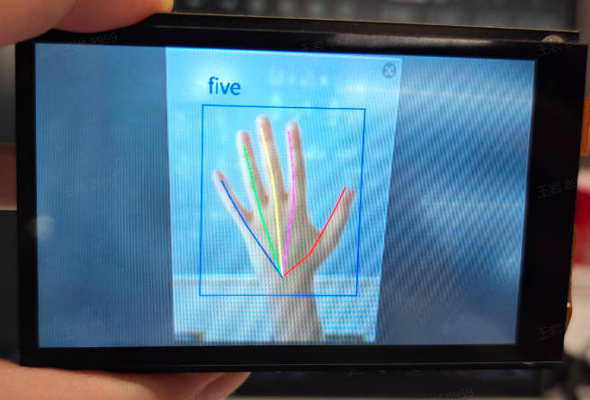
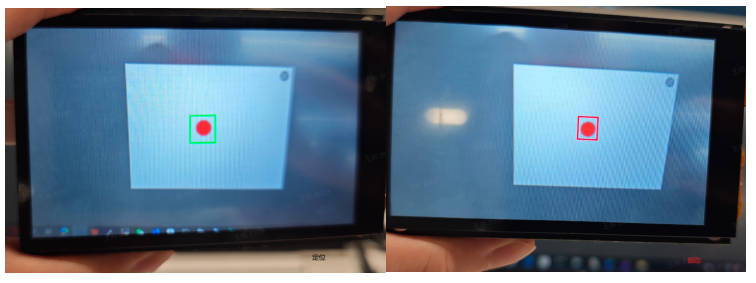
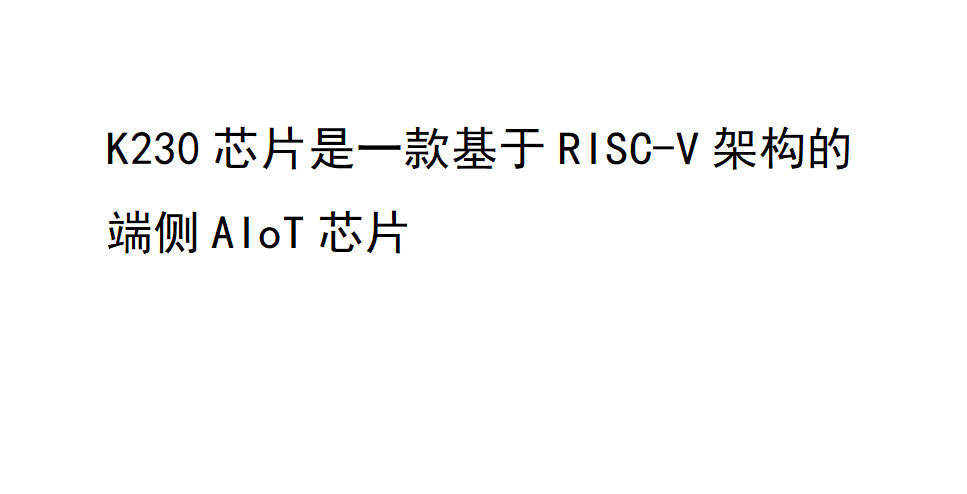
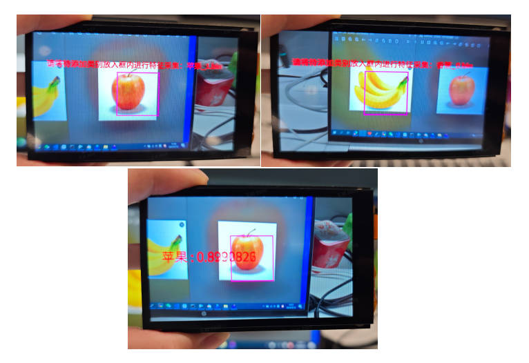

# AI Demo说明文档

## AI Demo应用

K230 支持丰富的 AI 应用。为了方便用户体验试用，CanMV K230 镜像内置了多个 AI Demo 应用， 分为单模型应用和多模型应用两种，内容涵盖物体、人脸、人手、人体、车牌、OCR、音频（KWS、TTS）等多个应用领域。用户可以通过 CanMV IDE 打开源代码后方便的运行。AI Demo 应用的源代码位于 `/CanMV/sdcard/examples/05-AI-Demo` 目录下。AI Demo 应用列表如下，一些 Demo 在 K230D 芯片上因为内存限制无法运行，请注意适配列表。

| Demo 名称                | 场景            | 任务类型   | K230 | K230D |
| ----------------------- | --------------- | ---------- | ---- | ---- |
| body_seg                | 人体部位分割    | 单模型任务 | √ |  |
| dynamic_gesture         | 动态手势识别    | 多模型任务 | √ | √ |
| eye_gaze                | 注视估计        | 多模型任务 | √ |  |
| face_detection          | 人脸检测        | 单模型任务 | √ | √ |
| face_landmark           | 人脸关键部位    | 多模型任务 | √ | √ |
| face_mesh               | 人脸3D网格      | 多模型任务 | √ |  |
| face_parse              | 人脸解析        | 多模型任务 | √ |  |
| face_pose               | 人脸姿态        | 多模型任务 | √ | √ |
| face_registration       | 人脸注册        | 多模型任务 | √ |  |
| face_recognition        | 人脸识别        | 多模型任务 | √ |  |
| face_registration_lite  | 轻量人脸注册     | 多模型任务 | √ | √ |
| face_recognition_lite   | 轻量人脸识别     | 多模型任务 | √ | √ |
| falldown_detection      | 跌倒检测        | 单模型任务 | √ | √ |
| finger_guessing         | 猜拳游戏        | 多模型任务 | √ | √ |
| hand_detection          | 手掌检测        | 单模型任务 | √ | √ |
| hand_keypoint_class     | 手掌关键点分类  | 多模型任务 | √ | √ |
| hand_keypoint_detection | 手掌关键点检测  | 多模型任务 | √ | √ |
| hand_recognition        | 手势识别        | 多模型任务 | √ | √ |
| keyword_spotting        | 关键词唤醒      | 单模型任务 | √ | √ |
| multi_kws               | 多命令关键词唤醒 | 单模型任务 | √ | √ |
| licence_det             | 车牌检测        | 单模型任务 | √ | √ |
| licence_det_rec         | 车牌识别        | 多模型任务 | √ | √ |
| nanotracker             | 单目标跟踪      | 多模型任务 | √ | √ |
| object_detect_yolov8n   | yolov8n目标检测 | 单模型任务 | √ | √ |
| ocr_det                 | OCR检测         | 单模型任务 | √ |  |
| ocr_rec                 | OCR识别         | 多模型任务 | √ |  |
| person_detection        | 人体检测        | 单模型任务 | √ | √ |
| person_kp_detect        | 人体关键点检测  | 多模型任务 | √ | √ |
| puzzle_game             | 拼图游戏        | 多模型任务 | √ | √ |
| segment_yolov8n         | yolov8分割      | 单模型任务 | √ |  |
| self_learning           | 自学习          | 单模型任务 | √ | √ |
| space_resize            | 局部放大器      | 多模型任务 | √ | √ |
| tts_zh                  | 中文文本转语音  | 多模型任务 | √ |  |
| yolo11n_obb             | yolo11n旋转目标检测| 单模型任务 | √ |√ |
| yolov8n_obb             | yolov8n旋转目标检测| 单模型任务 | √ |√ |

```{admonition} 提示
K230D 芯片的开发板运行上述 demo 需要更改 `__main__` 中的 `display_mode` 为 `lcd` 适配显示输出，同时需要按照注释降低分辨率运行。同时部分 demo 无法在 K230D 上运行，详情见上述表格。
```

## AI Demo开发框架介绍

### AI Demo开发框架

为了帮助用户简化 AI 部分的开发，基于 K230_CanMV 提供的 API 接口，我们搭建了配套的 AI 开发框架。框架结构如下图所示：


Camera 默认输出两路图像：一路格式为 YUV420SP (Sensor.YUV420SP)，直接提供给 Display 显示；另一路格式为 RGBP888 (Sensor.RGBP888)，则用于 AI 部分进行处理。AI 主要负责任务的前处理、推理和后处理流程。处理完成后，结果将绘制在 OSD 图像实例上，并发送给 Display 进行叠加显示。

```{admonition} 提示
PipeLine 流程封装主要简化视觉任务的开发过程。您可以使用 'get_frame' 获取一帧图像以进行机器视觉处理；如果您希望自定义 AI 过程，请参考 [face_detection](./face_detection.md)。若使用音频相关的 AI，请参考 demo 中的 keyword_spotting 和 tts_zh 两个示例。

```

### 接口封装

为了方便用户开发，基于上述框架，对从 Camera 获取图像、AI2D 预处理、kmodel模型推理部分的通用功能做了封装。封装接口请参考：[AI Demo API](../../api/aidemo_libs.md)

### 应用方法和示例

#### 概述

用户可根据具体的AI场景自写任务类继承AIBase，可以将任务分为如下四类：单模型任务、多模型任务，自定义预处理任务、无预处理任务。不同任务需要编写不同的代码实现，具体如下图所示：


关于不同任务的介绍：

| 任务类型         | 任务描述                                                     | 代码说明                                                     |
| ---------------- | ------------------------------------------------------------ | ------------------------------------------------------------ |
| 单模型任务       | 该任务只有一个模型，只需要关注该模型的前处理、推理、后处理过程，此类任务的前处理使用Ai2d实现，可能使用一个Ai2d实例，也可能使用多个Ai2d实例，后处理基于场景自定义。 | 编写自定义任务类，主要关注任务类的config_preprocess、postprocess、以及该任务需要的其他方法如：draw_result等。<br />如果该任务包含多个Ai2d实例，则需要重写preprocess，按照预处理的顺序设置预处理阶段的计算过程。 |
| 自定义预处理任务 | 该任务只有一个模型，只需要关注该模型的前处理、推理、后处理过程，此类任务的前处理不使用Ai2d实现，可以使用ulab.numpy自定义，后处理基于场景自定义。 | 编写自定义任务类，主要关注任务类的preprocess、postprocess、以及该任务需要的其他方法如：draw_result等 |
| 无预处理任务     | 该任务只有一个模型且不需要预处理，只需要关注该模型的推理和后处理过程，此类任务一般作为多模型任务的一部分，直接对前一个模型的输出做为输入推理，后处理基于需求自定义。 | 编写自定义任务类，主要关注任务类的run(模型推理的整个过程，包括preprocess、inference、postprocess中的全部或某一些步骤)、postprocess、以及该任务需要的其他方法如：draw_results等 |
| 多模型任务       | 该任务包含多个模型，可能是串联，也可能是其他组合方式。对于每个模型基本上属于前三种模型中的一种，最后通过一个完整的任务类将上述模型子任务统一起来。 | 编写多个子模型任务类，不同子模型任务参照前三种任务定义。不同任务关注不同的方法。<br />编写多模型任务类，将子模型任务类统一起来实现整个场景。 |

#### 单模型任务

单模型任务的伪代码结构如下：

```python
from libs.PipeLine import PipeLine
from libs.AIBase import AIBase
from libs.AI2D import Ai2d
from libs.Utils import *
import os
from media.media import *
import nncase_runtime as nn
import ulab.numpy as np
import image
import gc
import sys

# 自定义AI任务类，继承自AIBase基类
class MyAIApp(AIBase):
    def __init__(self, kmodel_path, model_input_size, rgb888p_size=[224,224], display_size=[1920,1080], debug_mode=0):
        # 调用基类的构造函数
        super().__init__(kmodel_path, model_input_size, rgb888p_size, debug_mode)
        # 模型文件路径
        self.kmodel_path = kmodel_path
        # 模型输入分辨率
        self.model_input_size = model_input_size
        # sensor给到AI的图像分辨率，并对宽度进行16的对齐
        self.rgb888p_size = [ALIGN_UP(rgb888p_size[0], 16), rgb888p_size[1]]
        # 显示分辨率，并对宽度进行16的对齐
        self.display_size = [ALIGN_UP(display_size[0], 16), display_size[1]]
        # 是否开启调试模式
        self.debug_mode = debug_mode
        # 实例化Ai2d，用于实现模型预处理
        self.ai2d = Ai2d(debug_mode)
        # 设置Ai2d的输入输出格式和类型
        self.ai2d.set_ai2d_dtype(nn.ai2d_format.NCHW_FMT, nn.ai2d_format.NCHW_FMT, np.uint8, np.uint8)

    # 配置预处理操作，这里使用了resize，Ai2d支持crop/shift/pad/resize/affine，具体代码请打开/sdcard/libs/AI2D.py查看
    def config_preprocess(self, input_image_size=None):
        with ScopedTiming("set preprocess config", self.debug_mode > 0):
            # 初始化ai2d预处理配置，默认为sensor给到AI的尺寸，可以通过设置input_image_size自行修改输入尺寸
            ai2d_input_size = input_image_size if input_image_size else self.rgb888p_size
            # 配置resize预处理方法
            self.ai2d.resize(nn.interp_method.tf_bilinear, nn.interp_mode.half_pixel)
            # 构建预处理流程
            self.ai2d.build([1,3,ai2d_input_size[1],ai2d_input_size[0]],[1,3,self.model_input_size[1],self.model_input_size[0]])

    # 自定义当前任务的后处理，results是模型输出array列表，需要根据实际任务重写
    def postprocess(self, results):
        with ScopedTiming("postprocess", self.debug_mode > 0):
           pass

    # 绘制结果到画面上，需要根据任务自己写
    def draw_result(self, pl, dets):
        with ScopedTiming("display_draw", self.debug_mode > 0):
            pass

if __name__ == "__main__":
    # 显示模式，默认"hdmi",可以选择"hdmi"和"lcd"
    display_mode="hdmi"
    if display_mode=="hdmi":
        display_size=[1920,1080]
    else:
        display_size=[800,480]
    # 设置模型路径，这里要替换成当前任务模型
    kmodel_path = "example_test.kmodel"
    rgb888p_size = [1920, 1080]
    ###### 其它参数########
    ...
    ######################

    # 初始化PipeLine，用于图像处理流程
    pl = PipeLine(rgb888p_size=rgb888p_size, display_size=display_size, display_mode=display_mode)
    pl.create()  # 创建PipeLine实例
    # 初始化自定义AI任务实例
    my_ai = MyAIApp(kmodel_path, model_input_size=[320, 320],rgb888p_size=rgb888p_size, display_size=display_size, debug_mode=0)
    my_ai.config_preprocess()  # 配置预处理
    while True:
        with ScopedTiming("total",1):
            img = pl.get_frame()            # 获取当前帧数据
            res = my_ai.run(img)            # 推理当前帧
            my_ai.draw_result(pl, res)      # 绘制结果
            pl.show_image()                 # 显示结果
            gc.collect()                    # 垃圾回收
    my_ai.deinit()                          # 反初始化
    pl.destroy()                            # 销毁PipeLine实例

```

下面以人脸检测为例给出示例代码：

```python
from libs.PipeLine import PipeLine
from libs.AIBase import AIBase
from libs.AI2D import Ai2d
from libs.Utils import *
from media.media import *
import nncase_runtime as nn
import ulab.numpy as np
import time,os,sys,ujson,gc,random
import image
import aidemo

# 自定义人脸检测类，继承自AIBase基类
class FaceDetectionApp(AIBase):
    def __init__(self, kmodel_path, model_input_size, anchors, confidence_threshold=0.5, nms_threshold=0.2, rgb888p_size=[224,224], display_size=[1920,1080], debug_mode=0):
        super().__init__(kmodel_path, model_input_size, rgb888p_size, debug_mode)  # 调用基类的构造函数
        self.kmodel_path = kmodel_path  # 模型文件路径
        self.model_input_size = model_input_size  # 模型输入分辨率
        self.confidence_threshold = confidence_threshold  # 置信度阈值
        self.nms_threshold = nms_threshold  # NMS（非极大值抑制）阈值
        self.anchors = anchors  # 锚点数据，用于目标检测
        self.rgb888p_size = [ALIGN_UP(rgb888p_size[0], 16), rgb888p_size[1]]  # sensor给到AI的图像分辨率，并对宽度进行16的对齐
        self.display_size = [ALIGN_UP(display_size[0], 16), display_size[1]]  # 显示分辨率，并对宽度进行16的对齐
        self.debug_mode = debug_mode  # 是否开启调试模式
        self.ai2d = Ai2d(debug_mode)  # 实例化Ai2d，用于实现模型预处理
        self.ai2d.set_ai2d_dtype(nn.ai2d_format.NCHW_FMT, nn.ai2d_format.NCHW_FMT, np.uint8, np.uint8)  # 设置Ai2d的输入输出格式和类型

    # 配置预处理操作，这里使用了pad和resize，Ai2d支持crop/shift/pad/resize/affine，具体代码请打开/sdcard/app/libs/AI2D.py查看
    def config_preprocess(self, input_image_size=None):
        with ScopedTiming("set preprocess config", self.debug_mode > 0):  # 计时器，如果debug_mode大于0则开启
            ai2d_input_size = input_image_size if input_image_size else self.rgb888p_size  # 初始化ai2d预处理配置，默认为sensor给到AI的尺寸，可以通过设置input_image_size自行修改输入尺寸
            top, bottom, left, right = self.get_padding_param()  # 获取padding参数
            self.ai2d.pad([0, 0, 0, 0, top, bottom, left, right], 0, [104, 117, 123])  # 填充边缘
            self.ai2d.resize(nn.interp_method.tf_bilinear, nn.interp_mode.half_pixel)  # 缩放图像
            self.ai2d.build([1,3,ai2d_input_size[1],ai2d_input_size[0]],[1,3,self.model_input_size[1],self.model_input_size[0]])  # 构建预处理流程

    # 自定义当前任务的后处理，results是模型输出array列表，这里使用了aidemo库的face_det_post_process接口
    def postprocess(self, results):
        with ScopedTiming("postprocess", self.debug_mode > 0):
            post_ret = aidemo.face_det_post_process(self.confidence_threshold, self.nms_threshold, self.model_input_size[1], self.anchors, self.rgb888p_size, results)
            if len(post_ret) == 0:
                return post_ret
            else:
                return post_ret[0]

    # 绘制检测结果到画面上
    def draw_result(self, pl, dets):
        with ScopedTiming("display_draw", self.debug_mode > 0):
            if dets:
                pl.osd_img.clear()  # 清除OSD图像
                for det in dets:
                    # 将检测框的坐标转换为显示分辨率下的坐标
                    x, y, w, h = map(lambda x: int(round(x, 0)), det[:4])
                    x = x * self.display_size[0] // self.rgb888p_size[0]
                    y = y * self.display_size[1] // self.rgb888p_size[1]
                    w = w * self.display_size[0] // self.rgb888p_size[0]
                    h = h * self.display_size[1] // self.rgb888p_size[1]
                    pl.osd_img.draw_rectangle(x, y, w, h, color=(255, 255, 0, 255), thickness=2)  # 绘制矩形框
            else:
                pl.osd_img.clear()

    # 获取padding参数
    def get_padding_param(self):
        dst_w = self.model_input_size[0]  # 模型输入宽度
        dst_h = self.model_input_size[1]  # 模型输入高度
        ratio_w = dst_w / self.rgb888p_size[0]  # 宽度缩放比例
        ratio_h = dst_h / self.rgb888p_size[1]  # 高度缩放比例
        ratio = min(ratio_w, ratio_h)  # 取较小的缩放比例
        new_w = int(ratio * self.rgb888p_size[0])  # 新宽度
        new_h = int(ratio * self.rgb888p_size[1])  # 新高度
        dw = (dst_w - new_w) / 2  # 宽度差
        dh = (dst_h - new_h) / 2  # 高度差
        top = int(round(0))
        bottom = int(round(dh * 2 + 0.1))
        left = int(round(0))
        right = int(round(dw * 2 - 0.1))
        return top, bottom, left, right

if __name__ == "__main__":
    # 显示模式，默认"hdmi",可以选择"hdmi"和"lcd"
    display_mode="hdmi"
    # k230保持不变，k230d可调整为[640,360]
    rgb888p_size = [1920, 1080]

    if display_mode=="hdmi":
        display_size=[1920,1080]
    else:
        display_size=[800,480]
    # 设置模型路径和其他参数
    kmodel_path = "/sdcard/examples/kmodel/face_detection_320.kmodel"
    # 其它参数
    confidence_threshold = 0.5
    nms_threshold = 0.2
    anchor_len = 4200
    det_dim = 4
    anchors_path = "/sdcard/examples/utils/prior_data_320.bin"
    anchors = np.fromfile(anchors_path, dtype=np.float)
    anchors = anchors.reshape((anchor_len, det_dim))

    # 初始化PipeLine，用于图像处理流程
    pl = PipeLine(rgb888p_size=rgb888p_size, display_size=display_size, display_mode=display_mode)
    pl.create()  # 创建PipeLine实例
    # 初始化自定义人脸检测实例
    face_det = FaceDetectionApp(kmodel_path, model_input_size=[320, 320], anchors=anchors, confidence_threshold=confidence_threshold, nms_threshold=nms_threshold, rgb888p_size=rgb888p_size, display_size=display_size, debug_mode=0)
    face_det.config_preprocess()  # 配置预处理

    while True:
        with ScopedTiming("total",1):
            img = pl.get_frame()            # 获取当前帧数据
            res = face_det.run(img)         # 推理当前帧
            face_det.draw_result(pl, res)   # 绘制结果
            pl.show_image()                 # 显示结果
            gc.collect()                    # 垃圾回收
    face_det.deinit()                       # 反初始化
    pl.destroy()                            # 销毁PipeLine实例
```

多个Ai2d实例时的伪代码如下：

```python
from libs.PipeLine import PipeLine
from libs.AIBase import AIBase
from libs.AI2D import Ai2d
from libs.Utils import *
import os
from media.media import *
import nncase_runtime as nn
import ulab.numpy as np
import image
import gc
import sys

# 自定义AI任务类，继承自AIBase基类
class MyAIApp(AIBase):
    def __init__(self, kmodel_path, model_input_size, rgb888p_size=[224,224], display_size=[1920,1080], debug_mode=0):
        # 调用基类的构造函数
        super().__init__(kmodel_path, model_input_size, rgb888p_size, debug_mode)
        # 模型文件路径
        self.kmodel_path = kmodel_path
        # 模型输入分辨率
        self.model_input_size = model_input_size
        # sensor给到AI的图像分辨率，并对宽度进行16的对齐
        self.rgb888p_size = [ALIGN_UP(rgb888p_size[0], 16), rgb888p_size[1]]
        # 显示分辨率，并对宽度进行16的对齐
        self.display_size = [ALIGN_UP(display_size[0], 16), display_size[1]]
        # 是否开启调试模式
        self.debug_mode = debug_mode
        # 实例化Ai2d，用于实现模型预处理
        self.ai2d_resize = Ai2d(debug_mode)
        # 设置Ai2d的输入输出格式和类型
        self.ai2d_resize.set_ai2d_dtype(nn.ai2d_format.NCHW_FMT, nn.ai2d_format.NCHW_FMT, np.uint8, np.uint8)
        # 实例化Ai2d，用于实现模型预处理
        self.ai2d_resize = Ai2d(debug_mode)
        # 设置Ai2d的输入输出格式和类型
        self.ai2d_resize.set_ai2d_dtype(nn.ai2d_format.NCHW_FMT, nn.ai2d_format.NCHW_FMT, np.uint8, np.uint8)
        # 实例化Ai2d，用于实现模型预处理
        self.ai2d_crop = Ai2d(debug_mode)
        # 设置Ai2d的输入输出格式和类型
        self.ai2d_crop.set_ai2d_dtype(nn.ai2d_format.NCHW_FMT, nn.ai2d_format.NCHW_FMT, np.uint8, np.uint8)

    # 配置预处理操作，这里使用了resize和crop，Ai2d支持crop/shift/pad/resize/affine，具体代码请打开/sdcard/libs/AI2D.py查看
    def config_preprocess(self, input_image_size=None):
        with ScopedTiming("set preprocess config", self.debug_mode > 0):
            # 初始化ai2d预处理配置，默认为sensor给到AI的尺寸，可以通过设置input_image_size自行修改输入尺寸
            ai2d_input_size = input_image_size if input_image_size else self.rgb888p_size
            # 配置resize预处理方法
            self.ai2d_resize.resize(nn.interp_method.tf_bilinear, nn.interp_mode.half_pixel)
            # 构建预处理流程
            self.ai2d_resize.build([1,3,ai2d_input_size[1],ai2d_input_size[0]],[1,3,640,640])
            # 配置crop预处理方法
            self.ai2d_crop.crop(0,0,320,320)
            # 构建预处理流程
            self.ai2d_crop.build([1,3,640,640],[1,3,320,320])

    # 假设该任务需要crop和resize预处理，顺序是先resize再crop，该顺序不符合ai2d的处理顺序，因此需要设置两个Ai2d实例分别处理
    def preprocess(self,input_np):
        resize_tensor=self.ai2d_resize.run(input_np)
        resize_np=resize_tensor.to_numpy()
        crop_tensor=self.ai2d_crop.run(resize_np)
        return [crop_tensor]


    # 自定义当前任务的后处理，results是模型输出array列表，需要根据实际任务重写
    def postprocess(self, results):
        with ScopedTiming("postprocess", self.debug_mode > 0):
           pass

    # 绘制结果到画面上，需要根据任务自己写
    def draw_result(self, pl, dets):
        with ScopedTiming("display_draw", self.debug_mode > 0):
            pass

    # 重写deinit，释放多个ai2d资源
    def deinit(self):
        with ScopedTiming("deinit",self.debug_mode > 0):
            del self.ai2d_resize
            del self.ai2d_crop
            super().deinit()

if __name__ == "__main__":
    # 显示模式，默认"hdmi",可以选择"hdmi"和"lcd"
    display_mode="hdmi"
    if display_mode=="hdmi":
        display_size=[1920,1080]
    else:
        display_size=[800,480]
    # 设置模型路径，这里要替换成当前任务模型
    kmodel_path = "example_test.kmodel"
    rgb888p_size = [1920, 1080]
    ###### 其它参数########
    ...
    ######################

    # 初始化PipeLine，用于图像处理流程
    pl = PipeLine(rgb888p_size=rgb888p_size, display_size=display_size, display_mode=display_mode)
    pl.create()  # 创建PipeLine实例
    # 初始化自定义AI任务实例
    my_ai = MyAIApp(kmodel_path, model_input_size=[320, 320],rgb888p_size=rgb888p_size, display_size=display_size, debug_mode=0)
    my_ai.config_preprocess()  # 配置预处理
    while True:
        with ScopedTiming("total",1):
            img = pl.get_frame()            # 获取当前帧数据
            res = my_ai.run(img)            # 推理当前帧
            my_ai.draw_result(pl, res)      # 绘制结果
            pl.show_image()                 # 显示结果
            gc.collect()                    # 垃圾回收
    my_ai.deinit()                          # 反初始化
    pl.destroy()                            # 销毁PipeLine实例
```

#### 自定义预处理任务

对于需要重写前处理（不使用提供的ai2d类，自己手动写预处理）的AI任务伪代码如下：

```python
from libs.PipeLine import PipeLine
from libs.AIBase import AIBase
from libs.AI2D import Ai2d
from libs.Utils import *
import os
from media.media import *
import nncase_runtime as nn
import ulab.numpy as np
import image
import gc
import sys

# 自定义AI任务类，继承自AIBase基类
class MyAIApp(AIBase):
    def __init__(self, kmodel_path, model_input_size, rgb888p_size=[224,224], display_size=[1920,1080], debug_mode=0):
        # 调用基类的构造函数
        super().__init__(kmodel_path, model_input_size, rgb888p_size, debug_mode)
        # 模型文件路径
        self.kmodel_path = kmodel_path
        # 模型输入分辨率
        self.model_input_size = model_input_size
        # sensor给到AI的图像分辨率，并对宽度进行16的对齐
        self.rgb888p_size = [ALIGN_UP(rgb888p_size[0], 16), rgb888p_size[1]]
        # 显示分辨率，并对宽度进行16的对齐
        self.display_size = [ALIGN_UP(display_size[0], 16), display_size[1]]
        # 是否开启调试模式
        self.debug_mode = debug_mode
        # 实例化Ai2d，用于实现模型预处理
        self.ai2d = Ai2d(debug_mode)
        # 设置Ai2d的输入输出格式和类型
        self.ai2d.set_ai2d_dtype(nn.ai2d_format.NCHW_FMT, nn.ai2d_format.NCHW_FMT, np.uint8, np.uint8)

    # 对于不使用ai2d完成预处理的AI任务，使用封装的接口或者ulab.numpy实现预处理，需要在子类中重写该函数
    def preprocess(self,input_np):
        #############
        #注意自定义预处理过程
        #############
        return [tensor]

    # 自定义当前任务的后处理，results是模型输出array列表，需要根据实际任务重写
    def postprocess(self, results):
        with ScopedTiming("postprocess", self.debug_mode > 0):
           pass

    # 绘制结果到画面上，需要根据任务自己写
    def draw_result(self, pl, dets):
        with ScopedTiming("display_draw", self.debug_mode > 0):
            pass

if __name__ == "__main__":
    # 显示模式，默认"hdmi",可以选择"hdmi"和"lcd"
    display_mode="hdmi"
    if display_mode=="hdmi":
        display_size=[1920,1080]
    else:
        display_size=[800,480]
    # 设置模型路径，这里要替换成当前任务模型
    kmodel_path = "example_test.kmodel"
    rgb888p_size = [1920, 1080]
    ###### 其它参数########
    ...
    ######################

    # 初始化PipeLine，用于图像处理流程
    pl = PipeLine(rgb888p_size=rgb888p_size, display_size=display_size, display_mode=display_mode)
    pl.create()  # 创建PipeLine实例
    # 初始化自定义AI任务实例
    my_ai = MyAIApp(kmodel_path, model_input_size=[320, 320],rgb888p_size=rgb888p_size, display_size=display_size, debug_mode=0)
    my_ai.config_preprocess()  # 配置预处理
    while True:
        with ScopedTiming("total",1):
            img = pl.get_frame()            # 获取当前帧数据
            res = my_ai.run(img)            # 推理当前帧
            my_ai.draw_result(pl, res)      # 绘制结果
            pl.show_image()                 # 显示结果
            gc.collect()                    # 垃圾回收
    my_ai.deinit()                          # 反初始化
    pl.destroy()                            # 销毁PipeLine实例

```

以关键词唤醒keyword_spotting为例：

```python
from libs.Utils import ScopedTiming
from libs.AIBase import AIBase
from libs.AI2D import Ai2d
from media.pyaudio import *                     # 音频模块
from media.media import *                       # 软件抽象模块，主要封装媒体数据链路以及媒体缓冲区
import media.wave as wave                       # wav音频处理模块
import nncase_runtime as nn                     # nncase运行模块，封装了kpu（kmodel推理）和ai2d（图片预处理加速）操作
import ulab.numpy as np                         # 类似python numpy操作，但也会有一些接口不同
import aidemo                                   # aidemo模块，封装ai demo相关前处理、后处理等操作
import time                                     # 时间统计
import struct                                   # 字节字符转换模块
import gc                                       # 垃圾回收模块
import os,sys                                   # 操作系统接口模块

# 自定义关键词唤醒类，继承自AIBase基类
class KWSApp(AIBase):
    def __init__(self, kmodel_path, threshold, debug_mode=0):
        super().__init__(kmodel_path)  # 调用基类的构造函数
        self.kmodel_path = kmodel_path  # 模型文件路径
        self.threshold=threshold
        self.debug_mode = debug_mode  # 是否开启调试模式
        self.cache_np = np.zeros((1, 256, 105), dtype=np.float)

    # 自定义预处理，返回模型输入tensor列表
    def preprocess(self,pcm_data):
        pcm_data_list=[]
        # 获取音频流数据
        for i in range(0, len(pcm_data), 2):
            # 每两个字节组织成一个有符号整数，然后将其转换为浮点数，即为一次采样的数据，加入到当前一帧（0.3s）的数据列表中
            int_pcm_data = struct.unpack("<h", pcm_data[i:i+2])[0]
            float_pcm_data = float(int_pcm_data)
            pcm_data_list.append(float_pcm_data)
        # 将pcm数据处理为模型输入的特征向量
        mp_feats = aidemo.kws_preprocess(fp, pcm_data_list)[0]
        mp_feats_np = np.array(mp_feats).reshape((1, 30, 40))
        audio_input_tensor = nn.from_numpy(mp_feats_np)
        cache_input_tensor = nn.from_numpy(self.cache_np)
        return [audio_input_tensor,cache_input_tensor]

    # 自定义当前任务的后处理，results是模型输出array列表
    def postprocess(self, results):
        with ScopedTiming("postprocess", self.debug_mode > 0):
            logits_np = results[0]
            self.cache_np= results[1]
            max_logits = np.max(logits_np, axis=1)[0]
            max_p = np.max(max_logits)
            idx = np.argmax(max_logits)
            # 如果分数大于阈值，且idx==1(即包含唤醒词)，播放回复音频
            if max_p > self.threshold and idx == 1:
                return 1
            else:
                return 0


if __name__ == "__main__":
    os.exitpoint(os.EXITPOINT_ENABLE)
    nn.shrink_memory_pool()
    # 设置模型路径和其他参数
    kmodel_path = "/sdcard/examples/kmodel/kws.kmodel"
    # 其它参数
    THRESH = 0.5                # 检测阈值
    SAMPLE_RATE = 16000         # 采样率16000Hz,即每秒采样16000次
    CHANNELS = 1                # 通道数 1为单声道，2为立体声
    FORMAT = paInt16            # 音频输入输出格式 paInt16
    CHUNK = int(0.3 * 16000)    # 每次读取音频数据的帧数，设置为0.3s的帧数16000*0.3=4800
    reply_wav_file = "/sdcard/examples/utils/wozai.wav"         # kws唤醒词回复音频路径

    # 初始化音频预处理接口
    fp = aidemo.kws_fp_create()
    # 初始化音频流
    p = PyAudio()
    p.initialize(CHUNK)
    MediaManager.init()    #vb buffer初始化
    # 用于采集实时音频数据
    input_stream = p.open(format=FORMAT,channels=CHANNELS,rate=SAMPLE_RATE,input=True,frames_per_buffer=CHUNK)
    # 用于播放回复音频
    output_stream = p.open(format=FORMAT,channels=CHANNELS,rate=SAMPLE_RATE,output=True,frames_per_buffer=CHUNK)
    # 初始化自定义关键词唤醒实例
    kws = KWSApp(kmodel_path,threshold=THRESH,debug_mode=0)

    try:
        while True:
            os.exitpoint()                      # 检查是否有退出信号
            with ScopedTiming("total",1):
                pcm_data=input_stream.read()
                res=kws.run(pcm_data)
                if res:
                    print("====Detected XiaonanXiaonan!====")
                    wf = wave.open(reply_wav_file, "rb")
                    wav_data = wf.read_frames(CHUNK)
                    while wav_data:
                        output_stream.write(wav_data)
                        wav_data = wf.read_frames(CHUNK)
                    time.sleep(1) # 时间缓冲，用于播放回复声音
                    wf.close()
                else:
                    print("Deactivated!")
                gc.collect()                    # 垃圾回收
    except Exception as e:
        sys.print_exception(e)                  # 打印异常信息
    finally:
        input_stream.stop_stream()
        output_stream.stop_stream()
        input_stream.close()
        output_stream.close()
        p.terminate()
        MediaManager.deinit()              #释放vb buffer
        aidemo.kws_fp_destroy(fp)
        kws.deinit()                       # 反初始化
```

#### 无预处理任务

对于不需要预处理（直接输入推理）的AI任务伪代码如下：

```python
from libs.PipeLine import PipeLine
from libs.AIBase import AIBase
from libs.AI2D import Ai2d
from libs.Utils import * 
import os
from media.media import *
import nncase_runtime as nn
import ulab.numpy as np
import image
import gc
import sys

# 自定义AI任务类，继承自AIBase基类
class MyAIApp(AIBase):
    def __init__(self, kmodel_path, model_input_size, rgb888p_size=[224,224], display_size=[1920,1080], debug_mode=0):
        # 调用基类的构造函数
        super().__init__(kmodel_path, model_input_size, rgb888p_size, debug_mode)
        # 模型文件路径
        self.kmodel_path = kmodel_path
        # 模型输入分辨率
        self.model_input_size = model_input_size
        # sensor给到AI的图像分辨率，并对宽度进行16的对齐
        self.rgb888p_size = [ALIGN_UP(rgb888p_size[0], 16), rgb888p_size[1]]
        # 显示分辨率，并对宽度进行16的对齐
        self.display_size = [ALIGN_UP(display_size[0], 16), display_size[1]]
        # 是否开启调试模式
        self.debug_mode = debug_mode

    # 自定义当前任务的后处理，results是模型输出array列表，需要根据实际任务重写
    def postprocess(self, results):
        with ScopedTiming("postprocess", self.debug_mode > 0):
           pass

    # 对于无预处理的AI任务，需要在子类中重写该函数
    def run(self,inputs_np):
        # 先将ulab.numpy.ndarray列表转换成tensor列表
        tensors=[]
        for input_np in inputs_np:
            tensors.append(nn.from_numpy(input_np))
        # 调用AIBase内的inference函数进行模型推理
        results=self.inference(tensors)
        # 调用当前子类的postprocess方法进行自定义后处理
        outputs=self.postprocess(results)
        return outputs

    # 绘制结果到画面上，需要根据任务自己写
    def draw_result(self, pl, dets):
        with ScopedTiming("display_draw", self.debug_mode > 0):
            pass

if __name__ == "__main__":
    # 显示模式，默认"hdmi",可以选择"hdmi"和"lcd"
    display_mode="hdmi"
    if display_mode=="hdmi":
        display_size=[1920,1080]
    else:
        display_size=[800,480]
    # 设置模型路径，这里要替换成当前任务模型
    kmodel_path = "example_test.kmodel"
    rgb888p_size = [1920, 1080]
    ###### 其它参数########
    ...
    ######################

    # 初始化PipeLine，用于图像处理流程
    pl = PipeLine(rgb888p_size=rgb888p_size, display_size=display_size, display_mode=display_mode)
    pl.create()  # 创建PipeLine实例
    # 初始化自定义AI任务实例
    my_ai = MyAIApp(kmodel_path, model_input_size=[320, 320],rgb888p_size=rgb888p_size, display_size=display_size, debug_mode=0)
    my_ai.config_preprocess()  # 配置预处理

    while True:
        with ScopedTiming("total",1):
            img = pl.get_frame()            # 获取当前帧数据
            res = my_ai.run(img)            # 推理当前帧
            my_ai.draw_result(pl, res)      # 绘制结果
            pl.show_image()                 # 显示结果
            gc.collect()                    # 垃圾回收
    my_ai.deinit()                          # 反初始化
    pl.destroy()                            # 销毁PipeLine实例

```

比如单目标跟踪（nanotracker.py）中的追踪模块，只需要对模版模型和实时推理模型的输出作为追踪模型的输入，不需要预处理：

```python
class TrackerApp(AIBase):
    def __init__(self,kmodel_path,crop_input_size,thresh,rgb888p_size=[1280,720],display_size=[1920,1080],debug_mode=0):
        super().__init__(kmodel_path,rgb888p_size,debug_mode)
        # kmodel路径
        self.kmodel_path=kmodel_path
        # crop模型的输入尺寸
        self.crop_input_size=crop_input_size
        # 跟踪框阈值
        self.thresh=thresh
        # 跟踪框宽、高调整系数
        self.CONTEXT_AMOUNT = 0.5
        # sensor给到AI的图像分辨率，宽16字节对齐
        self.rgb888p_size=[ALIGN_UP(rgb888p_size[0],16),rgb888p_size[1]]
        # 视频输出VO分辨率，宽16字节对齐
        self.display_size=[ALIGN_UP(display_size[0],16),display_size[1]]
        # debug模式
        self.debug_mode=debug_mode
        # 可以不定义
        self.ai2d=Ai2d(debug_mode)
        self.ai2d.set_ai2d_dtype(nn.ai2d_format.NCHW_FMT,nn.ai2d_format.NCHW_FMT,np.uint8, np.uint8)

    # 可以不定义
    def config_preprocess(self,input_image_size=None):
        with ScopedTiming("set preprocess config",self.debug_mode > 0):
            pass

    # 重写run函数，因为没有预处理过程，所以原来run操作中包含的preprocess->inference->postprocess不合适，这里只包含inference->postprocess
    def run(self,input_np_1,input_np_2,center_xy_wh):
        input_tensors=[]
        input_tensors.append(nn.from_numpy(input_np_1))
        input_tensors.append(nn.from_numpy(input_np_2))
        results=self.inference(input_tensors)
        return self.postprocess(results,center_xy_wh)


    # 自定义后处理，results是模型输出array的列表,这里使用了aidemo的nanotracker_postprocess列表
    def postprocess(self,results,center_xy_wh):
        with ScopedTiming("postprocess",self.debug_mode > 0):
            det = aidemo.nanotracker_postprocess(results[0],results[1],[self.rgb888p_size[1],self.rgb888p_size[0]],self.thresh,center_xy_wh,self.crop_input_size[0],self.CONTEXT_AMOUNT)
            return det
```

#### 多模型任务

这里以双模型串联推理为例，给出的伪代码如下：

```python
from libs.PipeLine import PipeLine
from libs.AIBase import AIBase
from libs.AI2D import Ai2d
from libs.Utils import *
import os
from media.media import *
import nncase_runtime as nn
import ulab.numpy as np
import image
import gc
import sys

# 自定义AI任务类，继承自AIBase基类
class MyAIApp_1(AIBase):
    def __init__(self, kmodel_path, model_input_size, rgb888p_size=[224,224], display_size=[1920,1080], debug_mode=0):
        # 调用基类的构造函数
        super().__init__(kmodel_path, model_input_size, rgb888p_size, debug_mode)
        # 模型文件路径
        self.kmodel_path = kmodel_path
        # 模型输入分辨率
        self.model_input_size = model_input_size
        # sensor给到AI的图像分辨率，并对宽度进行16的对齐
        self.rgb888p_size = [ALIGN_UP(rgb888p_size[0], 16), rgb888p_size[1]]
        # 显示分辨率，并对宽度进行16的对齐
        self.display_size = [ALIGN_UP(display_size[0], 16), display_size[1]]
        # 是否开启调试模式
        self.debug_mode = debug_mode
        # 实例化Ai2d，用于实现模型预处理
        self.ai2d = Ai2d(debug_mode)
        # 设置Ai2d的输入输出格式和类型
        self.ai2d.set_ai2d_dtype(nn.ai2d_format.NCHW_FMT, nn.ai2d_format.NCHW_FMT, np.uint8, np.uint8)

    # 配置预处理操作，这里使用了resize，Ai2d支持crop/shift/pad/resize/affine，具体代码请打开/sdcard/libs/AI2D.py查看
    def config_preprocess(self, input_image_size=None):
        with ScopedTiming("set preprocess config", self.debug_mode > 0):
            # 初始化ai2d预处理配置，默认为sensor给到AI的尺寸，可以通过设置input_image_size自行修改输入尺寸
            ai2d_input_size = input_image_size if input_image_size else self.rgb888p_size
            # 配置resize预处理方法
            self.ai2d.resize(nn.interp_method.tf_bilinear, nn.interp_mode.half_pixel)
            # 构建预处理流程
            self.ai2d.build([1,3,ai2d_input_size[1],ai2d_input_size[0]],[1,3,self.model_input_size[1],self.model_input_size[0]])

    # 自定义当前任务的后处理，results是模型输出array列表，需要根据实际任务重写
    def postprocess(self, results):
        with ScopedTiming("postprocess", self.debug_mode > 0):
           pass


# 自定义AI任务类，继承自AIBase基类
class MyAIApp_2(AIBase):
    def __init__(self, kmodel_path, model_input_size, rgb888p_size=[224,224], display_size=[1920,1080], debug_mode=0):
        # 调用基类的构造函数
        super().__init__(kmodel_path, model_input_size, rgb888p_size, debug_mode)
        # 模型文件路径
        self.kmodel_path = kmodel_path
        # 模型输入分辨率
        self.model_input_size = model_input_size
        # sensor给到AI的图像分辨率，并对宽度进行16的对齐
        self.rgb888p_size = [ALIGN_UP(rgb888p_size[0], 16), rgb888p_size[1]]
        # 显示分辨率，并对宽度进行16的对齐
        self.display_size = [ALIGN_UP(display_size[0], 16), display_size[1]]
        # 是否开启调试模式
        self.debug_mode = debug_mode
        # 实例化Ai2d，用于实现模型预处理
        self.ai2d = Ai2d(debug_mode)
        # 设置Ai2d的输入输出格式和类型
        self.ai2d.set_ai2d_dtype(nn.ai2d_format.NCHW_FMT, nn.ai2d_format.NCHW_FMT, np.uint8, np.uint8)

    # 配置预处理操作，这里使用了resize，Ai2d支持crop/shift/pad/resize/affine，具体代码请打开/sdcard/libs/AI2D.py查看
    def config_preprocess(self, input_image_size=None):
        with ScopedTiming("set preprocess config", self.debug_mode > 0):
            # 初始化ai2d预处理配置，默认为sensor给到AI的尺寸，可以通过设置input_image_size自行修改输入尺寸
            ai2d_input_size = input_image_size if input_image_size else self.rgb888p_size
            # 配置resize预处理方法
            self.ai2d.resize(nn.interp_method.tf_bilinear, nn.interp_mode.half_pixel)
            # 构建预处理流程
            self.ai2d.build([1,3,ai2d_input_size[1],ai2d_input_size[0]],[1,3,self.model_input_size[1],self.model_input_size[0]])

    # 自定义当前任务的后处理，results是模型输出array列表，需要根据实际任务重写
    def postprocess(self, results):
        with ScopedTiming("postprocess", self.debug_mode > 0):
           pass


class MyApp:
    def __init__(kmodel1_path,kmodel2_path,kmodel1_input_size,kmodel2_input_size,rgb888p_size,display_size,debug_mode):
        # 创建两个模型推理的实例
        self.app_1=MyApp_1(kmodel1_path,kmodel1_input_size,rgb888p_size,display_size,debug_mode)
        self.app_2=MyApp_2(kmodel2_path,kmodel2_input_size，rgb888p_size,display_size，debug_mode)
        self.app_1.config_preprocess()

    # 编写run函数，具体代码根据AI任务的需求编写，此处只是给出一个示例
    def run(self,input_np):
        outputs_1=self.app_1.run(input_np)
        outputs_2=[]
        for out in outputs_1:
            self.app_2.config_preprocess(out)
            out_2=self.app_2.run(input_np)
            outputs_2.append(out_2)
        return outputs_1,outputs_2

    # 绘制
    def draw_result(self,pl,outputs_1,outputs_2):
        pass

    ######其他函数########
    # 省略
    ####################


if __name__ == "__main__":
    # 显示模式，默认"hdmi",可以选择"hdmi"和"lcd"
    display_mode="hdmi"
    if display_mode=="hdmi":
        display_size=[1920,1080]
    else:
        display_size=[800,480]
    rgb888p_size = [1920, 1080]
    # 设置模型路径，这里要替换成当前任务模型
    kmodel1_path = "test_kmodel1.kmodel"
    kmdoel1_input_size=[320,320]
    kmodel2_path = "test_kmodel2.kmodel"
    kmodel2_input_size=[48,48]

    ###### 其它参数########
    # 省略
    ######################

    # 初始化PipeLine，用于图像处理流程
    pl = PipeLine(rgb888p_size=rgb888p_size, display_size=display_size, display_mode=display_mode)
    pl.create()  # 创建PipeLine实例
    # 初始化自定义AI任务实例
    my_ai = MyApp(kmodel1_path,kmodel2_path, kmodel1_input_size,kmodel2_input_size,rgb888p_size=rgb888p_size, display_size=display_size, debug_mode=0)
    my_ai.config_preprocess()  # 配置预处理

    while True:
        with ScopedTiming("total",1):
            img = pl.get_frame()            # 获取当前帧数据
            outputs_1,outputs_2 = my_ai.run(img)            # 推理当前帧
            my_ai.draw_result(pl, outputs_1,outputs_2)      # 绘制结果
            pl.show_image()                 # 显示结果
            gc.collect()                    # 垃圾回收
    my_ai.app_1.deinit()                    # 反初始化
    my_ai.app_2.deinit()
    pl.destroy()                            # 销毁PipeLine实例

```

示例代码请参考车牌检测识别：烧录固件，打开IDE，选择文件->打开文件，按照如下路径选择对应的脚本打开：**此电脑->CanMV->sdcard->examples->05-AI-Demo->licence_det_rec.py**。

### 参考文档

#### k230 canmv文档

文档链接：[Welcome to K230 CanMV’s documentation! — K230 CanMV 文档 (canaan-creative.com)](https://www.kendryte.com/k230_canmv/dev/index.html)

#### Ulab库支持

链接： [ulab – Manipulate numeric data similar to numpy — Adafruit CircuitPython 9.1.0-beta.3 documentation](https://docs.circuitpython.org/en/latest/shared-bindings/ulab/index.html)

github链接：[v923z/micropython-ulab: a numpy-like fast vector module for micropython, circuitpython, and their derivatives (github.com)](https://github.com/v923z/micropython-ulab)

## AI Demo

```{admonition} 提示
K230D芯片的开发板运行上述demo需要更改`__main__`中的`display_mode`为`lcd`适配显示输出，同时需要按照注释降低分辨率运行。同时部分demo无法在K230D上运行，详情见上述表格。
```

请在[K230 MicroPython镜像下载列表](https://www.kendryte.com/resource?selected=0-0-3-0)和[K230D MicroPython镜像下载列表](https://www.kendryte.com/resource?selected=1-0-2-0)按照您手中的开发板类型下载最新版本镜像，并完成烧录。烧录方法请参考文档：[烧录固件](../../../zh/userguide/how_to_burn_firmware.md)。

镜像烧录结束后，链接IDE，IDE使用方法参考文档：[如何使用IDE](../../../zh/userguide/how_to_use_ide.md)。

### 动态手势识别

#### demo说明

动态手势识别实现了五种动态手势的识别，五种手势包括：上挥手、下挥手、左挥手、右挥手、手指捏合五个手势。

#### 代码

打开IDE，选择文件->打开文件，按照如下路径选择对应的脚本打开：**此电脑->CanMV->sdcard->examples->05-AI-Demo->dynamic_gesture.py**，您可以参考IDE显示的源码。点击IDE左下角运行按钮进行demo演示。

#### 演示效果

请将手掌对准摄像头，屏幕左上角出现对应方向的手掌后，做出向左、向右、向上、向下、五指捏合的动作，识别到动作后会显示动态手势的类别，并以箭头标识出来。

### 注视估计

#### demo说明

注视估计根据人脸特征预测人眼注视方向。该应用是双模型应用，先进行人脸检测，然后对检测到的人脸的注视方向进行预测，使用箭头在屏幕上标示出来。

#### 代码

打开IDE，选择文件->打开文件，按照如下路径选择对应的脚本打开：**此电脑->CanMV->sdcard->examples->05-AI-Demo->eye_gaze.py**，您可以参考IDE显示的源码。点击IDE左下角运行按钮进行demo演示。

#### 演示效果

原图像如下：


这里以01studio的LCD屏幕（800*480）为例给出演示效果，请将`__main__`函数中的`display_mode`改为`lcd`后运行，hdmi效果类似。


### 人脸检测

#### demo说明

人脸检测应用对视频中每一个人脸检测，并以检测框的形式标识出来，同时将每个人脸的左眼球、右眼球、鼻尖、左嘴角、右嘴角五个关键点位置标出。

#### 代码

打开IDE，选择文件->打开文件，按照如下路径选择对应的脚本打开：**此电脑->CanMV->sdcard->examples->05-AI-Demo->face_detection.py**，您可以参考IDE显示的源码。点击IDE左下角运行按钮进行demo演示。

#### 演示效果

原图像如下：


这里以01studio的LCD屏幕（800*480）为例给出演示效果，请将`__main__`函数中的`display_mode`改为`lcd`后运行，hdmi效果类似。


### 人脸关键部位

#### demo说明

人脸关键部位应用是双模型应用，首先对视频的每一帧图像进行人脸检测，然后对检测到的每一张人脸识别106个关键点，并根据106个关键点绘制人脸、嘴巴、眼睛、鼻子和眉毛区域的轮廓。

#### 代码

打开IDE，选择文件->打开文件，按照如下路径选择对应的脚本打开：**此电脑->CanMV->sdcard->examples->05-AI-Demo->face_landmark.py**，您可以参考IDE显示的源码。点击IDE左下角运行按钮进行demo演示。

#### 演示效果

原图像如下：


这里以01studio的LCD屏幕（800*480）为例给出演示效果，请将`__main__`函数中的`display_mode`改为`lcd`后运行，hdmi效果类似。


### 人脸3D网格

#### demo说明

人脸3D网格是多模型应用，首先对视频中的每一帧图像进行人脸检测，然后使用人脸对齐模型（3DDFA，3D Dense Face Alignment）进行人脸对齐，最后使用人脸mesh模型进行人脸3D网格重建，得到图中每个人脸的mesh。

#### 代码

打开IDE，选择文件->打开文件，按照如下路径选择对应的脚本打开：**此电脑->CanMV->sdcard->examples->05-AI-Demo->face_mesh.py**，您可以参考IDE显示的源码。点击IDE左下角运行按钮进行demo演示。

#### 演示效果

原图像如下：


这里以01studio的LCD屏幕（800*480）为例给出演示效果，请将`__main__`函数中的`display_mode`改为`lcd`后运行，hdmi效果类似。


### 人脸解析

#### demo说明

人脸解析（又称人脸分割）应用是一个双模型应用，首先进行人脸检测，然后实现人脸不同部分的分割。人脸分割包括对眼睛、鼻子、嘴巴等部位的像素级分类，不同区域在屏幕上以不同颜色标识。

#### 代码

打开IDE，选择文件->打开文件，按照如下路径选择对应的脚本打开：**此电脑->CanMV->sdcard->examples->05-AI-Demo->face_parse.py**，您可以参考IDE显示的源码。点击IDE左下角运行按钮进行demo演示。

#### 演示效果

原图像如下：


这里以01studio的LCD屏幕（800*480）为例给出演示效果，请将`__main__`函数中的`display_mode`改为`lcd`后运行，hdmi效果类似。


### 人脸姿态

#### demo说明

人脸姿态是一个双模型应用，首先对视频的每一帧进行人脸检测，然后对检测到的每张人脸预测人脸朝向。人脸朝向使用欧拉角（roll/yaw/pitch）表示，roll表示人脸左右摇头的程度，yaw表示人脸左右旋转的程度，pitch表示人脸低头抬头的程度。该应用通过构建投影矩阵的方式将人脸朝向可视化到屏幕上。

#### 代码

打开IDE，选择文件->打开文件，按照如下路径选择对应的脚本打开：**此电脑->CanMV->sdcard->examples->05-AI-Demo->face_pose.py**，您可以参考IDE显示的源码。点击IDE左下角运行按钮进行demo演示。

#### 演示效果

原图像如下：


这里以01studio的LCD屏幕（800*480）为例给出演示效果，请将`__main__`函数中的`display_mode`改为`lcd`后运行，hdmi效果类似。


### 人脸注册

#### demo说明

人脸注册是人脸识别的前置任务，对人脸数据库中每一张包含人脸的图片进行特征化，并将人脸特征以bin文件的形式写入人脸数据库目录，以备人脸识别程序调用。人脸注册输出的人脸特征维度是512。

#### 代码

打开IDE，选择文件->打开文件，按照如下路径选择对应的脚本打开：**此电脑->CanMV->sdcard->examples->05-AI-Demo->face_registration.py**，您可以参考IDE显示的源码。点击IDE左下角运行按钮进行demo演示。

#### 演示效果

将带有人脸的图片注册为人脸特征并存入人脸特征库，下图是人脸图片中的一张：


### 人脸识别

#### demo说明

人脸识别应用是基于人脸注册的信息对视频中的每一帧图片做人脸身份识别，如果识别到的人脸在注册数据库中，则标注识别人脸的身份信息，否则显示unknown。

#### 代码

打开IDE，选择文件->打开文件，按照如下路径选择对应的脚本打开：**此电脑->CanMV->sdcard->examples->05-AI-Demo->face_recognition.py**，您可以参考IDE显示的源码。点击IDE左下角运行按钮进行demo演示。

#### 演示效果

注册人脸原图像如下：


这里以01studio的LCD屏幕（800*480）为例给出演示效果，请将`__main__`函数中的`display_mode`改为`lcd`后运行，hdmi效果类似。


### 跌倒检测

#### demo说明

跌倒检测应用对视频中的每一帧图片是否存在人类并对人类的跌倒状态进行检测，如果非跌倒则标识NoFall，如果跌倒则标识Fall。

#### 代码

打开IDE，选择文件->打开文件，按照如下路径选择对应的脚本打开：**此电脑->CanMV->sdcard->examples->05-AI-Demo->falldown_detect.py**，您可以参考IDE显示的源码。点击IDE左下角运行按钮进行demo演示。

#### 演示效果

原图像如下：


这里以01studio的LCD屏幕（800*480）为例给出演示效果，请将`__main__`函数中的`display_mode`改为`lcd`后运行，hdmi效果类似。


### 猜拳游戏

#### demo说明

猜拳游戏是基于手部应用的趣味性游戏，首先保持屏幕内无其他手掌，然后一只手进入镜头出石头/剪刀/布，机器同时会随机出石头/剪刀/布，最后按照三局两胜的原则判定输赢。

#### 代码

打开IDE，选择文件->打开文件，按照如下路径选择对应的脚本打开：**此电脑->CanMV->sdcard->examples->05-AI-Demo->finger_guessing.py**，您可以参考IDE显示的源码。点击IDE左下角运行按钮进行demo演示。

#### 演示效果

初始请保证摄像头范围内空白，一只手进入镜头的同时出石头/剪刀/布,规则采用三局两胜制。请您自行体验。

### 手掌检测

#### demo说明

手掌检测应用对视频中每一帧图片存在的手掌进行检测，在屏幕上标识手掌检测框。

#### 代码

打开IDE，选择文件->打开文件，按照如下路径选择对应的脚本打开：**此电脑->CanMV->sdcard->examples->05-AI-Demo->hand_detection.py**，您可以参考IDE显示的源码。点击IDE左下角运行按钮进行demo演示。

#### 演示效果

原图像如下：


这里以01studio的LCD屏幕（800*480）为例给出演示效果，请将`__main__`函数中的`display_mode`改为`lcd`后运行，hdmi效果类似。


### 手掌关键点分类

#### demo说明

手掌关键点分类应用是双模型任务，首先对视频中存在的手掌进行检测，然后对检测到的手掌进行关键点回归，得到关键点信息后通过计算手指之间的角度信息区分不同的手势。现在支持9中手势如下图。


#### 代码

打开IDE，选择文件->打开文件，按照如下路径选择对应的脚本打开：**此电脑->CanMV->sdcard->examples->05-AI-Demo->hand_keypoint_class.py**，您可以参考IDE显示的源码。点击IDE左下角运行按钮进行demo演示。

#### 演示效果

原图像如下：


这里以01studio的LCD屏幕（800*480）为例给出演示效果，请将`__main__`函数中的`display_mode`改为`lcd`后运行，hdmi效果类似。



### 手掌关键点检测

#### demo说明

手掌关键点检测是一个双模型任务，首先对视频中的每一帧图像进行手掌检测，然后对检测到的每一个手掌进行关键点回归得到21个手掌骨骼关键点位置，在屏幕上将关键点和关键点的连线标识出来。

#### 代码

打开IDE，选择文件->打开文件，按照如下路径选择对应的脚本打开：**此电脑->CanMV->sdcard->examples->05-AI-Demo->hand_keypoint_detection.py**，您可以参考IDE显示的源码。点击IDE左下角运行按钮进行demo演示。

#### 演示效果

原图像如下：


这里以01studio的LCD屏幕（800*480）为例给出演示效果，请将`__main__`函数中的`display_mode`改为`lcd`后运行，hdmi效果类似。


### 手势识别

#### demo说明

手势识别应用是基于分类的手势识别任务，首先对视频中的每一帧图片进行手掌检测，然后将检测到的手掌送入分类模型进行分类得到识别的手势。这里只是给出示例，支持3种手势如下图所示。


#### 代码

打开IDE，选择文件->打开文件，按照如下路径选择对应的脚本打开：**此电脑->CanMV->sdcard->examples->05-AI-Demo->hand_recognition.py**，您可以参考IDE显示的源码。点击IDE左下角运行按钮进行demo演示。

#### 演示效果

原图像如下：


这里以01studio的LCD屏幕（800*480）为例给出演示效果，请将`__main__`函数中的`display_mode`改为`lcd`后运行，hdmi效果类似。


### 关键词唤醒

#### demo说明

关键词唤醒应用是典型的音频应用，应用启动后，请在麦克风附近以“小楠小楠”唤醒，应用识别到唤醒词后会恢复“我在”。其他需要采集音频数据的应用开发也可参考该应用。

#### 代码

打开IDE，选择文件->打开文件，按照如下路径选择对应的脚本打开：**此电脑->CanMV->sdcard->examples->05-AI-Demo->keyword_spotting.py**，您可以参考IDE显示的源码。点击IDE左下角运行按钮进行demo演示。

#### 演示效果

请靠近麦克风，用“小楠小楠”唤醒，唤醒后k230会回复“我在”！

### 车牌检测

#### demo说明

车牌检测应用对视频中出现的车牌进行检测，在屏幕上用检测框标识出来。

#### 代码

打开IDE，选择文件->打开文件，按照如下路径选择对应的脚本打开：**此电脑->CanMV->sdcard->examples->05-AI-Demo->licence_det.py**，您可以参考IDE显示的源码。点击IDE左下角运行按钮进行demo演示。

#### 演示效果

请您自行寻找车牌图片进行检测，本示例涉及车牌隐私，没有给出演示效果。

### 车牌识别

#### demo说明

车牌识别应用是一个双模型任务，首先对视频中出现的车牌进行检测，然后对检测到的每个车牌进行识别，并将识别的车牌内容标识在对应检测框附近。

#### 代码

打开IDE，选择文件->打开文件，按照如下路径选择对应的脚本打开：**此电脑->CanMV->sdcard->examples->05-AI-Demo->licence_det_rec.py**，您可以参考IDE显示的源码。点击IDE左下角运行按钮进行demo演示。

#### 演示效果

请您自行寻找车牌图片进行识别，本示例涉及车牌隐私，没有给出演示效果。

### 单目标跟踪

#### demo说明

单目标跟踪应用对目标框中注册的目标进行跟踪识别。应用启动后会等待一段时间，在这段时间将待跟踪的目标（尽量与背景颜色有差异）放入目标框中，注册结束后会自动进入跟踪状态，移动目标跟踪框也会随目标移动。

#### 代码

打开IDE，选择文件->打开文件，按照如下路径选择对应的脚本打开：**此电脑->CanMV->sdcard->examples->05-AI-Demo->nanotracker.py**，您可以参考IDE显示的源码。点击IDE左下角运行按钮进行demo演示。

#### 演示效果

原图像如下：


这里以01studio的LCD屏幕（800*480）为例给出演示效果，请将`__main__`函数中的`display_mode`改为`lcd`后运行，hdmi效果类似。



### yolov8n目标检测

#### demo说明

yolov8n目标检测应用使用yolov8n模型对COCO的80个类别进行检测，检测结果在屏幕上以检测框的形式标识。

#### 代码

打开IDE，选择文件->打开文件，按照如下路径选择对应的脚本打开：**此电脑->CanMV->sdcard->examples->05-AI-Demo->object_detect_yolov8n.py**，您可以参考IDE显示的源码。点击IDE左下角运行按钮进行demo演示。

#### 演示效果

原图像如下：


这里以01studio的LCD屏幕（800*480）为例给出演示效果，请将`__main__`函数中的`display_mode`改为`lcd`后运行，hdmi效果类似。


### OCR检测

#### demo说明

OCR检测应用对视频中出现的文本检测，检测结果以检测框的形式在屏幕标识出来。

#### 代码

打开IDE，选择文件->打开文件，按照如下路径选择对应的脚本打开：**此电脑->CanMV->sdcard->examples->05-AI-Demo->ocr_det.py**，您可以参考IDE显示的源码。点击IDE左下角运行按钮进行demo演示。

#### 演示效果

原图像如下：



这里以01studio的LCD屏幕（800*480）为例给出演示效果，请将`__main__`函数中的`display_mode`改为`lcd`后运行，hdmi效果类似。


### OCR识别

#### demo说明

OCR识别应用是一个双模型任务，首先对视频中每一帧图片中的文本进行检测，然后对检测到的文本进行识别，最后将检测框在屏幕上标识出来并在检测框附近添加识别文本内容。

#### 代码

打开IDE，选择文件->打开文件，按照如下路径选择对应的脚本打开：**此电脑->CanMV->sdcard->examples->05-AI-Demo->ocr_rec.py**，您可以参考IDE显示的源码。点击IDE左下角运行按钮进行demo演示。

#### 演示效果

原图像如下：


这里以01studio的LCD屏幕（800*480）为例给出演示效果，请将`__main__`函数中的`display_mode`改为`lcd`后运行，hdmi效果类似。


### 人体检测

#### demo说明

人体检测应用将视频中的人检测出来，并在屏幕上以检测框的形式标识。

#### 代码

打开IDE，选择文件->打开文件，按照如下路径选择对应的脚本打开：**此电脑->CanMV->sdcard->examples->05-AI-Demo->person_detection.py**，您可以参考IDE显示的源码。点击IDE左下角运行按钮进行demo演示。

#### 演示效果

原图像如下：


这里以01studio的LCD屏幕（800*480）为例给出演示效果，请将`__main__`函数中的`display_mode`改为`lcd`后运行，hdmi效果类似。


### 人体关键点检测

#### demo说明

人体关键点检测应用使用yolov8n-pose模型对人体姿态进行检测，检测结果得到17个人体骨骼关键点的位置，并用不同颜色的线将关键点连起来在屏幕显示。

#### 代码

打开IDE，选择文件->打开文件，按照如下路径选择对应的脚本打开：**此电脑->CanMV->sdcard->examples->05-AI-Demo->person_keypoint_detect.py**，您可以参考IDE显示的源码。点击IDE左下角运行按钮进行demo演示。

#### 演示效果

原图像如下：


这里以01studio的LCD屏幕（800*480）为例给出演示效果，请将`__main__`函数中的`display_mode`改为`lcd`后运行，hdmi效果类似。


### 拼图游戏

#### demo说明

拼图游戏是基于手部的趣味性游戏，应用启动时保持镜头范围内没有手掌，等待屏幕初始化，左侧是随机打乱的拼图，右侧是目标拼图。手掌进入后，拇指和中指张开，两指之间的黄色点位用于定位移动块，快速合并两指然后再打开，黄色点位变为蓝色点位，然后对应方块移动到旁边的空白处。

#### 代码

打开IDE，选择文件->打开文件，按照如下路径选择对应的脚本打开：**此电脑->CanMV->sdcard->examples->05-AI-Demo->puzzle_game.py**，您可以参考IDE显示的源码。点击IDE左下角运行按钮进行demo演示。

#### 演示效果

这里以01studio的LCD屏幕（800*480）为例给出演示效果，请将`__main__`函数中的`display_mode`改为`lcd`后运行，hdmi效果类似。距离镜头一定距离，张开拇指和中指，在空白位置周边的方块捏合拇指和中指，空白方块和当前方块会互换位置。


### yolov8n分割

#### demo说明

yolov8n分割应用使用yolov8n模型对视频中出现的COCO数据集80个类别的目标进行分割，并以蒙版的形式显示在屏幕上。

#### 代码

打开IDE，选择文件->打开文件，按照如下路径选择对应的脚本打开：**此电脑->CanMV->sdcard->examples->05-AI-Demo->segment_yolov8n.py**，您可以参考IDE显示的源码。点击IDE左下角运行按钮进行demo演示。

#### 演示效果

原图像如下：


这里以01studio的LCD屏幕（800*480）为例给出演示效果，请将`__main__`函数中的`display_mode`改为`lcd`后运行，hdmi效果类似。


### 自学习

#### demo说明

自学习是基于特征的分类方法，首先在代码中设置labels，设定要采集的物品名称，然后启动应用，按照屏幕提示将待采集的物品放入特征采集框，特征采集结束后自动进入识别状态，将待识别物品放入采集框，该物品会与注册的物品做特征比对，按照相似度完成分类。

#### 代码

打开IDE，选择文件->打开文件，按照如下路径选择对应的脚本打开：**此电脑->CanMV->sdcard->examples->05-AI-Demo->self_learning.py**，您可以参考IDE显示的源码。点击IDE左下角运行按钮进行demo演示。

#### 演示效果

待学习的苹果和香蕉图片如下：


这里以01studio的LCD屏幕（800*480）为例给出演示效果，请将`__main__`函数中的`display_mode`改为`lcd`后运行，hdmi效果类似。根据屏幕提示将苹果和香蕉放入框内学习，然后自动进入识别状态，会将框内的物体识别为苹果和香蕉，并给出相似度分数。



### 局部放大器

#### demo说明

局部放大器是基于手部特征的趣味应用，启动该应用后，保证一只手在镜头内部，捏合拇指和中指，定位到某一位置，张开两指，该区域的放大图像会在两指附近显示出来。

#### 代码

打开IDE，选择文件->打开文件，按照如下路径选择对应的脚本打开：**此电脑->CanMV->sdcard->examples->05-AI-Demo->space_resize.py**，您可以参考IDE显示的源码。点击IDE左下角运行按钮进行demo演示。

#### 演示效果

这里以01studio的LCD屏幕（800*480）为例给出演示效果，请将`__main__`函数中的`display_mode`改为`lcd`后运行，hdmi效果类似。捏合拇指和中指，放入镜头，然后拇指和中指开合，周围的一个小区域会缩放显示。


### 文本转语音（中文）

#### demo说明

文本转语音（tts,中文）是典型的音频应用，您可以修改main函数中的text文本，音频生成后可以通过耳机听到生成的音频。本应用较耗时较长，同时完整音频播放时间也比较长，时长受生成文本的长度限制。

#### 代码

打开IDE，选择文件->打开文件，按照如下路径选择对应的脚本打开：**此电脑->CanMV->sdcard->examples->05-AI-Demo->tts_zh.py**，您可以参考IDE显示的源码。点击IDE左下角运行按钮进行demo演示。

#### 演示效果

请插入耳机或者音响，运行程序，生成结束后会播放生成的音频。请自行体验!

### 人体分割

#### demo说明

人体分割任务将整个人体划分为15部分，并用不同的颜色表示出来。

#### 代码

打开IDE，选择文件->打开文件，按照如下路径选择对应的脚本打开：**此电脑->CanMV->sdcard->examples->05-AI-Demo->body_seg.py**，您可以参考IDE显示的源码。点击IDE左下角运行按钮进行demo演示。

### 多命令词唤醒

#### demo说明

多命令词唤醒是关键词唤醒的扩展版，它支持`xiaonanxiaonan`、`go`、`stop`、`wow`四个关键词的唤醒，适用于语音命令控制的场景。

#### 代码

打开IDE，选择文件->打开文件，按照如下路径选择对应的脚本打开：**此电脑->CanMV->sdcard->examples->05-AI-Demo->multi_kws.py**，您可以参考IDE显示的源码。点击IDE左下角运行按钮进行demo演示。

### 轻量版人脸注册

#### demo说明

轻量版人脸注册使用了新的人脸识别模型，相比于重量模型（44M），它的模型只有不到3M，适用于K230D人脸识别注册过程！

#### 代码

打开IDE，选择文件->打开文件，按照如下路径选择对应的脚本打开：**此电脑->CanMV->sdcard->examples->05-AI-Demo->face_registration_lite.py**，您可以参考IDE显示的源码。点击IDE左下角运行按钮进行demo演示。

### 轻量版人脸识别

#### demo说明

轻量版人脸识别使用了新的人脸识别模型，相比于重量模型（44M），它的模型只有不到3M，适用于有帧率要求或者K230D上的人脸识别过程！

#### 代码

打开IDE，选择文件->打开文件，按照如下路径选择对应的脚本打开：**此电脑->CanMV->sdcard->examples->05-AI-Demo->face_recognition_lite.py**，您可以参考IDE显示的源码。点击IDE左下角运行按钮进行demo演示。

### YOLO11n旋转目标检测

#### demo说明

YOLO11n旋转目标检测实现了15种目标带角度的检测，包括飞机、船只等等。

#### 代码

打开IDE，选择文件->打开文件，按照如下路径选择对应的脚本打开：**此电脑->CanMV->sdcard->examples->05-AI-Demo->yolo11n_obb.py**，您可以参考IDE显示的源码。点击IDE左下角运行按钮进行demo演示。

### YOLOv8n旋转目标检测

#### demo说明

YOLOv8n旋转目标检测实现了15种目标带角度的检测，包括飞机、船只等等。

#### 代码

打开IDE，选择文件->打开文件，按照如下路径选择对应的脚本打开：**此电脑->CanMV->sdcard->examples->05-AI-Demo->yolov8n_obb.py**，您可以参考IDE显示的源码。点击IDE左下角运行按钮进行demo演示。
