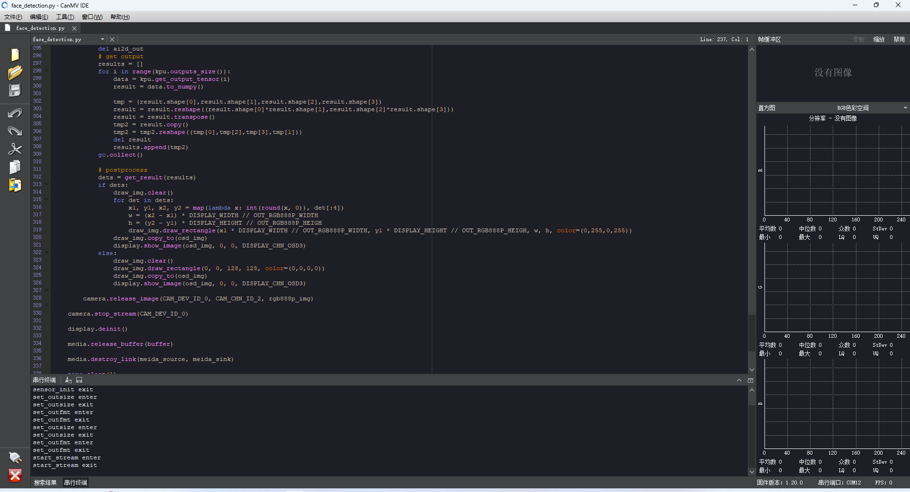

# 2. 人脸检测示例

## 1. 概述

K230 CanMV 人脸检测是通过python语言开发实现的一个简单的具备摄像头数据采集预览，人脸检测画框功能的应用。该示例程序应用到了K230 CanMV 平台的多个硬件模块：AI2D，KPU，Camera，Display等。

## 2. 硬件环境

运行该示例程序需要如下硬件环境：

- K230 CanMV开发板及配套的Sensor模组

## 3. 示例代码

```python
import os

from media.sensor import * #导入camera模块，使用camera相关接口
from media.display import * #导入display模块，使用display相关接口
from media.media import * #导入media模块，使用meida相关接口
from time import *

import nncase_runtime as nn #导入nn模块，使用nn相关接口
import ulab.numpy as np #导入np模块，使用np相关接口

import time
import image

import random
import gc

DISPLAY_WIDTH = ALIGN_UP(1920, 16)
DISPLAY_HEIGHT = 1080

OUT_RGB888P_WIDTH = ALIGN_UP(1024, 16)
OUT_RGB888P_HEIGH = 624

confidence_threshold = 0.5
top_k = 5000
nms_threshold = 0.2
keep_top_k = 750
vis_thres = 0.5
variance = [0.1, 0.2]

anchors_path = '/sdcard/app/tests/nncase_runtime/face_detection/prior_data_320.bin'
prior_data = np.fromfile(anchors_path, dtype=np.float)
prior_data = prior_data.reshape((4200,4))

scale = np.ones(4, dtype=np.uint8)*1024
scale1 = np.ones(10, dtype=np.uint8)*1024


def decode(loc, priors, variances):
    boxes = np.concatenate(
        (priors[:, :2] + loc[:, :2] * variances[0] * priors[:, 2:],
        priors[:, 2:] * np.exp(loc[:, 2:] * variances[1])), axis=1)
    boxes[:, :2] -= boxes[:, 2:] / 2
    boxes[:, 2:] += boxes[:, :2]
    return boxes


def decode_landm(pre, priors, variances):
    landms = np.concatenate((priors[:, :2] + pre[:, :2] * variances[0] * priors[:, 2:],
                        priors[:, :2] + pre[:, 2:4] * variances[0] * priors[:, 2:],
                        priors[:, :2] + pre[:, 4:6] * variances[0] * priors[:, 2:],
                        priors[:, :2] + pre[:, 6:8] * variances[0] * priors[:, 2:],
                        priors[:, :2] + pre[:, 8:10] * variances[0] * priors[:, 2:])
                        , axis=1)
    return landms


def py_cpu_nms(dets, thresh):
    """Pure Python NMS baseline."""
    x1 = dets[:, 0]
    y1 = dets[:, 1]
    x2 = dets[:, 2]
    y2 = dets[:, 3]
    scores = dets[:, 4]
    areas = (x2 - x1 + 1) * (y2 - y1 + 1)

    order = np.argsort(scores,axis = 0)[::-1]

    keep = []
    while order.size > 0:
        i = order[0]
        keep.append(i)
        new_x1 = []
        new_x2 = []
        new_y1 = []
        new_y2 = []
        new_areas = []
        for order_i in order:
            new_x1.append(x1[order_i])
            new_x2.append(x2[order_i])
            new_y1.append(y1[order_i])
            new_y2.append(y2[order_i])
            new_areas.append(areas[order_i])
        new_x1 = np.array(new_x1)
        new_x2 = np.array(new_x2)
        new_y1 = np.array(new_y1)
        new_y2 = np.array(new_y2)
        xx1 = np.maximum(x1[i], new_x1)
        yy1 = np.maximum(y1[i], new_y1)
        xx2 = np.minimum(x2[i], new_x2)
        yy2 = np.minimum(y2[i], new_y2)

        w = np.maximum(0.0, xx2 - xx1 + 1)
        h = np.maximum(0.0, yy2 - yy1 + 1)
        inter = w * h

        new_areas = np.array(new_areas)
        ovr = inter / (areas[i] + new_areas - inter)
        new_order = []
        for ovr_i,ind in enumerate(ovr):
            if ind < thresh:
                new_order.append(order[ovr_i])
        order = np.array(new_order,dtype=np.uint8)
    return keep


def pad_img_to_square(image, rgb_mean):
    height, width, _ = image.shape
    long_side = max(width, height)
    image_t = np.empty((long_side, long_side, 3), dtype=image.dtype)
    image_t[:, :] = rgb_mean
    image_t[0:0 + height, 0:0 + width] = image
    return image_t


def softmax(x):
    x = x[0]
    x_row_max = np.max(x,axis=-1)
    x_row_max = x_row_max.reshape(tuple(list(x.shape)[:-1]+[1]))
    x = x - x_row_max
    x_exp = np.exp(x)
    x_exp_row_sum = np.sum(x_exp,axis=-1).reshape(tuple(list(x.shape)[:-1]+[1]))
    softmax = x_exp / x_exp_row_sum

    return softmax


def draw_image(img_raw,dets):
    pass


def get_result(output_data):
    loc = []
    loc = np.zeros((1, 4200, 4), dtype=np.float)
    start_i = 0
    for _i in range(0, 3):
        sum_shape = 1
        for sh_i in output_data[_i].shape:
            sum_shape *= sh_i
        output_data[_i] = output_data[_i].reshape((1, -1, loc.shape[2]))
        loc[:,start_i:start_i + int(sum_shape/loc.shape[2]),:] = output_data[_i]
        start_i = start_i + int(sum_shape/loc.shape[2])

    #conf = []
    start_i = 0
    conf = np.zeros((1, 4200, 2), dtype=np.float)
    for _i in range(3, 6):
        sum_shape = 1
        for sh_i in output_data[_i].shape:
            sum_shape *= sh_i
        output_data[_i] = output_data[_i].reshape((1, -1, conf.shape[2]))
        conf[:,start_i:start_i + int(sum_shape/conf.shape[2]),:] = output_data[_i]
        start_i = start_i + int(sum_shape/conf.shape[2])
    conf = softmax(conf)
    #landms = []
    #for _i in range(6, 9):
        ##landms.append(np.reshape(np.transpose(output_data[_i], [0, 2, 3, 1]), [1, -1, 10]))
        #landms.append(np.reshape(output_data[_i],(1, -1, 10)))
    #landms = np.hstack(landms)

    boxes = decode(loc[0], prior_data, variance)
    boxes = boxes * scale
    scores = conf[:, 1]
    #landms = decode_landm(np.squeeze(landms, axis=0), prior_data, variance)
    #landms = landms * scale1

    # ignore low scores
    inds = []
    boxes_ind = []
    scores_ind = []
    for i in range(len(scores)):
        if scores[i] > confidence_threshold:
            inds.append(i)
            boxes_ind.append(boxes[i])
            scores_ind.append(scores[i])

    boxes_ind = np.array(boxes_ind)
    scores_ind = np.array(scores_ind)
    #landms = landms[inds]

    # keep top-K before NMS
    order = np.argsort(scores_ind, axis=0)[::-1][:top_k]
    boxes_order = []
    scores_order = []
    for order_i in order:
        boxes_order.append(boxes_ind[order_i])
        scores_order.append(scores_ind[order_i])
    if len(boxes_order)==0:
        return []
    #print('***',boxes_order,len(boxes_order))
    #print('***',scores_order,len(scores_order))
    boxes_order = np.array(boxes_order)
    scores_order = np.array(scores_order).reshape((-1,1))
    #landms = landms[order]

    # do NMS
    dets = np.concatenate((boxes_order, scores_order), axis=1)
    keep = py_cpu_nms(dets, nms_threshold)

    dets_out = []
    for keep_i in keep:
        dets_out.append(dets[keep_i])
    dets_out = np.array(dets_out)
    #landms = landms[keep]

    # keep top-K faster NMS
    dets_out = dets_out[:keep_top_k, :]
    #landms = landms[:args.keep_top_k, :]
    # dets = np.concatenate((dets, landms), axis=1)
    return dets_out


def face_detect_test():
    print("face_detect_test start")

    #初始化KPU
    kpu = nn.kpu()
    #初始化AI2D
    ai2d = nn.ai2d()
    #加载模型
    kpu.load_kmodel("/sdcard/app/tests/nncase_runtime/face_detection/face_detection_320.kmodel")
    ai2d.set_dtype(nn.ai2d_format.NCHW_FMT,
                                   nn.ai2d_format.NCHW_FMT,
                                   np.uint8, np.uint8)
    ai2d.set_pad_param(True, [0,0,0,0,0,125,0,0], 0, [104,117,123])
    ai2d.set_resize_param(True, nn.interp_method.tf_bilinear, nn.interp_mode.half_pixel )
    ai2d_builder = ai2d.build([1,3,OUT_RGB888P_HEIGH,OUT_RGB888P_WIDTH], [1,3,320,320])

    # 初始化并配置sensor
    sensor = Sensor()
    sensor.reset()
    sensor.set_hmirror(False)
    sensor.set_vflip(False)
    # 通道0直接给到显示VO，格式为YUV420
    sensor.set_framesize(width = DISPLAY_WIDTH, height = DISPLAY_HEIGHT)
    sensor.set_pixformat(PIXEL_FORMAT_YUV_SEMIPLANAR_420)
    # 通道2给到AI做算法处理，格式为RGB888
    sensor.set_framesize(width = OUT_RGB888P_WIDTH , height = OUT_RGB888P_HEIGH, chn=CAM_CHN_ID_2)
    # set chn2 output format
    sensor.set_pixformat(PIXEL_FORMAT_RGB_888_PLANAR, chn=CAM_CHN_ID_2)

    # OSD图像初始化
    osd_img = image.Image(DISPLAY_WIDTH, DISPLAY_HEIGHT, image.ARGB8888)

    sensor_bind_info = sensor.bind_info(x = 0, y = 0, chn = CAM_CHN_ID_0)
    Display.bind_layer(**sensor_bind_info, layer = Display.LAYER_VIDEO1)
    # 设置为LT9611显示，默认1920x1080
    Display.init(Display.LT9611, to_ide = True)

    try:
        # media初始化
        MediaManager.init()
        # 启动sensor
        sensor.run()
        rgb888p_img = None
        while  True:
            #捕获摄像头数据
            rgb888p_img = sensor.snapshot(chn=CAM_CHN_ID_2)
            if rgb888p_img == -1:
                print("face_detect_test, capture_image failed")
                continue

            # for rgb888planar
            if rgb888p_img.format() == image.RGBP888:
                ai2d_input = rgb888p_img.to_numpy_ref()
                ai2d_input_tensor = nn.from_numpy(ai2d_input)
                data = np.ones((1,3,320,320),dtype=np.uint8)
                ai2d_out = nn.from_numpy(data)
                ai2d_builder.run(ai2d_input_tensor, ai2d_out)
                #设置kpu输入
                kpu.set_input_tensor(0, ai2d_out)
                #运行kmodel
                kpu.run()
                del ai2d_input_tensor
                del ai2d_out
                # get output
                results = []
                for i in range(kpu.outputs_size()):
                    data = kpu.get_output_tensor(i)
                    result = data.to_numpy()
                    tmp = (result.shape[0],result.shape[1],result.shape[2],result.shape[3])
                    result = result.reshape((result.shape[0]*result.shape[1],result.shape[2]*result.shape[3]))
                    result = result.transpose()
                    tmp2 = result.copy()
                    tmp2 = tmp2.reshape((tmp[0],tmp[2],tmp[3],tmp[1]))
                    del result
                    results.append(tmp2)
                gc.collect()

                #获取人脸检测结果
                dets = get_result(results)
                osd_img.clear()
                if dets:
                    for det in dets:
                        x1, y1, x2, y2 = map(lambda x: int(round(x, 0)), det[:4])
                        w = (x2 - x1) * DISPLAY_WIDTH // OUT_RGB888P_WIDTH
                        h = (y2 - y1) * DISPLAY_HEIGHT // OUT_RGB888P_HEIGH
                        #绘制人脸框
                        osd_img.draw_rectangle(x1 * DISPLAY_WIDTH // OUT_RGB888P_WIDTH, y1 * DISPLAY_HEIGHT // OUT_RGB888P_HEIGH, w, h, color=(255,255,0,255))
                    Display.show_image(osd_img, 0, 0, Display.LAYER_OSD3)
            rgb888p_img = None

    except Exception as e:
        print(f"An error occurred during running: {e}")
    finally:
        os.exitpoint(os.EXITPOINT_ENABLE_SLEEP)
        #停止摄像头输出
        sensor.stop()
        #去初始化显示设备
        Display.deinit()
        #释放媒体缓冲区
        MediaManager.deinit()
        del kpu #释放kpu资源
        del ai2d #释放ai2d资源
        gc.collect()
        time.sleep(1)
    print("face_detect_test end")
    return 0

face_detect_test()
```

## 4. 运行示例代码

通过K230 CanMV IDE 打开示例程序代码，并点击运行按钮开始运行人脸检测示例程序。有关IDE的使用请参考《K230_CanMV_IDE使用说明》，有关镜像烧录及开发环境搭建请参考《K230_CanMV使用说明》

通过IDE打开示例程序并运行如下图所示：


运行结果如下图所示：

