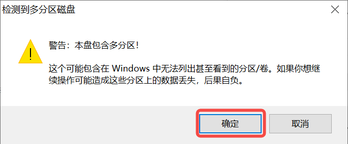
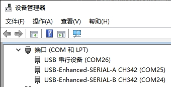

# K230_CanMV使用说明


版权所有©2023北京嘉楠捷思信息技术有限公司

<div style="page-break-after:always"></div>

## 免责声明

您购买的产品、服务或特性等应受北京嘉楠捷思信息技术有限公司（“本公司”，下同）及其关联公司的商业合同和条款的约束，本文档中描述的全部或部分产品、服务或特性可能不在您的购买或使用范围之内。除非合同另有约定，本公司不对本文档的任何陈述、信息、内容的正确性、可靠性、完整性、适销性、符合特定目的和不侵权提供任何明示或默示的声明或保证。除非另有约定，本文档仅作为使用指导参考。

由于产品版本升级或其他原因，本文档内容将可能在未经任何通知的情况下，不定期进行更新或修改。

## 商标声明

、“嘉楠”和其他嘉楠商标均为北京嘉楠捷思信息技术有限公司及其关联公司的商标。本文档可能提及的其他所有商标或注册商标，由各自的所有人拥有。

**版权所有 © 2023北京嘉楠捷思信息技术有限公司。保留一切权利。**
非经本公司书面许可，任何单位和个人不得擅自摘抄、复制本文档内容的部分或全部，并不得以任何形式传播。

<div style="page-break-after:always"></div>

## 目录

[TOC]

## 前言

### 概述

本文档主要介绍 K230 CanMV 的安装和使用。

### 读者对象

本文档（本指南）主要适用于以下人员：

- 技术支持工程师
- 软件开发工程师

### 缩略词定义

| 简称 | 说明 |
| ---- | ---- |
|      |      |

### 修订记录

| 文档版本号 | 修改说明 | 修改者 | 日期 |
| ---------- | -------- | ---------- | ---------- |
| V1.0       | 初版     | 软件部      | 2023-09-18 |

## 1. 概述

K230 CanMV是基于K230开发的一个可运行micropython的应用，用户可通过python语言使用硬件的各种资源。

CanMV源码下载地址如下：

`https://github.com/kendryte/k230_canmv`

`https://gitee.com/kendryte/k230_canmv`

## 2. 开发环境搭建

### 2.1 支持的硬件

CanMV-K230: 具体硬件信息参考 《K230_硬件设计指南》

#### 2.2 编译环境

| 主机环境 | 描述 |
| --- | --- |
| Docker编译环境 | 提供了dockerfile，可以生成docker镜像，用于编译 |
| Ubuntu 20.04.4 LTS (x86_64) | 可以在ubuntu 20.04环境下编译 |

K230 CanMV需要在linux环境下编译，支持docker环境编译，开发包中发布了docker file（`k230_sdk/tools/docker/Dockerfile`），可以生成docker镜像。具体dockerfile使用和编译步骤，详见4.3.1章节。

CanMV使用的Docker镜像以ubuntu 20.04为基础，如果不使用docker编译环境，可以在ubuntu 20.04主机环境下参考dockerfile的内容，安装相关HOST package和工具链后，编译CanMV。

K230 CanMV没有在其他Linux版本的主机环境下验证过，不保证可以在其他环境下编译通过。

## 3. 编译流程

说明：本章节命令仅供参考，文件名请根据实际情况进行替换。

CanMV源码下载地址如下：

`https://github.com/kendryte/k230_canmv`

`https://gitee.com/kendryte/k230_canmv`

```sh
git clone https://github.com/kendryte/k230_canmv.git
cd k230_canmv
make prepare_sourcecode
# 生成docker镜像（第一次编译需要，已经生成docker镜像后跳过此步骤，可选）
docker build -f k230_sdk/tools/docker/Dockerfile -t k230_docker k230_sdk/tools/docker
# 启动docker环境(可选)
docker run -u root -it -v $(pwd):$(pwd) -v $(pwd)/k230_sdk/toolchain:/opt/toolchain -w $(pwd) k230_docker /bin/bash
# 默认使用CanMV板卡，如果需要使用其他板卡，请使用 make CONF=k230_xx_defconfig，支持的板卡在configs目录下
make CONF=k230_canmv_defconfig
```

编译完成后会在`output/k230_xx_defconfig/images`目录下生成`sysimage-sdcard.img`镜像

## 4. 镜像烧录

### 4.1 ubuntu下烧录

在sd卡插到宿主机之前，输入：

`ls -l /dev/sd\*`

查看当前的存储设备。

将sd卡插入宿主机后，再次输入：

`ls -l /dev/sd\*`

查看此时的存储设备，新增加的就是sd卡设备节点。

假设/dev/sdc就是sd卡设备节点，执行如下命令烧录sd卡：

`sudo dd if=sysimage-sdcard.img of=/dev/sdc bs=1M oflag=sync`

说明：`sysimage-sdcard.img`可以是`images`目录下的`sysimage-sdcard.img`文件，或者`sysimage-sdcard.img.gz`文件解压缩后的文件。

### 4.2 Windows下烧录

Windows下可通过rufus工具对TF卡进行烧录（rufus工具下载地址 `http://rufus.ie/downloads/`）。

1）将TF卡插入PC，然后启动rufus工具，点击工具界面的"选择”按钮，选择待烧写的固件。


2）点击“开始”按钮开始烧写，烧写过程有进度条展示，烧写结束后会提示“准备就绪”。





说明：`sysimage-sdcard.img`可以是`images`目录下的`sysimage-sdcard.img`文件，或者`sysimage-sdcard.img.gz`文件解压缩后的文件。

## 5. 上板测试

### 5.1 开发板准备

本章节以CanMV-K230为例

请准备如下硬件：

- CanMV-K230
- Typec USB线两根
- SD卡
- 网线一根(可选)
- HDMI转接线一根(可选)

CanMV-K230通过Power接口提供两路调试串口，linux下显示的串口设备为/dev/ttyACMx，windows下显示的串口设备为USB-Enhanced-SERIAL-A/B CH342。

windows驱动下载地址 `https://www.wch.cn/downloads/CH343SER_EXE.html`。

使用type C分别连接Power和USB接口，板子上电，可以发现三个USB串口设备。

linux串口显示：


- `/dev/ttyACM0`为小核linux调试串口
- `/dev/ttyACM1`为大核rt-smart调试串口
- `/dev/ttyACM2`为micropython REPL串口，如果没有这个设备，请确定两个USB口都与电脑连接。

windows串口显示：



- `USB-Enhanced-SERIAL-A CH342（COM25）`为小核linux调试串口
- `USB-Enhanced-SERIAL-B CH342（COM24）`为大核rt-smart调试串口
- `USB串行设备（COM26）`为micropython REPL串口，如果没有这个设备，请确定两个USB口都与电脑连接。

### 5.2 启动micropython

1. 打开大核rt-smart调试串口，打开micropython REPL串口，串口波特率设置`115200 8N1`
1. 在大核rt-smart调试串口下输入`./sdcard/app/micropython`
1. micropython REPL串口会提示进入REPL

启动过程如下图所示


## 6. 目录结构

```sh
k230_canmv
├── configs
├── k230_sdk
├── k230_sdk_overlay
├── Kconfig
├── Makefile
├── micropython
├── micropython_port
├── output
├── README.md
├── scripts
└── tests
```

目录介绍:

1. `configs`: 各种板级配置
1. `k230_sdk`: k230_sdk源码
1. `k230_sdk_overlay`: 基于k230源码的修改
1. `micropython`: micropython源码
1. `micropython_port`: k230 micropython 移植
1. `scripts`: 各种辅助脚本
1. `tests`: 各模块测试代码

其中`k230_sdk`, `micropython`是git submodule, 子项目地址为:

- `k230_sdk`: <https://github.com/kendryte/k230_sdk.git>
- `micropython`: <https://github.com/micropython/micropython.git>

`k230_sdk_overlay`中的目录结构与`k230_sdk`相同, 编译时会将`k230_sdk_overlay`同步到`k230_sdk`
`output`为编译生成目录

`micropython_port`目录大体如下:

```sh
micropython_port/
├── boards
│   ├── k230_canmv
│   ├── k230_evb
│   ├── manifest.py
│   └── mpconfigport.mk
├── core
├── include
│   ├── core
│   ├── kpu
│   ├── machine
│   ├── maix
│   ├── mpp
│   └── omv
├── Kconfig
├── kpu
├── machine
├── maix
├── Makefile
├── micropython_overlay
├── mpconfigport.h
├── mpp
└── omv
```

目录介绍:

1. `boards`: 各种板级配置
1. `core`: micropython core模块
1. `machine`: machine模块, 包含GPIO, SPI, IIC, UART, PWM, WDT等
1. `kpu`: k230 kpu模块, 包含KPU, AI2D
1. `mpp`: k230 mpp模块, 包含VO, VI, AI, AO, MMZ, VPU, DPU等
1. `maix`: k230 其他模块, 包含IOMUX, PM等
1. `omv`: openmv模块
1. `include`: 各模块头文件
1. `micropython_overlay`: 基于micropython源码的修改
