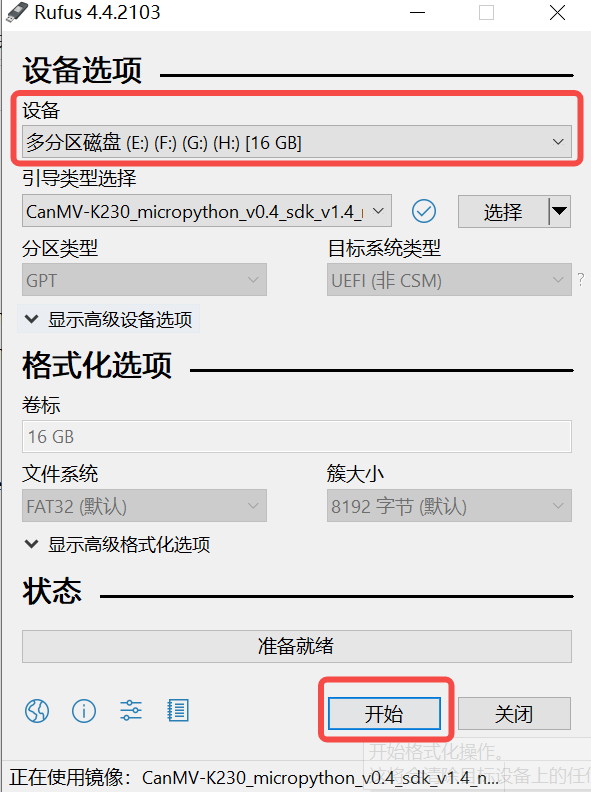

# 烧录固件

## 概述

本章节将介绍如何将 CanMV 固件烧录到开发板上。

## 固件获取

您可以通过以下链接获取 CanMV-K230 固件：[Github](https://github.com/kendryte/k230_canmv/releases) 或 [嘉楠开发者社区](https://www.kendryte.com/resource)。

请下载文件名以 “CanMV-K230_micropython” 开头的 `.gz` 压缩包，解压后会得到 `sysimage-sdcard.img` 文件，该文件即为 CanMV-K230 的固件镜像。

```{admonition} 注意
下载的固件文件通常为 gz 压缩格式，需要解压后才能获得可用于烧录的 img 文件。
```

## 固件烧录

### 在 Windows 平台上进行烧录

在 Windows 系统中，您可以使用 Rufus 工具将固件烧录到 TF 卡。Rufus 工具的下载地址为：[Rufus官网下载](http://rufus.ie/downloads/)。

1. 将 TF 卡插入电脑，启动 Rufus 工具。点击界面中的 “选择” 按钮，选择需要烧录的固件文件。
   
1. 点击 “开始” 按钮，Rufus 将自动进行烧录。进度条会显示烧录的进度，烧录完成后，系统会提示 “准备就绪”。
   
   
   
   

### 在 Linux 平台上进行烧录

在插入 TF 卡之前，首先运行以下命令查看当前的存储设备：

```bash
ls -l /dev/sd\*
```

随后，将 TF 卡插入宿主机，再次运行相同命令，找出新增的设备节点，即为 TF 卡的设备节点。

假设 TF 卡的设备节点为 `/dev/sdc`，可使用以下命令将固件烧录到 TF 卡：

```bash
sudo dd if=sysimage-sdcard.img of=/dev/sdc bs=1M oflag=sync
```

## 启动设备

固件成功烧录后，将开发板连接至电脑，系统会自动识别一个名为 `CanMV` 的虚拟 U 盘以及一个虚拟串口。

```{note}
部分开发板需要同时连接 2 条 USB 线。如果没有看到相应的虚拟 U 盘和虚拟串口，请检查连接是否正确。
```

### 在 Windows 系统下查看设备

打开设备管理器，您将看到如下设备：


- USB 串行设备（COM3）为 Micropython 的 REPL 串口，该串口是 CanMV-IDE 需要连接的接口。请确保您烧录的固件文件名以 “CanMV-K230_micropython” 开头。

### 在 Linux 系统下查看设备

在 Linux 系统中，串口设备会显示为：


- `/dev/ttyACM0` 为 Micropython 的 REPL 串口，也是 CanMV-IDE 需要连接的接口。请确保您烧录的固件文件名以 “CanMV-K230_micropython” 开头。
