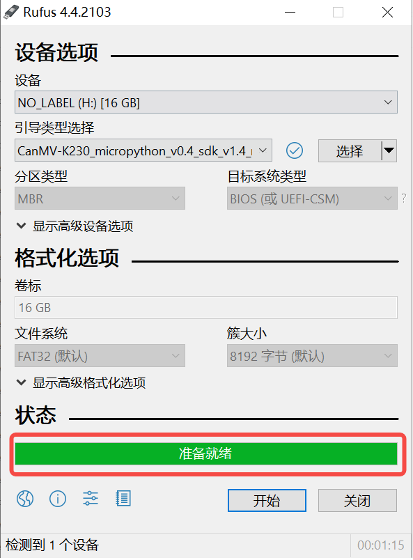

# 2. 烧录固件

## 1. 概述

本章节讲述如何下载CanMV固件到开发板

## 2. 固件获取

CanMV-K230 固件下载地址：[github](https://github.com/kendryte/k230_canmv/releases) 或者 [开发者社区](https://developer.canaan-creative.com/resource)

请下载“CanMV-K230_micropython”开头的gz压缩包，解压得到sysimage-sdcard.img文件，即为CanMV-K230的固件。

```{admonition} 注意
下载获得的镜像一般为`gz`压缩文件，需要解压之后获得`img`文件再进行烧录
```

## 3. 固件烧录

### 3.1 Windows下烧录

Windows下可通过rufus工具对TF卡进行烧录（rufus工具下载地址 [http://rufus.ie/downloads/](http://rufus.ie/downloads/)）。

1）将TF卡插入PC，然后启动rufus工具，点击工具界面的"选择”按钮，选择待烧写的固件。


2）点击“开始”按钮开始烧写，烧写过程有进度条展示，烧写结束后会提示“准备就绪”。




### 3.2 Linux下烧录

在TF卡插到宿主机之前，输入：

`ls -l /dev/sd\*`

查看当前的存储设备。

将TF卡插入宿主机后，再次输入：

`ls -l /dev/sd\*`

查看此时的存储设备，新增加的就是TF卡设备节点。

假设/dev/sdc就是TF卡设备节点，执行如下命令烧录TF卡：

`sudo dd if=sysimage-sdcard.img of=/dev/sdc bs=1M oflag=sync`

## 4. 启动设备

烧录固件成功后，将开发板连接到电脑，可以看到一个虚拟U盘`CanMV`以及`1`个虚拟串口

```{note}
部分开发板需要同时连接2个USB，如果没有看到对应的虚拟U盘和虚拟串口，检查是否正确连接
```

### 4.1 Windows下查看设备

查看设备管理器


- `USB串行设备（COM3）`为micropython REPL串口 是CanMV-IDE需要连接的串口。连接，TF卡烧录的固件是否为“CanMV-K230_micropython”开头的固件。

### 4.2 Linux下查看设备

Linux串口显示如下：


- `/dev/ttyACM0`为micropython REPL串口 是CanMV-IDE需要连接的串口。TF卡烧录的固件是否为“CanMV-K230_micropython”开头的固件。
