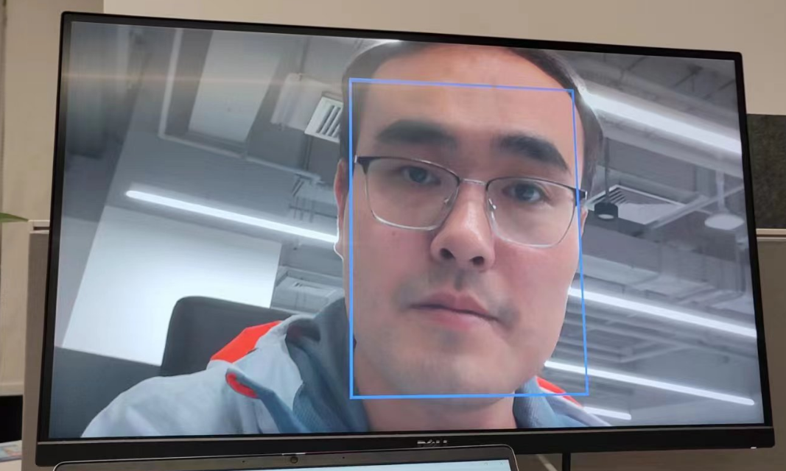

# 4. 运行示例程序

## 1. 概述

K230 CanMV `V0.5`版本之后支持虚拟U盘功能，在虚拟U盘中带有示例脚本，用户无需从网络下载即可使用

在烧录正确固件并成功启动之后，用户可在电脑中看到虚拟U盘`CanMV`，打开进入目录`tests`或`examples`(不同版本文件夹名称可能不同)，可看到不同类别的示例程序，在IDE中选择对应的脚本，然后点击运行即可体验对应的dmeo

## 2. 运行示例程序

```{note}
如果没有安装IDE，请参考[IDE使用说明](./how_to_use_ide.md)安装
```

在 <https://github.com/kendryte/k230_canmv/tree/main/fs_resource/tests> 下载测试程序，通过IDE加载。(**V0.5版本之前，0.5版本后建议使用虚拟U盘**)


点击打开按钮，选择下载的文件，打开。 点击左下角的绿色按钮运行，等待一会儿，显示器会显示sensor采集的图像，该程序为人脸检测程序，可以看到人脸被框出。

(**V0.5版本之后已经支持虚拟U盘功能，可以直接打开TF卡中的示例**)

查看“我的电脑”或“此电脑”，在设备和驱动器中会出现“CanMV"设备。


建议使用虚拟U盘里面的示例。



