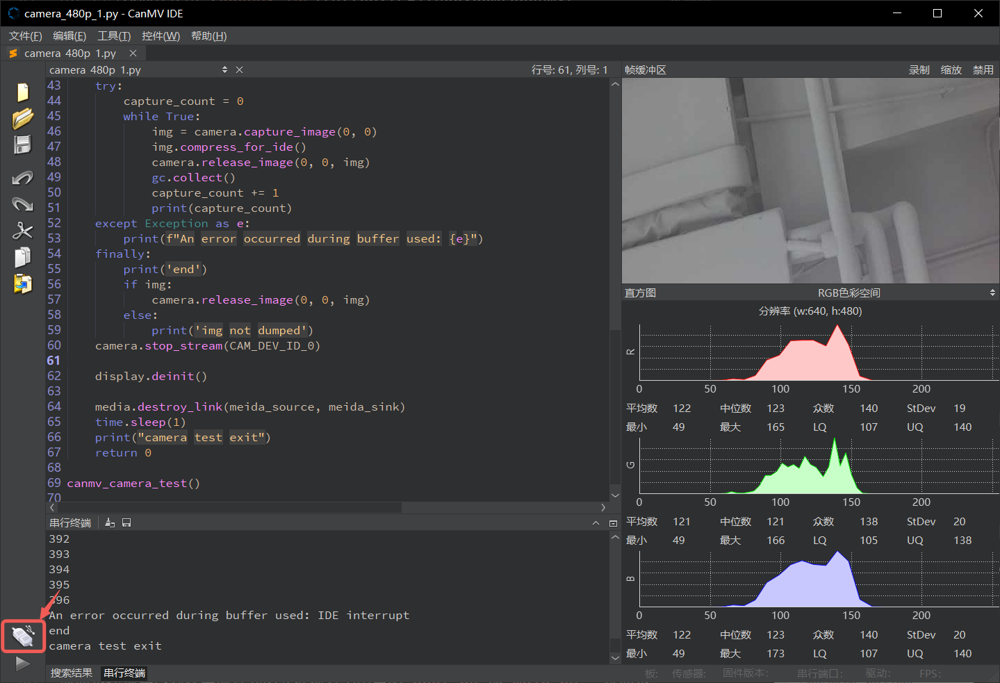
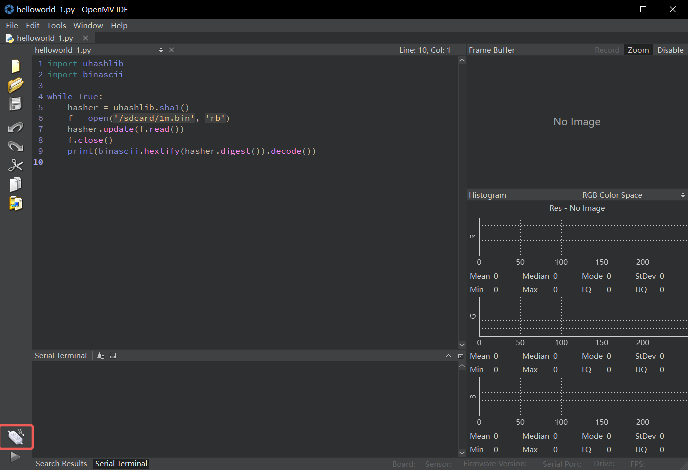

# 3. 连接IDE

## 1. 概述

CanMV 基于 OpenMV 项目开发，CanMV IDE 与 OpenMV IDE 基本一致，主要修改了连接方式和通信协议等相关组件，IDE 基于 qtcreator 开发。

K230 使用的 CanMV IDE 版本要求4.0.5以上，可以在[github](https://github.com/kendryte/canmv_ide/releases)或[开发者社区](https://developer.canaan-creative.com/resource)

用户也可以选择使用 [OpenMV IDE](https://github.com/openmv/openmv-ide/releases)，但是 OpenMV IDE 只能连接 K230，不能连接 K210，使用 4.0 以上版本的 OpenMV IDE 连接可以获得更高的图像显示帧率。

## 2 连接开发板

将开发板的USB端口连接到电脑，点击界面左下角的连接按钮，等待连接完成。

如果使用 OpenMV IDE，同样直接点击左下角的连接按钮即可。

## 3 运行 Python 代码

运行代码前首先需要在编辑器中打开一个代码文件，如图已经打开了一个文件，点击左下角的运行按钮即可运行当前文件，如下图运行了`print('cool')`，在串口终端中打印了一个`cool`。

## 4 保存代码和文件到开发板

点击菜单栏中的`工具`或者`Tools`选项，有两个选项可以将文件保存到开发板的`/sdcard`目录下。

第一个选项将当前打开的脚本文件保存为固定的`main.py`，会在CanMV启动时运行。

第二个选项`保存文件到CanMV Cam`可以保存一个指定的文件到开发板的指定路径上，注意由于只有 SD 卡上的路径可读写，所以实际的路径是 `/sdcard/<填写的路径>`

## 5 在 IDE 中显示图像

当启用显示输出（即调用 `display.init()`）时，IDE会显示与 LCD 或 HDMI 相同的图像，也可以使用 image 类，对 image 对象调用 `compress_for_ide()` 方法将指定图像发送到 IDE 进行显示，如果图像来源是 camera 并且像素格式为 YUV420SP，会自动使用硬件编码器进行图像编码，此时会占用 VENC 模块的第4通道。可以参考示例中的 `Media/camera_480p.py`

## 6 更新资源

当有新的资源（示例和 kmodel 等）可用时，IDE 会在开启时弹出对话框提示更新，点击“安装”按钮即可进行更新。

