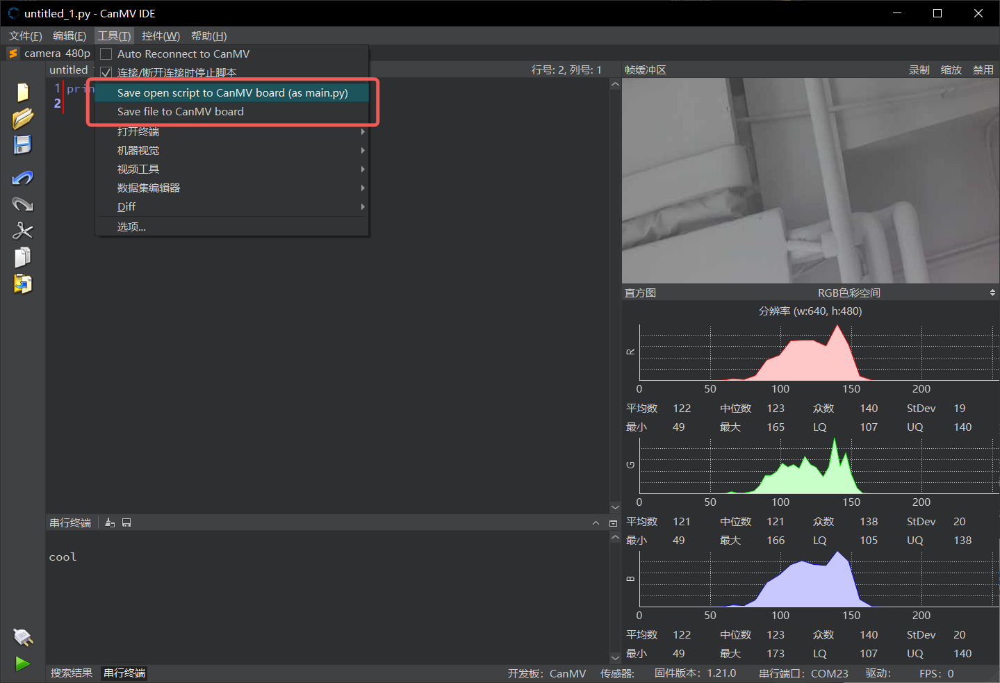

# 3. 连接 IDE

## 1. 概述

CanMV IDE 基于 OpenMV 项目开发，与 OpenMV IDE 基本一致，主要区别在于修改了连接方式和通信协议等相关组件。CanMV IDE 是基于 QtCreator 开发的。

CanMV IDE 适用于 K230，要求版本为 4.0.5 或更高版本，您可以在 [Github](https://github.com/kendryte/canmv_ide/releases) 或 [嘉楠开发者社区](https://www.kendryte.com/resource) 下载。

用户也可以选择使用 [OpenMV IDE](https://github.com/openmv/openmv-ide/releases)，但请注意，OpenMV IDE 仅支持连接 K230，不能连接 K210。使用 4.0 及以上版本的 OpenMV IDE 可获得更高的图像显示帧率。

## 2 连接开发板

将开发板通过 USB 接口连接至电脑，打开 CanMV IDE 并点击界面左下角的“连接”按钮，等待 IDE 与开发板连接完成。

若使用 OpenMV IDE，操作方式相同，直接点击左下角的“连接”按钮即可。

## 3 运行 Python 代码

在运行代码之前，首先需要在编辑器中打开一个代码文件。打开文件后，点击左下角的“运行”按钮即可运行当前文件。例如，运行 `print('cool')` 代码时，串口终端中将显示 `cool` 的输出结果。

## 4 保存代码和文件到开发板

要将代码或文件保存到开发板上，可以点击菜单栏中的 工具 或 Tools 选项。该选项提供了两种保存方式：

1. **保存为** main.py：将当前打开的脚本文件保存为 main.py，该文件将在 CanMV 启动时自动运行。
1. **保存文件到 CanMV Cam**：将指定的文件保存到开发板的特定路径。请注意，由于开发板上只有 SD 卡路径可读写，因此文件将保存到 `/sdcard/<指定路径>`。

## 5 在 IDE 中显示图像

当调用 `display.init()` 方法启用显示输出时，CanMV IDE 将显示与 LCD 或 HDMI 相同的图像。此外，您还可以使用 `image` 类的 `compress_for_ide()` 方法，将指定图像发送到 IDE 进行显示。如果图像来自摄像头，并且像素格式为 YUV420SP，系统将自动调用硬件编码器进行图像编码，此时会占用 VENC 模块的第 4 通道。详细示例请参考 `Media/camera_480p.py`。

## 6 更新资源

当有新的资源（如示例代码或 kmodel 文件）可用时，CanMV IDE 会在启动时弹出对话框提示更新。点击“安装”按钮即可完成更新。

